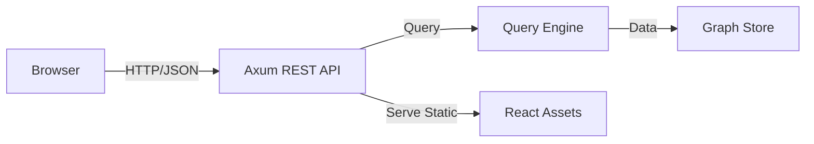

# Phase 11: Native Graph Visualizer - Implementation Plan

## Executive Summary

**Goal**: Build an embedded web interface for Samyama to allow visual data exploration and interactive Cypher querying.

**Technology Choice**:
*   **Backend**: `axum` (already in deps) to serve a REST/JSON API.
*   **Frontend**: React + Vite + Tailwind CSS.
*   **Graph Rendering**: `force-graph` (High-performance Canvas-based renderer).
*   **Embedding**: `rust-embed` to compile the frontend assets directly into the Samyama binary.

## Requirements Coverage

| Requirement | Description |
|-------------|-------------|
| **REQ-UI-001** | Embedded HTTP server serving the Visualizer at port `8080` |
| **REQ-UI-002** | Interactive Graph View (Pan, Zoom, Drag) |
| **REQ-UI-003** | Cypher Query Editor with results history |
| **REQ-UI-004** | Node/Edge Detail Inspector (Property viewer) |
| **REQ-UI-005** | Table & JSON views for query results |

## Architecture



## Implementation Roadmap (4 Weeks)

### Week 1: Backend API (HTTP)
*   **REST Endpoints**:
    *   `POST /api/query`: Executes Cypher and returns standard JSON Graph format.
    *   `GET /api/status`: Cluster and health information.
*   **Integration**: Add `HttpServer` module to Samyama that shares the `Arc<RwLock<GraphStore>>` with the `RespServer`.

### Week 2: Frontend Foundation
*   **Scaffolding**: Setup Vite project in `ui/` directory.
*   **State Management**: basic React context for query history and results.
*   **Components**: Editor, Sidebar, and basic Layout.

### Week 3: Graph Visualization
*   **Force-Directed Graph**: Implement the renderer using `react-force-graph`.
*   **Interaction**: Implement "Expand Node" logic (clicking a node triggers a new query for its neighbors).
*   **Styling**: Use Tailwind CSS for a modern, dark-themed UI.

### Week 4: Embedding & Polish
*   **Production Build**: Script to build React app and copy assets.
*   **Binary Embedding**: Use `rust-embed` to serve the UI directly from the Samyama executable.
*   **Verification**: Ensure users can run Samyama and immediately see the UI at `http://localhost:8080`.

## API Design (JSON Graph Format)
```json
{
  "nodes": [
    {"id": "1", "labels": ["Person"], "properties": {"name": "Alice"}},
    {"id": "2", "labels": ["Person"], "properties": {"name": "Bob"}}
  ],
  "links": [
    {"id": "10", "source": "1", "target": "2", "type": "KNOWS"}
  ]
}
```

## Risks
*   **WASM/JS Performance**: Rendering >50k nodes in the browser can be slow. 
    *   *Mitigation*: Default to showing a subset of data and use Canvas-based rendering.
*   **Port Collision**: Port 8080 might be taken.
    *   *Mitigation*: Make port configurable via CLI flag.

---
**Status**: Planned
**Version**: 1.0
