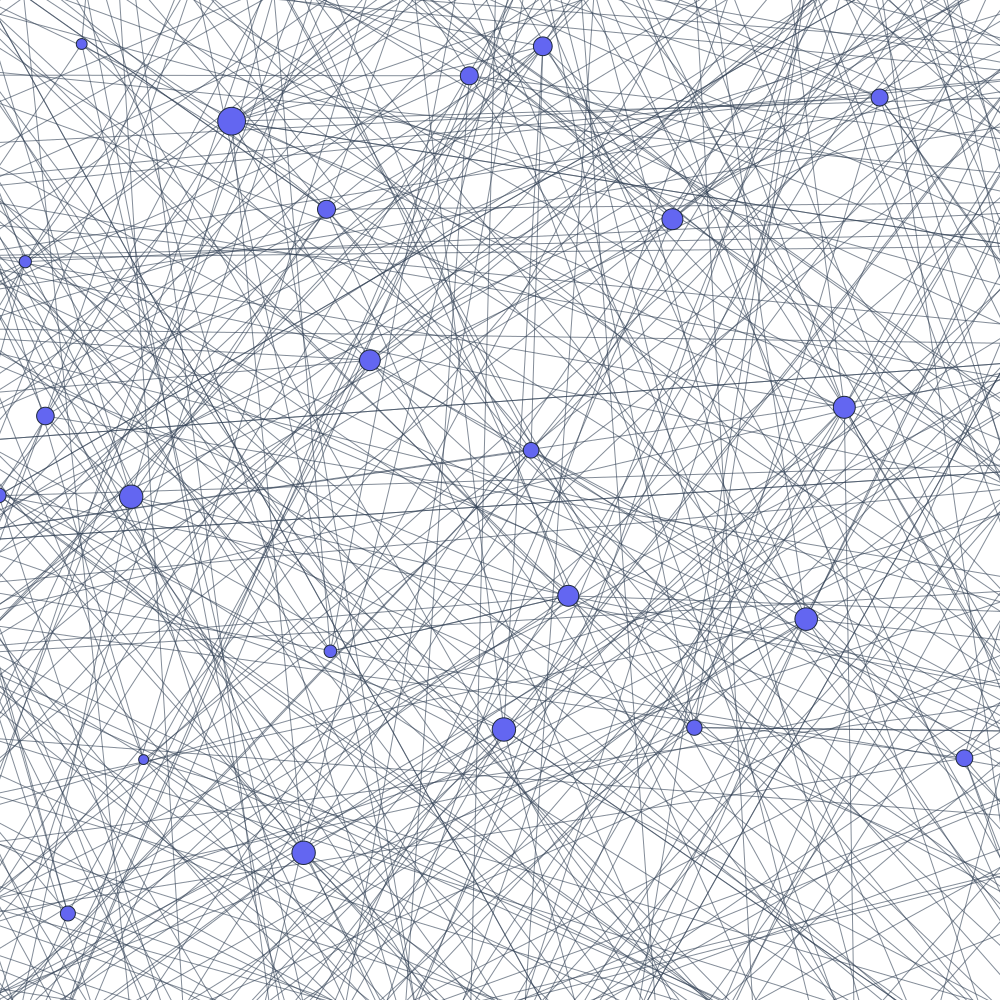

# Samyama Graph Database

**Samyama** is a high-performance, distributed, AI-native graph database written in **Rust**. It combines a **property graph engine**, **vector search**, **graph analytics**, and **natural language querying** in a single binary.



## Key Features

- **OpenCypher Query Engine**: ~90% OpenCypher coverage — MATCH, CREATE, DELETE, SET, MERGE, OPTIONAL MATCH, UNION, WITH, UNWIND, aggregations, and 30+ built-in functions.
- **RESP Protocol**: Drop-in compatibility with any Redis client (`redis-cli`, Jedis, ioredis).
- **Vector Search**: Built-in HNSW indexing for millisecond semantic search and Graph RAG.
- **NLQ (Natural Language Queries)**: Ask questions in plain English — the LLM translates to Cypher automatically.
- **Graph Algorithms**: Native PageRank, BFS, Dijkstra, WCC, SCC, MaxFlow, MST, Triangle Counting.
- **Optimization Solvers**: 15+ metaheuristic algorithms (Jaya, Rao, GWO, PSO, Firefly, Cuckoo, ABC, NSGA-II) for in-database optimization.
- **Multi-Tenancy**: Tenant-level isolation with per-tenant quotas via RocksDB column families.
- **High Availability**: Raft consensus (via `openraft`) for cluster replication and automatic failover.
- **Persistence**: RocksDB storage with Write-Ahead Log and checkpointing.
- **EXPLAIN Queries**: Inspect query execution plans without running them.

## Getting Started

### Build

```bash
git clone https://github.com/samyama-ai/samyama-graph
cd samyama-graph
cargo build --release
```

### Run the Server

```bash
./target/release/samyama
```

This starts the RESP server on port 6379 and the HTTP API on port 8080.

### Connect

```bash
redis-cli -p 6379

# Create nodes
GRAPH.QUERY mygraph "CREATE (n:Person {name: 'Alice', age: 30})"

# Query
GRAPH.QUERY mygraph "MATCH (n:Person) RETURN n"

# Explain a query plan
GRAPH.QUERY mygraph "EXPLAIN MATCH (n:Person) WHERE n.age > 25 RETURN n"
```

## Examples

Samyama ships with domain-specific demos that showcase the full feature set.

### Core Infrastructure

| Example | Command | Description |
|---------|---------|-------------|
| Persistence | `cargo run --example persistence_demo` | RocksDB persistence, WAL, multi-tenancy, recovery |
| Cluster | `cargo run --example cluster_demo` | 3-node Raft cluster with leader election and failover |
| Full Benchmark | `cargo run --example full_benchmark` | Scale test up to 1M+ nodes |

### Industry Demos (with NLQ + Agentic Enrichment)

Each demo builds a domain-specific knowledge graph, runs Cypher queries, executes graph algorithms, and demonstrates natural language querying via the NLQ pipeline.

| Example | Command | What it demonstrates |
|---------|---------|---------------------|
| Banking / Fraud Detection | `cargo run --example banking_demo` | Customer segmentation, fraud patterns, money laundering detection, OFAC screening |
| Clinical Trials | `cargo run --example clinical_trials_demo` | Patient-trial matching (vector search), drug interactions (PageRank), site optimization (NSGA-II) |
| Supply Chain | `cargo run --example supply_chain_demo` | Disruption analysis, cold-chain monitoring, port optimization (Jaya), alternative suppliers (vector search) |
| Smart Manufacturing | `cargo run --example smart_manufacturing_demo` | Digital twin, failure cascade analysis, production scheduling (Cuckoo Search), energy optimization |
| Social Network | `cargo run --example social_network_demo` | Follower graphs, mutual connections, influence analysis (PageRank), community detection (WCC) |
| Knowledge Graph | `cargo run --example knowledge_graph_demo` | Document lineage, expert finding (vector search), topic clustering, knowledge hub identification |
| Enterprise SOC | `cargo run --example enterprise_soc_demo` | Threat intel, MITRE ATT&CK mapping, attack path analysis (Dijkstra), lateral movement simulation |
| Agentic Enrichment | `cargo run --example agentic_enrichment_demo` | Generation-Augmented Knowledge (GAK) — LLM generates Cypher to enrich the graph autonomously |

## Cypher Support

**~90% OpenCypher coverage.** See [docs/CYPHER_COMPATIBILITY.md](docs/CYPHER_COMPATIBILITY.md) for the full matrix.

### Supported Clauses

`MATCH`, `OPTIONAL MATCH`, `WHERE`, `RETURN`, `RETURN DISTINCT`, `ORDER BY`, `SKIP`, `LIMIT`, `CREATE`, `DELETE`, `DETACH DELETE`, `SET`, `REMOVE`, `MERGE` (with `ON CREATE SET` / `ON MATCH SET`), `WITH`, `UNWIND`, `UNION` / `UNION ALL`, `EXPLAIN`, `EXISTS` subqueries

### Supported Functions

| Category | Functions |
|----------|-----------|
| String | `toUpper`, `toLower`, `trim`, `replace`, `substring`, `left`, `right`, `reverse`, `toString` |
| Numeric | `abs`, `ceil`, `floor`, `round`, `sqrt`, `sign`, `toInteger`, `toFloat` |
| Aggregation | `count`, `sum`, `avg`, `min`, `max`, `collect` |
| List/Collection | `size`, `length`, `head`, `last`, `tail`, `keys`, `range` |
| Graph | `id`, `labels`, `type`, `exists`, `coalesce`, `startsWith`, `endsWith`, `contains` |

### Operators

Arithmetic (`+`, `-`, `*`, `/`, `%`), comparison (`=`, `<>`, `<`, `>`, `<=`, `>=`), logical (`AND`, `OR`, `NOT`, `XOR`), string (`STARTS WITH`, `ENDS WITH`, `CONTAINS`, `=~`), null (`IS NULL`, `IS NOT NULL`), list (`IN`).

Cross-type coercion: Integer/Float promotion and String/Boolean coercion for LLM-generated queries. Null propagation follows Neo4j three-valued logic.

## Architecture

```
src/
├── graph/           # Property graph model (Node, Edge, PropertyValue, GraphStore)
├── query/           # OpenCypher engine
│   ├── cypher.pest  #   PEG grammar (Pest)
│   ├── parser.rs    #   Parser → AST
│   └── executor/    #   Volcano iterator model (scan, filter, expand, project, aggregate, sort, limit)
├── protocol/        # RESP3 server (Tokio TCP)
├── persistence/     # RocksDB + WAL + multi-tenancy
├── raft/            # Raft consensus (openraft)
├── nlq/             # Natural Language Query pipeline (OpenAI, Gemini, Ollama, Claude Code)
├── vector/          # HNSW vector index
└── sharding/        # Tenant-level sharding
```

Key design decisions are documented as [Architecture Decision Records](docs/ADR/).

## Companion Crates

- **[samyama-graph-algorithms](crates/samyama-graph-algorithms/)**: PageRank, BFS, Dijkstra, WCC, SCC, MaxFlow, MST, Triangle Counting
- **[samyama-optimization](crates/samyama-optimization/)**: 15+ metaheuristic solvers for single and multi-objective optimization

## Benchmarks

Run with `cargo bench`. See [docs/performance/](docs/performance/) for detailed results.

| Operation | Throughput | Notes |
|-----------|-----------|-------|
| Node insertion | ~3.4M nodes/sec | At 1K batch, single-threaded |
| Label scan | <1 us | 100-node label groups |
| 1-hop traversal | ~22 us | MATCH-WHERE-RETURN pattern |
| Cypher parse | <8 us | Multi-hop patterns with aggregation |

## Documentation

- [Architecture](docs/ARCHITECTURE.md)
- [Cypher Compatibility](docs/CYPHER_COMPATIBILITY.md)
- [ACID Guarantees](docs/ACID_GUARANTEES.md)
- [Benchmarks](docs/performance/BENCHMARKS.md)
- [Architecture Decision Records](docs/ADR/)
- [Technology Comparisons](docs/TECHNOLOGY_COMPARISONS.md)

## Testing

248 unit tests, integration tests via Python scripts, and 8 domain-specific example demos.

```bash
cargo test                     # Run all tests
cargo bench                    # Run benchmarks
cargo clippy -- -D warnings    # Lint
cargo fmt -- --check           # Format check
```

## License

Apache License 2.0
