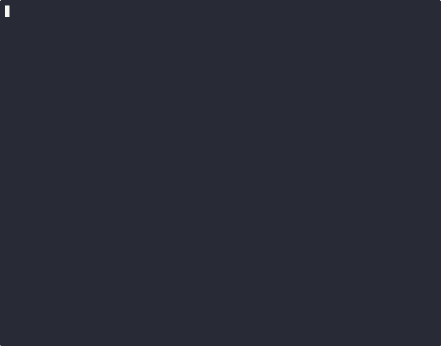
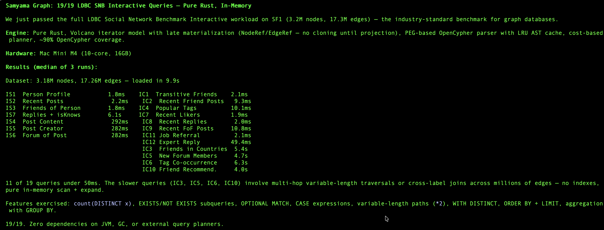

<p align="center">
  <h1 align="center">Samyama Graph </h1>
  <P align ="center">A Rust-native graph-vector database for GraphRAG, knowledge graphs, and billion-edge analytics.</P>
  <p align="center">
    <strong>The graph database that queried 1 billion edges for $2.50</strong>
  </p>
  <p align="center">
    <a href="https://github.com/samyama-ai/samyama-graph/releases"></a>
    <a href="https://github.com/samyama-ai/samyama-graph/actions"></a>
    <a href="LICENSE"></a>
    <a href="https://graph.samyama.cloud/book/"></a>
    <a href="https://chat.whatsapp.com/Jjjkb3uWRDi1YMdfffaD9d"></a>
  </p>
  <p align="center">
    💬 <strong><a href="https://chat.whatsapp.com/Jjjkb3uWRDi1YMdfffaD9d">Join the Samyama OSS community on WhatsApp</a></strong> — questions, help, and updates.
  </p>
</p>

---

We loaded the entire PubMed corpus — every article published since 1966 — plus ClinicalTrials.gov, Reactome pathways, and DrugBank into **one graph**. Then we asked:

> *"What drugs are most tested in cancer clinical trials?"*

```cypher
MATCH (m:MeSHTerm)<-[:ANNOTATED_WITH]-(a:Article)
      -[:REFERENCED_IN]->(t:ClinicalTrial)-[:TESTS]->(i:Intervention)
WHERE m.name = 'Neoplasms'
RETURN i.name, count(DISTINCT t) AS trials
ORDER BY trials DESC LIMIT 5
```

| Drug | Trials |
|------|--------|
| Placebo | 521 |
| **Pembrolizumab** | **137** |
| Carboplatin | 106 |
| Paclitaxel | 106 |
| Cyclophosphamide | 98 |

**5.2 seconds.** One query. Four databases. 74 million nodes. 1 billion edges. A single machine.

[See all 100 benchmark queries →](https://graph.samyama.cloud/book/biomedical_benchmark.html)

---

## Demo

> Cricket KG — 36K nodes, 1.4M edges, live graph simulation

[](https://github.com/samyama-ai/samyama-graph/releases/download/kg-snapshots-v2/samyama-cricket-demo.mp4)

*Click for full demo (1:56)*

### Infrastructure failure-propagation

One query family — reachability, criticality, N-1 contingency — runs identically across infrastructure domains. Both demos use real **CC BY 4.0** data.

**Power Grid** — IEEE 14-bus system (pglib-opf): degree centrality → connectivity → N-1 line contingency.



**Telecom** — GÉANT 2012 pan-European backbone (Internet Topology Zoo): 40 PoPs across 37 countries; N-1 link contingency exposes 8 single points of failure.


---

## Case Studies — prove it yourself

[`case_studies/`](case_studies) lets anyone who clones this repo download a real
public knowledge graph, import it, run showcase Cypher (and vector search), and
render the session as a narrated GIF — **one command, no database to install**.
Every showcase query is gated to return real rows before any GIF is recorded
(see the [Definition of Done](case_studies/DEFINITION_OF_DONE.md)).

```bash
cargo build --release && pip install rich requests
cd case_studies/cricket && ./run.sh          # fetch snapshot → import → validate → demo
RECORD=1 ./run.sh                            # also (re)generate demo.gif
```

Each snapshot is small enough to run on a laptop; every query returns real rows.
GIFs can't pause in a browser, so each domain also ships its `demo.cast` — replay
it pausably (`space`) with `asciinema play case_studies/<domain>/demo.cast`.

| Domain | Scale | Highlight | Snapshot | Demo |
|--------|-------|-----------|----------|------|
| [cricket](case_studies/cricket) | 37K / 1.4M | dismissal-rivalry networks, venues, awards | [`cricket.sgsnap`](https://github.com/samyama-ai/samyama-graph/releases/download/kg-snapshots-v1/cricket.sgsnap) | [gif](case_studies/cricket/demo.gif) |
| [drug-interactions](case_studies/drug-interactions) | 245K / 388K | polypharmacy shared-target risk, CYP hubs | [`druginteractions.sgsnap`](https://github.com/samyama-ai/samyama-graph/releases/download/kg-snapshots-v5/druginteractions.sgsnap) | [gif](case_studies/drug-interactions/demo.gif) |
| [surveillance](case_studies/surveillance) | 217K / 241K | WHO disease burden + immunization gaps | [`surveillance.sgsnap`](https://github.com/samyama-ai/samyama-graph/releases/download/kg-snapshots-v4/surveillance.sgsnap) | [gif](case_studies/surveillance/demo.gif) |
| [health-determinants](case_studies/health-determinants) | 240K / 240K | air, water, poverty — the upstream "why" | [`health-determinants.sgsnap`](https://github.com/samyama-ai/samyama-graph/releases/download/kg-snapshots-v6/health-determinants.sgsnap) | [gif](case_studies/health-determinants/demo.gif) |
| [health-systems](case_studies/health-systems) | 8.7K / 8.4K | WHO emergency-preparedness (SPAR) scores | [`health-systems.sgsnap`](https://github.com/samyama-ai/samyama-graph/releases/download/kg-snapshots-v6/health-systems.sgsnap) | [gif](case_studies/health-systems/demo.gif) |
| [pathways](case_studies/pathways) | 119K / 835K | protein hubs (TP53), pathway crosstalk | [`pathways.sgsnap`](https://github.com/samyama-ai/samyama-graph/releases/download/kg-snapshots-v3/pathways.sgsnap) | [gif](case_studies/pathways/demo.gif) |
| [dbms-research](case_studies/dbms-research) | 19K · 2 HNSW | **vector search** — semantic "nearest topics" | [`dbms-research.sgsnap`](https://github.com/samyama-ai/samyama-graph/releases/download/kg-snapshots-v7/dbms-research.sgsnap) | [gif](case_studies/dbms-research/demo.gif) |
| [imdb-movies](case_studies/imdb-movies) | 1.94M / 2.63M | top-rated films, director–actor power pairs, genre trends, decade arcs | [`imdb.sgsnap`](https://github.com/samyama-ai/samyama-graph/releases/download/kg-snapshots-v8/imdb.sgsnap) | [gif](case_studies/imdb-movies/demo.gif) |
| [football](case_studies/football) | 16K / 12K | top scorers, winning nations, busiest stadiums, multi-tournament veterans | [`football.sgsnap`](https://github.com/samyama-ai/samyama-graph/releases/download/kg-snapshots-v8/football.sgsnap) | [gif](case_studies/football/demo.gif) |

*surveillance + health-determinants + health-systems federate by `Country.iso_code`
into a public-health trifecta.* [Browse the catalogue →](case_studies)

---

## What is Samyama Graph?

Samyama Graph is a Rust-native graph-vector database that lets developers store, query, search, and analyze connected data in one system.
It brings together graph traversal, OpenCypher-style querying, vector search, graph algorithms, and Redis-compatible access, making it useful for GraphRAG, knowledge graphs, AI agent memory, and large-scale relationship analytics.

```bash
# Run with Docker (no Rust toolchain needed)
docker run -d -p 6379:6379 -p 8080:8080 ghcr.io/samyama-ai/samyama-graph:latest
```

```bash
# Or build from source
git clone https://github.com/samyama-ai/samyama-graph && cd samyama-graph
cargo build --release
./target/release/samyama    # RESP on :6379, HTTP on :8080
```

```bash
# Connect with any Redis client
redis-cli -p 6379
GRAPH.QUERY mydb "CREATE (a:Person {name: 'Alice'})-[:KNOWS]->(b:Person {name: 'Bob'})"
GRAPH.QUERY mydb "MATCH (a)-[:KNOWS]->(b) RETURN a.name, b.name"
```

---

## Why Samyama?

**If your data has relationships, you need a graph database.** If your graph database can't handle a billion edges on a single machine, you need Samyama.

| What | How |
|------|-----|
| **74M nodes, 1B edges** | Loaded PubMed + ClinicalTrials.gov + Reactome + DrugBank on one r6a.8xlarge ($2.50 spot) |
| **96/100 queries pass** | Point lookups, multi-hop traversals, cross-KG aggregations — [all verified](https://graph.samyama.cloud/book/biomedical_benchmark.html) |
| **Parallel everything** | Rayon: PageRank 3.1x, LCC 9.1x, Triangle Count 6x. Parallel scan, filter, compaction |
| **975 QPS concurrent** | 16-client read workload, p99 < 25ms, zero errors across 67K queries |
| **LDBC certified** | SNB Interactive 21/21, FinBench 40/40, Graphalytics 12/12 |

---

## The 30-Second Tour

**Cypher queries** — ~90% OpenCypher. MATCH, CREATE, MERGE, aggregations, path finding, 30+ functions.

```cypher
MATCH (a:Person)-[:KNOWS*1..3]->(b:Person)
WHERE a.name = 'Alice'
RETURN b.name, length(shortestPath(a, b))
```

**Graph algorithms** — PageRank, WCC, SCC, BFS, Dijkstra, LCC, CDLP, Triangle Count. All rayon-parallelized.

```cypher
CALL pagerank('social') YIELD nodeId, score
RETURN nodeId, score ORDER BY score DESC LIMIT 10
```

**Vector search** — HNSW indexing for semantic search and Graph RAG.

```cypher
CREATE VECTOR INDEX ON :Paper(embedding) OPTIONS {dimensions: 384, similarity: 'cosine'}
CALL vector.search('Paper', 'embedding', [0.1, 0.2, ...], 10) YIELD node, score
```

**Natural language** — Ask questions in English. The LLM translates to Cypher.

```
NLQ "Who are Alice's friends of friends that work at Google?"
→ MATCH (a:Person {name:'Alice'})-[:KNOWS]->()-[:KNOWS]->(fof)-[:WORKS_AT]->(c:Company {name:'Google'}) RETURN fof.name
```

**AI agents** — Auto-generated MCP servers from your graph schema.

```bash
pip install samyama[mcp]
samyama-mcp-serve --demo cricket    # Instant AI agent tools for any graph
```

---

## Benchmarks

**Run them:** `cargo bench --bench <name>` ([`benches/`](benches)). The vector,
optimization, and micro/MVCC suites are self-contained; LDBC needs a data download.

| Benchmark | Command | Measures | Data |
|-----------|---------|----------|------|
| Vector (HNSW) | `cargo bench --bench vector_benchmark` | build time, recall@k, search QPS (64–768 dim) | self-contained |
| Rao family | `cargo bench --bench rao_family_benchmark` | Jaya/Rao/BMR/NSGA-II on ZDT/DTLZ | self-contained |
| Graph optimization | `cargo bench --bench graph_optimization_benchmark` | 10+ metaheuristic solvers on allocation | self-contained |
| Graphalytics | `cargo bench --bench graphalytics_benchmark` | BFS, PageRank, WCC, CDLP, LCC, SSSP | synthetic / LDBC |
| Micro | `cargo bench --bench graph_benchmarks` | insertion, label scan, k-hop, filter, aggregate | self-contained |
| MVCC & arena | `cargo bench --bench mvcc_benchmark` | 1M-node alloc, version access, time-travel | self-contained |
| Late materialization | `cargo bench --bench late_materialization_bench` | raw vs lazy traversal vs Cypher | self-contained |
| LDBC SNB Interactive | `cargo bench --bench ldbc_benchmark` | 21 IS/IC queries + 8 updates | needs SF1 download |
| LDBC SNB BI | `cargo bench --bench ldbc_bi_benchmark` | 20 analytical (BI-1…20) | needs SF1 download |
| LDBC FinBench | `cargo bench --bench finbench_benchmark` | 40+ CR/SR/RW/W on financial networks | synthetic / download |

### Scale: 74M Nodes, 1 Billion Edges

| KG | Source | Nodes | Edges |
|----|--------|-------|-------|
| PubMed/MEDLINE | NLM | 66.2M | 1.04B |
| Clinical Trials | ClinicalTrials.gov | 7.8M | 27M |
| Pathways | Reactome | 119K | 835K |
| Drug Interactions | DrugBank + ChEMBL + SIDER | 245K | 388K |

Loaded in 31 minutes from snapshots. **96 of 100 queries return real data** across all four KGs. [Full results →](https://graph.samyama.cloud/book/biomedical_benchmark.html)

### Cross-KG Query Highlights

| Query | Time | Result |
|-------|------|--------|
| Cancer → Trial interventions | 5.2s | Pembrolizumab #1 (137 trials) |
| Diabetes → Trial interventions | 2.4s | Metformin #1 (70 trials) |
| Metformin → Trial adverse events | 2.1s | Diarrhoea (185 trials) — known side effect confirmed |
| Cancer trial sites by country | 3.8s | US 4,062 · China 1,170 · France 827 |
| NCI-funded → Trial drugs | 19.4s | Cyclophosphamide (517) · Radiation (362) |
| Aspirin articles → Trials | 1.5s | NCT00000491 "Aspirin MI study" |

### LDBC Compliance

| Benchmark | Pass Rate | Dataset |
|-----------|-----------|---------|
| SNB Interactive | **21/21 (100%)** | SF1: 3.18M nodes, 17.26M edges |
| SNB BI | **16/16 (100%)** | SF1 |
| Graphalytics | **12/12 (100%)** | XS reference graphs |
| FinBench | **40/40 (100%)** | 7.7K nodes, 42.2K edges |



### Concurrent Performance

| Workload | 1 client | 16 clients | Scaling |
|----------|----------|------------|---------|
| Pure read | 145 QPS | 975 QPS | 6.7x |
| Mixed 80/20 | 181 QPS | 722 QPS | 4.0x |
| Write-heavy | 279 QPS | 482 QPS | 1.7x |

---

## Examples

**Run them all in one command:** `./scripts/run_all_examples.sh --batch` builds
every example, starts a server, and runs each in turn with a pass/fail summary
(the orchestrator for the `examples/` directory).

### Domain Knowledge Graphs

| Domain | Command | What it shows |
|--------|---------|---------------|
| Banking & Fraud | `cargo run --example banking_demo` | Fraud patterns, money laundering, OFAC, NLQ |
| Clinical Trials | `cargo run --example clinical_trials_demo` | Patient-trial matching, drug interactions, vector search |
| Supply Chain | `cargo run --example supply_chain_demo` | Disruption analysis, port optimization (Jaya) |
| Manufacturing | `cargo run --example smart_manufacturing_demo` | Digital twin, failure cascades, scheduling |
| Social Network | `cargo run --example social_network_demo` | Influence, communities, recommendations |
| Enterprise SOC | `cargo run --example enterprise_soc_demo` | MITRE ATT&CK, attack paths, threat intel |
| Knowledge Graph | `cargo run --example knowledge_graph_demo` | Enterprise RAG + semantic search |
| Agentic (GAK) | `cargo run --example agentic_enrichment_demo` | Generation-augmented enrichment (needs `claude` CLI) |
| Raft Cluster | `cargo run --example cluster_demo` | 3-node HA consensus |

*19 demo examples + 11 data loaders in [`examples/`](examples); optimization/use-case
demos: `grid_dispatch_demo`, `amr_stewardship_demo`, `healthcare_allocation_demo`,
`wildfire_evac_demo`, `pca_demo`, `sdk_demo`, …*

### Data Loaders

| Dataset | Command | Scale |
|---------|---------|-------|
| LDBC SNB SF1 | `cargo run --example ldbc_loader` | 3.2M nodes, 17.3M edges |
| Clinical Trials | `cargo run --release --example aact_loader` | 7.8M nodes, 27M edges |
| Drug Interactions | `cargo run --release --example druginteractions_loader` | 245K nodes, 388K edges |
| Cricket | `cargo run --release --example cricket_loader` | 36K nodes, 1.4M edges |
| FinBench | `cargo run --example finbench_loader` | 7.7K nodes, 42K edges |
| IMDB Movies | `cargo run --release --example imdb_loader -- --data-dir <path>` | 1.94M nodes, 2.63M edges |
| Football | `cargo run --release --example football_loader -- --data-dir <path>` | 16K nodes, 12K edges |

### Related Repositories

samyama-graph is the engine. Per-domain KGs and companion projects live separately and can be loaded into it:

- **KGs:** [pubmed-kg](https://github.com/samyama-ai/pubmed-kg) (66M / 1B), [clinicaltrials-kg](https://git.samyama.ai/Samyama.ai/clinicaltrials-kg) (7.8M / 27M), [druginteractions-kg](https://git.samyama.ai/Samyama.ai/druginteractions-kg) (245K / 388K), [pathways-kg](https://git.samyama.ai/Samyama.ai/pathways-kg) (119K / 835K), [cricket-kg](https://git.samyama.ai/Samyama.ai/cricket-kg) (36K / 1.4M), [imdb-kg](https://github.com/samyama-ai/imdb-kg) (1.94M / 2.63M), [football-kg](https://github.com/samyama-ai/football-kg) (16K / 12K), [assetops-kg](https://git.samyama.ai/Samyama.ai/assetops-kg) (13K / 13K), [powergrid-kg](https://git.samyama.ai/Samyama.ai/powergrid-kg) (pglib-opf — infrastructure), [telecom-kg](https://git.samyama.ai/Samyama.ai/telecom-kg) (Internet Topology Zoo — infrastructure)
- **Benchmarks:** [biomedqa](https://github.com/samyama-ai/biomedqa) — 40-question pharmacology benchmark across three KGs
- **Companions:** [graphrag-rs](https://github.com/samyama-ai/graphrag-rs) — doc-to-KG + MCP server; [optimization_algorithms](https://github.com/samyama-ai/optimization_algorithms) — PyPI `rao-algorithms` package (PyO3 bindings over `crates/samyama-optimization/`)

---

## Architecture

```
samyama
├── graph/         Property graph model (Node, Edge, GraphStore, CSR adjacency)
├── query/         OpenCypher engine
│   ├── cypher.pest    PEG grammar
│   ├── executor/      Volcano iterator + WCO LeapFrog TrieJoin
│   └── planner.rs     Cost-based graph-native query planner
├── protocol/      RESP3 server (Redis-compatible, Tokio async)
├── persistence/   RocksDB + WAL + multi-tenancy
├── vector/        HNSW vector index
├── snapshot/      Portable .sgsnap v2 (CSR + ColumnStore)
├── raft/          Distributed consensus (openraft)
└── nlq/           Natural language → Cypher (OpenAI, Gemini, Ollama, Claude)
```

**Companion crates:**
- [samyama-graph-algorithms](crates/samyama-graph-algorithms/) — PageRank, BFS, Dijkstra, WCC, SCC, LCC, CDLP, Triangle Count (all rayon-parallelized)
- [samyama-optimization](crates/samyama-optimization/) — 15+ metaheuristic solvers (Jaya, Rao, GWO, NSGA-II, TLBO)
- [samyama-sdk](crates/samyama-sdk/) — Rust SDK with embedded and remote clients

---

## Documentation

| Resource | Link |
|----------|------|
| **The Book** | [graph.samyama.cloud/book](https://graph.samyama.cloud/book/) |
| Biomedical Benchmark | [100 queries, 96 pass](https://graph.samyama.cloud/book/biomedical_benchmark.html) |
| Cypher Compatibility | [docs/CYPHER_COMPATIBILITY.md](docs/CYPHER_COMPATIBILITY.md) |
| LDBC Results | [docs/ldbc/](docs/ldbc/) |
| Architecture Decisions | [docs/ADR/](docs/ADR/) |
| API Spec | [api/openapi.yaml](api/openapi.yaml) |

---

## Enterprise Edition

Everything above is open source (Apache 2.0). [Samyama Enterprise](https://samyama.dev) adds:

- GPU acceleration (wgpu + CUDA)
- OpenTelemetry OTLP metrics
- Prometheus + Grafana monitoring
- Backup & disaster recovery
- ADMIN commands + audit trail
- Ed25519 signed license tokens

[Contact us →](https://samyama.dev/contact)

---

## License

Apache License 2.0 — use it in production, contribute back if you'd like.

**Samyama** (Sanskrit: संयम) — the union of focused query, sustained analysis, and unified insight.
