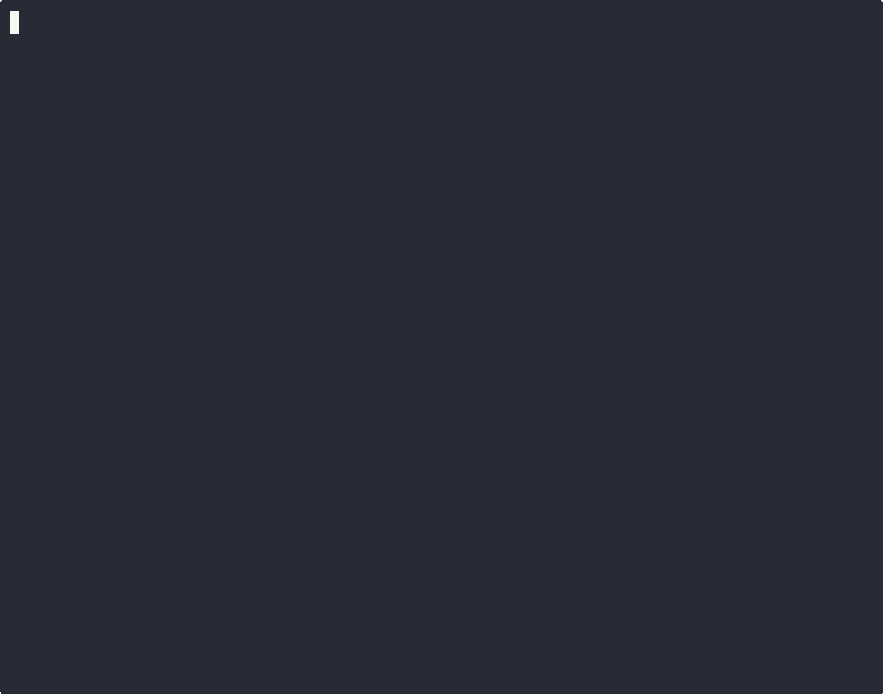
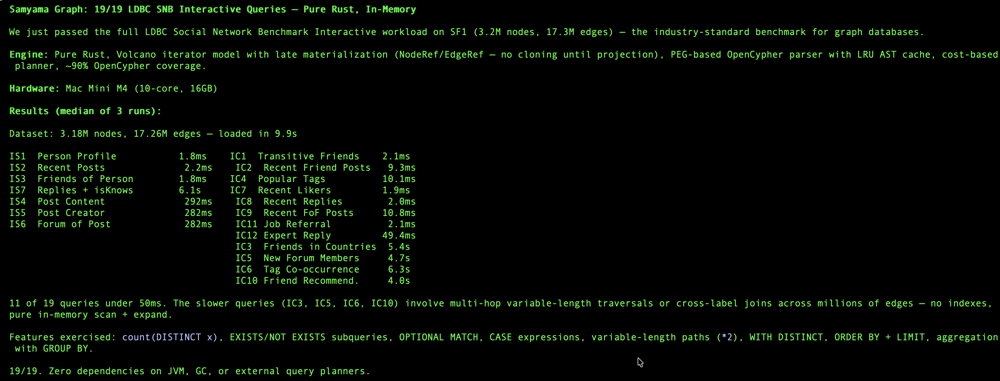

<p align="center">
  <h1 align="center">Samyama Graph</h1>
  <p align="center">A Rust-native graph-vector database for GraphRAG, knowledge graphs, and billion-edge analytics.</p>
  <p align="center">
    <strong>The graph database that queried 1 billion edges for $2.50</strong>
  </p>
  <p align="center">
    <a href="https://github.com/samyama-ai/samyama-graph/releases"></a>
    <a href="https://github.com/samyama-ai/samyama-graph/actions"></a>
    <a href="LICENSE"></a>
    <a href="https://graph.samyama.cloud/book/"></a>
    <a href="https://chat.whatsapp.com/Jjjkb3uWRDi1YMdfffaD9d"></a>
  </p>
  <p align="center">
    💬 <strong><a href="https://chat.whatsapp.com/Jjjkb3uWRDi1YMdfffaD9d">Join the Samyama OSS community on WhatsApp</a></strong> — questions, help, and updates.
  </p>
</p>

---

## What is Samyama Graph?

Samyama Graph is a Rust-native graph-vector database that lets developers store, query, search, and analyze connected data in one system.

It brings together graph traversal, OpenCypher-style querying, vector search, graph algorithms, and Redis-compatible access, making it useful for GraphRAG, knowledge graphs, AI agent memory, and large-scale relationship analytics.

### Quickstart

#### Option 1 — Run with Docker Compose

**Step 1 — Prerequisites**

- ✅ Docker Desktop installed and running — [Watch setup video →](https://samyama.dev/videos)
- ✅ No AWS account or credentials needed — the image is publicly available

**Step 2 — Pull the Docker image**

```bash
docker pull public.ecr.aws/f9f6l5u4/samyama-graph:1.1.0
```

**Step 3 — Docker Compose setup**

Create a clean folder, then create `docker-compose.yml` inside it.

Linux & Mac:

```bash
mkdir -p samyama-graph
cd samyama-graph
touch docker-compose.yml
```

Windows (PowerShell):

```powershell
mkdir C:\samyama-graph
cd C:\samyama-graph
notepad docker-compose.yml
```

> ℹ️ Replace `<your-openai-api-key>` with your actual key. Generate one at [platform.openai.com/api-keys](https://platform.openai.com/api-keys).

```yaml
version: "3.9"
services:
  samyama-graph:
    image: public.ecr.aws/f9f6l5u4/samyama-graph:1.1.0
    container_name: samyama-graph
    restart: unless-stopped
    ports:
      - "6379:6379"
      - "8080:8080"
    environment:
      EMBED_ENABLED: "true"
      EMBED_PROVIDER: openai
      EMBED_MODEL: text-embedding-3-small
      EMBED_API_KEY: <your-openai-api-key>
      EMBED_DIMENSION: 1024
    volumes:
      - samyama-data:/app/samyama_data
    networks:
      - samyama-network
networks:
  samyama-network:
    driver: bridge
volumes:
  samyama-data:
```

**Step 4 — Start the server**

```bash
docker compose up -d
```

Server will be available at http://localhost:8080

**Step 5 — Verify it's running**

```bash
docker ps
docker logs -f samyama-graph
```

You should see `samyama-graph` with status `Up`.

**Step 6 — Samyama Visualizer**

Visualize your imported graph data using the Samyama cloud visualizer at https://graph.samyama.cloud/

1. Open https://graph.samyama.cloud/ in your browser.
2. Sign up for a new account, or sign in if you already have one.
3. From the left sidebar, click **Home**.
4. In the connection field, enter your local graph server URL: `http://localhost:8080`.
5. Click **Connect** — the status will change to **Connected**.

<details>
<summary><strong>Step 7 — Optional: Load sample dataset</strong> <sub>Optional</sub></summary>

**7a — Download snapshot**

| Dataset | Description | File |
|---------|-------------|------|
| DBMS Research | Database management systems research knowledge graph | [`dbms-research.sgsnap`](https://github.com/samyama-ai/samyama-graph/releases/download/kg-snapshots-v7/dbms-research.sgsnap) |

Tip: Save the file in the same folder as `docker-compose.yml` to avoid path errors.
- Windows: `C:\samyama-graph\dbms-research.sgsnap`
- Linux / Mac: `./samyama-graph/dbms-research.sgsnap`

**7b — Create tenant**

Linux & Mac:

```bash
curl -X POST http://localhost:8080/api/tenants \
  -H "Content-Type: application/json" \
  -d '{"id": "dbms-research", "name": "dbms-research"}'
```

Windows (PowerShell):

```powershell
curl.exe -X POST http://localhost:8080/api/tenants `
  -H "Content-Type: application/json" `
  -d '{"id": "dbms-research", "name": "dbms-research"}'
```

**7c — Import snapshot**

Linux & Mac:

```bash
curl -X POST http://localhost:8080/api/snapshot/import \
  -F "file=@./samyama-graph/dbms-research.sgsnap" \
  -F "tenant_id=dbms-research"
```

Windows (PowerShell):

```powershell
curl.exe -X POST http://localhost:8080/api/snapshot/import `
  -F "file=@C:\samyama-graph\dbms-research.sgsnap" `
  -F "tenant_id=dbms-research"
```

Note: On Windows always use `curl.exe` — PowerShell's `curl` alias does not support `-F`.

</details>

**Step 8 — Stop / reset**

Stop the server:

```bash
docker compose down
```

Reset all data (⚠️ deletes volume):

```bash
docker compose down -v
```

⚠️ This deletes all graph data stored in the Docker volume.

#### Option 2 — Build from source

**System packages.** `zstd-sys` generates its bindings with `bindgen`, which needs libclang.
Without it the build fails part-way through with a misleading `'stddef.h' file not found`.

```bash
# Debian / Ubuntu
sudo apt-get install -y build-essential cmake pkg-config libssl-dev clang libclang-dev

# Fedora / RHEL
sudo dnf install -y gcc gcc-c++ cmake pkgconf-pkg-config openssl-devel clang clang-devel

# macOS — the Xcode Command Line Tools already provide clang
xcode-select --install
```

Then, with a stable Rust toolchain from [rustup](https://rustup.rs/):

```bash
# Build from source
git clone https://github.com/samyama-ai/samyama-graph && cd samyama-graph
cargo build --release
./target/release/samyama    # RESP on :6379, HTTP on :8080
```

```bash
# Connect with any Redis client
redis-cli -p 6379
GRAPH.QUERY mydb "CREATE (a:Person {name: 'Alice'})-[:KNOWS]->(b:Person {name: 'Bob'})"
GRAPH.QUERY mydb "MATCH (a)-[:KNOWS]->(b) RETURN a.name, b.name"
```

## What can you build with Samyama Graph?

Samyama Graph is useful when your application needs both connected-data reasoning and semantic retrieval.

You can use it to build:

- **GraphRAG systems** that combine vector search with graph traversal
- **Knowledge graph applications** for enterprise, research, healthcare, and operations data
- **AI agent memory** where entities, tools, actions, and context are stored as a graph
- **Biomedical and clinical graphs** across papers, trials, pathways, drugs, and conditions
- **Fraud and investigation graphs** for relationship discovery and pattern analysis
- **Infrastructure and dependency graphs** for impact analysis and root-cause exploration
- **Large-scale graph analytics** using built-in graph algorithms

---

We loaded the entire PubMed corpus — every article published since 1966 — plus ClinicalTrials.gov, Reactome pathways, and DrugBank into **one graph**. Then we asked:

> *"What drugs are most tested in cancer clinical trials?"*

```cypher
MATCH (m:MeSHTerm)<-[:ANNOTATED_WITH]-(a:Article)
      -[:REFERENCED_IN]->(t:ClinicalTrial)-[:TESTS]->(i:Intervention)
WHERE m.name = 'Neoplasms'
RETURN i.name, count(DISTINCT t) AS trials
ORDER BY trials DESC LIMIT 5
```

| Drug | Trials |
|------|--------|
| Placebo | 521 |
| **Pembrolizumab** | **137** |
| Carboplatin | 106 |
| Paclitaxel | 106 |
| Cyclophosphamide | 98 |

**5.2 seconds.** One query. Four databases. 74 million nodes. 1 billion edges. A single machine.

[See all 100 benchmark queries →](https://graph.samyama.cloud/book/biomedical_benchmark.html)

> ⭐ **Find this useful?** A GitHub star helps more developers discover Samyama Graph.

---

## Demo

> Cricket KG — 36K nodes, 1.4M edges, live graph simulation

[](https://github.com/samyama-ai/samyama-graph/releases/download/kg-snapshots-v2/samyama-cricket-demo.mp4)

*Click for full demo (1:56)*

### Infrastructure failure-propagation

One query family — reachability, criticality, N-1 contingency — runs identically across infrastructure domains. Both demos use real **CC BY 4.0** data.

**Power Grid** — IEEE 14-bus system (pglib-opf): degree centrality → connectivity → N-1 line contingency.



**Telecom** — GÉANT 2012 pan-European backbone (Internet Topology Zoo): 40 PoPs across 37 countries; N-1 link contingency exposes 8 single points of failure.


---

## Case Studies — prove it yourself

[`case_studies/`](case_studies) lets anyone who clones this repo download a real
public knowledge graph, import it, run showcase Cypher (and vector search), and
render the session as a narrated GIF — **one command, no database to install**.
Every showcase query is gated to return real rows before any GIF is recorded
(see the [Definition of Done](case_studies/DEFINITION_OF_DONE.md)).

```bash
cargo build --release && pip install rich requests
cd case_studies/cricket && ./run.sh          # fetch snapshot → import → validate → demo
RECORD=1 ./run.sh                            # also (re)generate demo.gif
```

Each snapshot is small enough to run on a laptop; every query returns real rows.
GIFs can't pause in a browser, so each domain also ships its `demo.cast` — replay
it pausably (`space`) with `asciinema play case_studies/<domain>/demo.cast`.

| Domain | Scale | Highlight | Snapshot | Demo |
|--------|-------|-----------|----------|------|
| [cricket](case_studies/cricket) | 37K / 1.4M | dismissal-rivalry networks, venues, awards | [`cricket.sgsnap`](https://github.com/samyama-ai/samyama-graph/releases/download/kg-snapshots-v1/cricket.sgsnap) | [gif](case_studies/cricket/demo.gif) |
| [drug-interactions](case_studies/drug-interactions) | 245K / 388K | polypharmacy shared-target risk, CYP hubs | [`druginteractions.sgsnap`](https://github.com/samyama-ai/samyama-graph/releases/download/kg-snapshots-v5/druginteractions.sgsnap) | [gif](case_studies/drug-interactions/demo.gif) |
| [surveillance](case_studies/surveillance) | 217K / 241K | WHO disease burden + immunization gaps | [`surveillance.sgsnap`](https://github.com/samyama-ai/samyama-graph/releases/download/kg-snapshots-v4/surveillance.sgsnap) | [gif](case_studies/surveillance/demo.gif) |
| [health-determinants](case_studies/health-determinants) | 240K / 240K | air, water, poverty — the upstream "why" | [`health-determinants.sgsnap`](https://github.com/samyama-ai/samyama-graph/releases/download/kg-snapshots-v6/health-determinants.sgsnap) | [gif](case_studies/health-determinants/demo.gif) |
| [health-systems](case_studies/health-systems) | 8.7K / 8.4K | WHO emergency-preparedness (SPAR) scores | [`health-systems.sgsnap`](https://github.com/samyama-ai/samyama-graph/releases/download/kg-snapshots-v6/health-systems.sgsnap) | [gif](case_studies/health-systems/demo.gif) |
| [pathways](case_studies/pathways) | 119K / 835K | protein hubs (TP53), pathway crosstalk | [`pathways.sgsnap`](https://github.com/samyama-ai/samyama-graph/releases/download/kg-snapshots-v3/pathways.sgsnap) | [gif](case_studies/pathways/demo.gif) |
| [dbms-research](case_studies/dbms-research) | 19K · 2 HNSW | **vector search** — semantic "nearest topics" | [`dbms-research.sgsnap`](https://github.com/samyama-ai/samyama-graph/releases/download/kg-snapshots-v7/dbms-research.sgsnap) | [gif](case_studies/dbms-research/demo.gif) |
| [imdb-movies](case_studies/imdb-movies) | 1.94M / 2.63M | top-rated films, director–actor power pairs, genre trends, decade arcs | [`imdb.sgsnap`](https://github.com/samyama-ai/samyama-graph/releases/download/kg-snapshots-v8/imdb.sgsnap) | [gif](case_studies/imdb-movies/demo.gif) |
| [football](case_studies/football) | 16K / 12K | top scorers, winning nations, busiest stadiums, multi-tournament veterans | [`football.sgsnap`](https://github.com/samyama-ai/samyama-graph/releases/download/kg-snapshots-v8/football.sgsnap) | [gif](case_studies/football/demo.gif) |

*surveillance + health-determinants + health-systems federate by `Country.iso_code`
into a public-health trifecta.* [Browse the catalogue →](case_studies)

---

## Why Samyama Graph?

**If your data has relationships, you need a graph database.** If your graph database can't handle a billion edges on a single machine, you need Samyama.

| What | How |
|------|-----|
| **74M nodes, 1B edges** | Loaded PubMed + ClinicalTrials.gov + Reactome + DrugBank on one r6a.8xlarge ($2.50 spot) |
| **96/100 queries pass** | Point lookups, multi-hop traversals, cross-KG aggregations — [all verified](https://graph.samyama.cloud/book/biomedical_benchmark.html) |
| **Parallel everything** | Rayon-parallel PageRank, LCC, CDLP and triangle counting; parallel scan, filter, compaction |
| **LDBC suites run in-tree** | SNB Interactive 21/21 and SNB BI 20/20 at SF1, no timeouts; Graphalytics 12/12 against the LDBC reference answers |

---

## The 30-Second Tour

**Cypher queries** — MATCH, CREATE, MERGE, aggregations, path finding, 30+ functions. **98.8% of the openCypher TCK's evaluated scenarios pass** (3,716 of 3,762, at 96.5% coverage of the 3,897-scenario corpus, measured 2026-08-29); on the same corpus and comparator Neo4j 5 scores 79.5%. That is conformance only — not performance or scale — and the competitor figure is a fixed baseline from one run. See [`docs/CYPHER_COMPATIBILITY.md`](docs/CYPHER_COMPATIBILITY.md) for a per-feature matrix verified by an executable probe, and [`docs/BENCHMARKS.md`](docs/BENCHMARKS.md) for the full accounting.

```cypher
MATCH (a:Person)-[:KNOWS*1..3]->(b:Person)
WHERE a.name = 'Alice'
RETURN b.name, length(shortestPath(a, b))
```

**Graph algorithms** — PageRank, WCC, SCC, BFS, Dijkstra, LCC, CDLP, Triangle Count. All rayon-parallelized.

```cypher
CALL pagerank('social') YIELD nodeId, score
RETURN nodeId, score ORDER BY score DESC LIMIT 10
```

**Vector search** — HNSW indexing for semantic search and Graph RAG.

```cypher
CREATE VECTOR INDEX paper_idx FOR (p:Paper) ON (p.embedding) OPTIONS {dimensions: 384, similarity: 'cosine'}

CALL vector.search('Paper', 'embedding', [0.1, 0.2, 0.3], 10) YIELD node, score
```

**Natural language** — Ask questions in English. The LLM translates to Cypher.

```
NLQ "Who are Alice's friends of friends that work at Google?"
→ MATCH (a:Person {name:'Alice'})-[:KNOWS]->()-[:KNOWS]->(fof)-[:WORKS_AT]->(c:Company {name:'Google'}) RETURN fof.name
```

**AI agents** — Auto-generated MCP servers from your graph schema.

```bash
pip install samyama[mcp]
samyama-mcp-serve --demo cricket    # Instant AI agent tools for any graph
```

---

## Benchmarks

**Run them:** `cargo bench --bench <name>` ([`benches/`](benches)). The vector,
optimization, and micro/MVCC suites are self-contained; LDBC needs a data download.

| Benchmark | Command | Measures | Data |
|-----------|---------|----------|------|
| Vector (HNSW) | `cargo bench --bench vector_benchmark` | build time, recall@k, search QPS (64–768 dim) | self-contained |
| Rao family | `cargo bench --bench rao_family_benchmark` | Jaya/Rao/BMR/NSGA-II on ZDT/DTLZ | self-contained |
| Graph optimization | `cargo bench --bench graph_optimization_benchmark` | 10+ metaheuristic solvers on allocation | self-contained |
| Graphalytics | `cargo bench --bench graphalytics_benchmark` | BFS, PageRank, WCC, CDLP, LCC, SSSP | synthetic / LDBC |
| Micro | `cargo bench --bench graph_benchmarks` | insertion, label scan, k-hop, filter, aggregate | self-contained |
| MVCC & arena | `cargo bench --bench mvcc_benchmark` | 1M-node alloc, version access, time-travel | self-contained |
| Late materialization | `cargo bench --bench late_materialization_bench` | raw vs lazy traversal vs Cypher | self-contained |
| LDBC SNB Interactive | `cargo bench --bench ldbc_benchmark` | 21 IS/IC queries + 8 updates | needs SF1 download |
| LDBC SNB BI | `cargo bench --bench ldbc_bi_benchmark` | 20 analytical (BI-1…20) | needs SF1 download |
| LDBC FinBench | `cargo bench --bench finbench_benchmark` | 40+ CR/SR/RW/W on financial networks | synthetic / download |
| Hierarchy (OEH) | `cargo bench --bench hierarchy_benchmark` | build, order test, roll-up vs subtree size | self-contained |
| **HIER corpus** | `cargo run --release --example hier_benchmark` | 112 hierarchy-heavy queries, index on vs off | self-contained |

**HIER** ([`benchmarks/hier/`](benchmarks/hier)) is a category for subsumption and
hierarchical roll-up over time, geography and ontology — the workload the LDBC and FinBench
suites do not contain. Every query is checked against an unindexed run of the same
question, so a speedup is only reported alongside an identical answer. Latest: **108/108
agree**; roll-up is flat at 15–20 ns from a 1-node subtree to a 137,257-node one. Against
Neo4j on an identical graph it is **94× faster across the 58 queries expressible on both**,
with no class losing — though without the index Samyama is 1.6× *slower* than Neo4j, so the
index is the differentiator rather than the engine. That 94× is the ratio of the two
*medians* over the 58 queries, which is not an average speedup and should not be read as
one; the geometric mean of the per-query ratios is 88×. Both are recomputed from the
committed per-query timings by `CH-BENCH-HIER`, measured 2026-08-14 on a host that no
longer exists.

### Scale: 74M Nodes, 1 Billion Edges

| KG | Source | Nodes | Edges |
|----|--------|-------|-------|
| PubMed/MEDLINE | NLM | 66.2M | 1.04B |
| Clinical Trials | ClinicalTrials.gov | 7.8M | 27M |
| Pathways | Reactome | 119K | 835K |
| Drug Interactions | DrugBank + ChEMBL + SIDER | 245K | 388K |

Loaded in 31 minutes from snapshots. **96 of 100 queries return real data** across all four KGs. [Full results →](https://graph.samyama.cloud/book/biomedical_benchmark.html)

### Cross-KG Query Highlights

| Query | Time | Result |
|-------|------|--------|
| Cancer → Trial interventions | 5.2s | Pembrolizumab #1 (137 trials) |
| Diabetes → Trial interventions | 2.4s | Metformin #1 (70 trials) |
| Metformin → Trial adverse events | 2.1s | Diarrhoea (185 trials) — known side effect confirmed |
| Cancer trial sites by country | 3.8s | US 4,062 · China 1,170 · France 827 |
| NCI-funded → Trial drugs | 19.4s | Cyclophosphamide (517) · Radiation (362) |
| Aspirin articles → Trials | 1.5s | NCT00000491 "Aspirin MI study" |

### LDBC suites

Run in-tree by the conformance harness, not audited by anyone: **LDBC
certification is a formal third-party process and we have not been through
it.** Every row below is a measurement from `samyama-graph-competitor-benchmarks`
on 2026-08-28, and the suite that produced it is named so the number can be
re-derived or refuted.

| Benchmark | Result | Dataset | Suite |
|-----------|--------|---------|-------|
| SNB Interactive | **21/21 complete, 21/21 return rows** | SF1: 3.18M nodes, 17.26M edges | `CH-BENCH-LDBC` |
| SNB BI | **20/20 complete, 0 timeouts** | SF1 | `CH-BENCH-LDBC` |
| Graphalytics | **12/12 agree with the LDBC reference** | XS reference graphs | `CH-BENCH-GALX` |
| FinBench | **21 read queries run, 18 return rows** | synthetic, ~7.7K nodes / 42.2K edges | `CH-BENCH-FIN` |

One of those is not clean, and saying so is the point of publishing them:
three FinBench queries are pinned to ids the generated data does not
guarantee, so they answer nothing while reporting `OK`
([#918](https://github.com/samyama-ai/samyama-graph/issues/918)).



### Concurrent performance

**Not published, because it is not measured.** The numbers that stood here were
added in April 2026 with no benchmark, log, host or date behind them, and no
benchmark in this repository produces them
([#919](https://github.com/samyama-ai/samyama-graph/issues/919)). An unfounded
number is worse than an absent one: it invites a reader to plan around it.

`CH-PERF-CONC` (PERF-17 — 64 concurrent clients, p99 ≤ 3× single-client p50) is
the suite that will answer this, and the figure returns here when it does.

---

## Examples

**Run them all in one command:** `./scripts/run_all_examples.sh --batch` builds
every example, starts a server, and runs each in turn with a pass/fail summary
(the orchestrator for the `examples/` directory).

### Domain Knowledge Graphs

| Domain | Command | What it shows |
|--------|---------|---------------|
| Banking & Fraud | `cargo run --example banking_demo` | Fraud patterns, money laundering, OFAC, NLQ |
| Clinical Trials | `cargo run --example clinical_trials_demo` | Patient-trial matching, drug interactions, vector search |
| Supply Chain | `cargo run --example supply_chain_demo` | Disruption analysis, port optimization (Jaya) |
| Manufacturing | `cargo run --example smart_manufacturing_demo` | Digital twin, failure cascades, scheduling |
| Social Network | `cargo run --example social_network_demo` | Influence, communities, recommendations |
| Enterprise SOC | `cargo run --example enterprise_soc_demo` | MITRE ATT&CK, attack paths, threat intel |
| Knowledge Graph | `cargo run --example knowledge_graph_demo` | Enterprise RAG + semantic search |
| Agentic (GAK) | `cargo run --example agentic_enrichment_demo` | Generation-augmented enrichment (needs `claude` CLI) |
| Raft Cluster | `cargo run --example cluster_demo` | 3-node HA consensus |

*19 demo examples + 11 data loaders in [`examples/`](examples); optimization/use-case
demos: `grid_dispatch_demo`, `amr_stewardship_demo`, `healthcare_allocation_demo`,
`wildfire_evac_demo`, `pca_demo`, `sdk_demo`, …*

### Data Loaders

| Dataset | Command | Scale |
|---------|---------|-------|
| LDBC SNB SF1 | `cargo run --example ldbc_loader` | 3.2M nodes, 17.3M edges |
| Clinical Trials | `cargo run --release --example aact_loader` | 7.8M nodes, 27M edges |
| Drug Interactions | `cargo run --release --example druginteractions_loader` | 245K nodes, 388K edges |
| Cricket | `cargo run --release --example cricket_loader` | 36K nodes, 1.4M edges |
| FinBench | `cargo run --example finbench_loader` | 7.7K nodes, 42K edges |
| IMDB Movies | `cargo run --release --example imdb_loader -- --data-dir <path>` | 1.94M nodes, 2.63M edges |
| Football | `cargo run --release --example football_loader -- --data-dir <path>` | 16K nodes, 12K edges |

### Related Repositories

samyama-graph is the engine. Per-domain KGs and companion projects live separately and can be loaded into it:

- **KGs:** [pubmed-kg](https://github.com/samyama-ai/pubmed-kg) (66M / 1B), [clinicaltrials-kg](https://git.samyama.ai/Samyama.ai/clinicaltrials-kg) (7.8M / 27M), [druginteractions-kg](https://git.samyama.ai/Samyama.ai/druginteractions-kg) (245K / 388K), [pathways-kg](https://git.samyama.ai/Samyama.ai/pathways-kg) (119K / 835K), [cricket-kg](https://git.samyama.ai/Samyama.ai/cricket-kg) (36K / 1.4M), [imdb-kg](https://github.com/samyama-ai/imdb-kg) (1.94M / 2.63M), [football-kg](https://github.com/samyama-ai/football-kg) (16K / 12K), [assetops-kg](https://git.samyama.ai/Samyama.ai/assetops-kg) (13K / 13K), [powergrid-kg](https://git.samyama.ai/Samyama.ai/powergrid-kg) (pglib-opf — infrastructure), [telecom-kg](https://git.samyama.ai/Samyama.ai/telecom-kg) (Internet Topology Zoo — infrastructure)
- **Benchmarks:** [biomedqa](https://github.com/samyama-ai/biomedqa) — 40-question pharmacology benchmark across three KGs
- **Companions:** [graphrag-rs](https://github.com/samyama-ai/graphrag-rs) — doc-to-KG + MCP server; [optimization_algorithms](https://github.com/samyama-ai/optimization_algorithms) — PyPI `rao-algorithms` package (PyO3 bindings over `crates/samyama-optimization/`)

---

## Architecture

```
samyama
├── graph/         Property graph model (Node, Edge, GraphStore, CSR adjacency)
├── query/         OpenCypher engine
│   ├── cypher.pest    PEG grammar
│   ├── executor/      Volcano iterator + WCO LeapFrog TrieJoin
│   └── planner.rs     Cost-based graph-native query planner
├── protocol/      RESP3 server (Redis-compatible, Tokio async)
├── persistence/   RocksDB + WAL + multi-tenancy
├── vector/        HNSW vector index
├── snapshot/      Portable .sgsnap v2 (CSR + ColumnStore)
├── raft/          Distributed consensus (openraft)
└── nlq/           Natural language → Cypher (OpenAI, Gemini, Ollama, Claude)
```

**Companion crates:**
- [samyama-graph-algorithms](crates/samyama-graph-algorithms/) — PageRank, BFS, Dijkstra, WCC, SCC, LCC, CDLP, Triangle Count (all rayon-parallelized)
- [samyama-optimization](crates/samyama-optimization/) — 15+ metaheuristic solvers (Jaya, Rao, GWO, NSGA-II, TLBO)
- [samyama-sdk](crates/samyama-sdk/) — Rust SDK with embedded and remote clients

---

## Documentation

| Resource | Link |
|----------|------|
| **The Book** | [graph.samyama.cloud/book](https://graph.samyama.cloud/book/) |
| Biomedical Benchmark | [100 queries, 96 pass](https://graph.samyama.cloud/book/biomedical_benchmark.html) |
| Cypher Compatibility | [docs/CYPHER_COMPATIBILITY.md](docs/CYPHER_COMPATIBILITY.md) |
| LDBC Results | [docs/BENCHMARKS.md](docs/BENCHMARKS.md) |
| Architecture Decisions | [docs/ADR/](docs/ADR/) |
| API Spec | [api/openapi.yaml](api/openapi.yaml) |
| Troubleshooting & Support | [docs/TROUBLESHOOTING.md](docs/TROUBLESHOOTING.md) |

---

## Enterprise Edition

Everything above is open source (Apache 2.0). [Samyama Enterprise](https://samyama.dev) adds:

- GPU acceleration (wgpu + CUDA)
- OpenTelemetry OTLP metrics
- Prometheus + Grafana monitoring
- Backup & disaster recovery
- ADMIN commands + audit trail
- Ed25519 signed license tokens

[Contact us →](https://samyama.dev/contact)

---

## Contributing

Contributions are welcome — bug reports, docs, tests, and code. See
**[CONTRIBUTING.md](CONTRIBUTING.md)** for development setup, build/test commands,
and the pull request workflow. Good first areas are listed there.

- 🐛 Found a bug or have an idea? [Open an issue](https://github.com/samyama-ai/samyama-graph/issues/new/choose).
- 💬 Questions or general discussion? [Join the community chat](https://chat.whatsapp.com/Jjjkb3uWRDi1YMdfffaD9d).

---

## License

Apache License 2.0 — use it in production, contribute back if you'd like.

**Samyama** (Sanskrit: संयम) — the union of focused query, sustained analysis, and unified insight.
