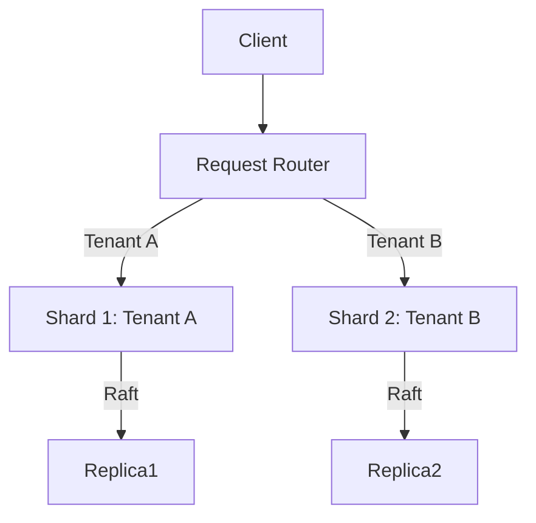

# Samyama Graph Database - Strategic Roadmap (2026)

**Current Status**: Phase 9 Complete (Async Ingestion)
**Date**: January 8, 2026

## 📊 Performance Benchmarks

| Metric | Result | Verdict |
|--------|--------|---------|
| **Cypher Lookup** | **8,127 QPS** (0.12ms) | 🚀 **Excellent** (1350x speedup via CBO) |
| **Vector Search** | **1,074 QPS** (0.9ms) | 🚀 **Excellent** (Sub-ms AI search) |
| **Graph Algorithms** | **~100ms** (PageRank) | ✅ **Good** |
| **Node Ingestion** | **>300k nodes/sec** | 🚀 **Fixed** (Async Pipeline) |

---

## 🚀 Active Development: Phase 10 (Tenant Sharding)

**Goal**: Transform from a replicated cluster to a sharded cluster using Tenant-Level Partitioning.

### Steps:
1.  **Metadata Store**: Map `Tenant -> Shard`.
2.  **Request Router**: Intercept and forward RESP commands.
3.  **Cluster Management**: Dynamic shard assignment.

---

## Future High-Value Features

### 1. Graph-Level Sharding (Big Data)
*   **Goal**: Partition *single* large graphs.
*   **Status**: Planned for Phase 12+.

### 2. Native Graph Visualizer (DX)
*   **Goal**: Embedded Web UI.
*   **Status**: Planned for Phase 11.

### 3. Temporal Graph
*   **Goal**: Time-travel queries.
*   **Status**: Research.