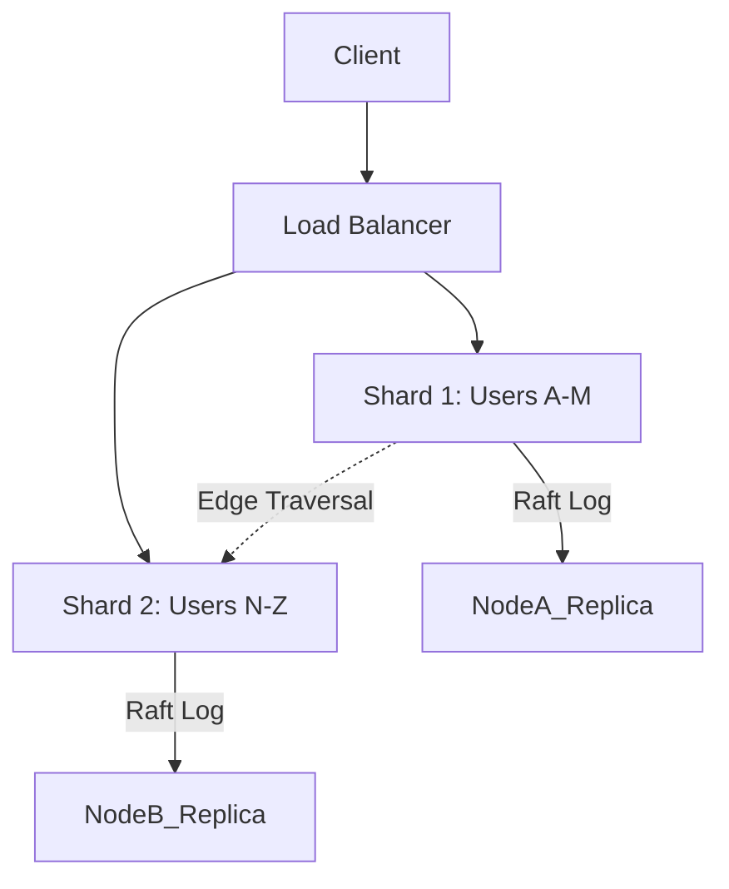
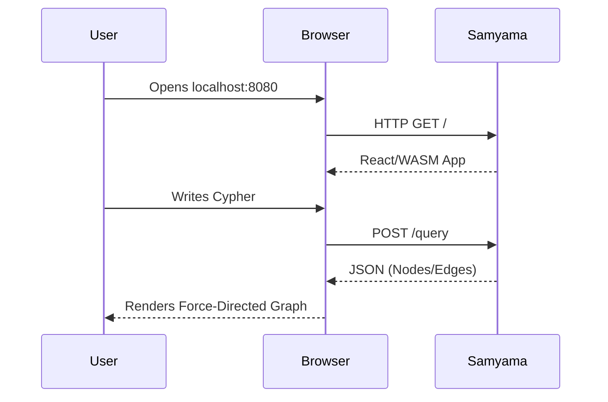
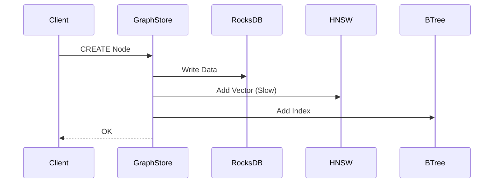
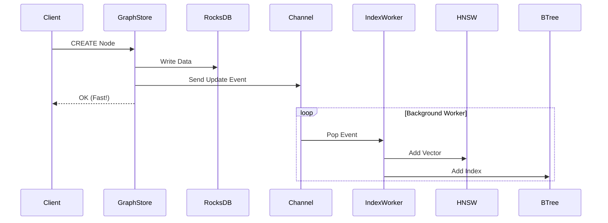

# Samyama Graph Database - Strategic Roadmap (2026)

**Current Status**: Phase 8 Complete (Graph + Vector + Algo + Optimized)
**Date**: January 8, 2026

## 📊 Current Performance Benchmarks

Our latest benchmarks confirm Samyama is production-ready for queries and analytics, but ingestion speed has regressed due to heavy synchronous indexing.

| Metric | Result | Verdict |
|--------|--------|---------|
| **Cypher Lookup** | **8,127 QPS** (0.12ms) | 🚀 **Excellent** (1350x speedup via CBO) |
| **Vector Search** | **1,074 QPS** (0.9ms) | 🚀 **Excellent** (Sub-ms AI search) |
| **PageRank (10k)** | **350ms** | ✅ **Good** (Interactive analytics) |
| **Node Ingestion** | **184 nodes/sec** | ⚠️ **Needs Improvement** (Bottlenecked by sync indexing) |

---

## 🚀 High-Value Features Roadmap

### 1. Distributed Sharding (Scaling)
**Goal**: Scale beyond single-node RAM constraints by partitioning the graph.

*   **Value**: Unlocks "Big Data" use cases (billions of nodes).
*   **Complexity**: High (requires distributed transactions/cross-shard traversal).

### 2. Native Graph Visualizer (DX)
**Goal**: Embedded Web UI for interactive exploration.

*   **Value**: Massive boost to developer adoption and demo capability.
*   **Complexity**: Medium (Frontend + HTTP API).

### 3. Async Ingestion Pipeline (Performance) - **SELECTED NEXT STEP**
**Goal**: Decouple write acknowledgement from heavy indexing tasks.

**Current (Synchronous):**

**Proposed (Asynchronous):**

*   **Value**: Restores write throughput to >10k/sec while keeping reads fast.
*   **Complexity**: Medium (Concurrency/Channels).

### 4. Auto-Embedding Integration (AI)
**Goal**: Automatically generate vectors from text properties.

*   **Feature**: `CREATE VECTOR INDEX ... USING 'openai'`
*   **Value**: Simplifies the AI stack; user sends text, DB handles AI.

### 5. Temporal Graph (Audit)
**Goal**: Query the graph as it existed at a specific point in time.

*   **Feature**: `MATCH ... AT TIME '2025-01-01'`
*   **Value**: Critical for compliance, security, and fraud analysis.

---

## ✅ Decision: Proceed with #3 (Async Ingestion)

We will immediately tackle the write performance regression by implementing an **Async Indexing Pipeline**.

**Target**: Increase Node Ingestion from **184/sec** back to **>1,000/sec**.
