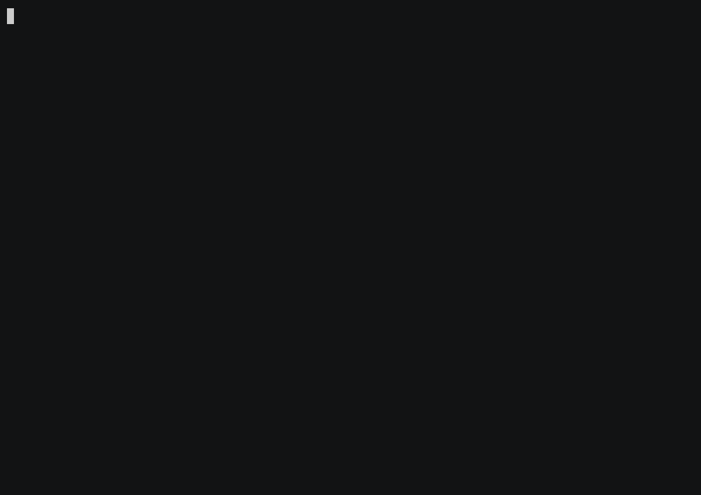
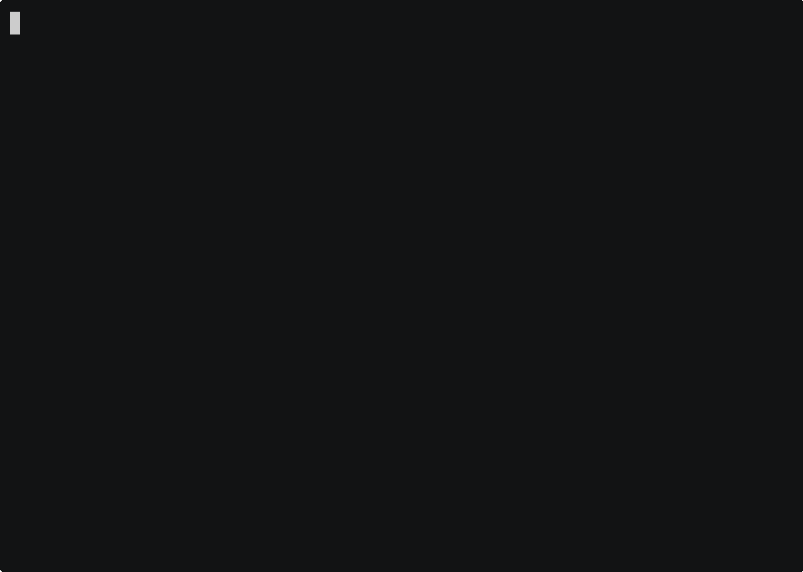

# Case Studies

**Prove Samyama's value on real public knowledge graphs — yourself, in one command.**

Each case study downloads a published `.sgsnap` snapshot of a real-world
knowledge graph, imports it into Samyama, runs a handful of showcase Cypher
queries that a domain **subject-matter expert (SME)** would actually ask, and
renders the session as a narrated GIF. Nothing is staged: if a query would
return an empty table, the build fails before any GIF is recorded (see the
[Definition of Done](DEFINITION_OF_DONE.md)).

This sits alongside [`examples/`](../examples) (hand-built demo graphs) and
[`benches/`](../benches) (performance) as the third leg of *verify it yourself*:
**examples** show the API, **benches** show the speed, **case studies** show the
value on data you can recognize.

## Run one

```bash
# 1. build the server once (from the repo root)
cargo build --release

# 2. install the two Python deps the demos use
pip install rich requests

# 3. run any case study — fetches the snapshot, imports, validates every query
cd case_studies/cricket && ./run.sh

# regenerate the GIF too (needs asciinema + agg installed):
RECORD=1 ./run.sh
```

`run.sh` is idempotent and self-contained: no database to install, no
credentials, no external services. Snapshots are fetched from pinned, hash-
verified release/S3 URLs and cached under `case_studies/.snapshots/`.

> **Want to pause and read at your own speed?** A looping GIF can't be paused in
> a browser, so each demo's `demo.cast` (asciinema recording) is committed too.
> Replay it pausably (press `space`) with: `asciinema play case_studies/<domain>/demo.cast`.

## Catalogue

Every case study below downloads a snapshot small enough to run on a normal
laptop, so anyone can reproduce it.

| Domain | What it shows | Snapshot | Scale | Demo |
|--------|---------------|----------|-------|------|
| [cricket](cricket) | Ball-by-ball sport analytics — dismissal-rivalry networks, venue specialists | `cricket.sgsnap` (21 MB) | 37K nodes / 1.4M edges |  |
| [drug-interactions](drug-interactions) | Polypharmacy risk, CYP-enzyme hubs, side-effect burden | `druginteractions.sgsnap` (8 MB) | 245K / 388K |  |
| [surveillance](surveillance) | WHO outbreak burden & immunization gaps (cross-KG by country) | `surveillance.sgsnap` (6 MB) | 217K / 241K |  |
| [health-determinants](health-determinants) | Air, water, poverty — the upstream "why" of health (cross-KG) | `health-determinants.sgsnap` (5 MB) | 240K / 240K |  |
| [health-systems](health-systems) | WHO emergency-preparedness (SPAR) scores (cross-KG) | `health-systems.sgsnap` (0.2 MB) | 8.7K / 8.4K |  |
| [pathways](pathways) | Systems-biology protein hubs (TP53), pathway crosstalk | `pathways.sgsnap` (9 MB) | 119K / 835K |  |
| [dbms-research](dbms-research) | **Vector search** over 1000+ open DBMS research problems | `dbms-research.sgsnap` (13 MB) | 19K nodes · 2 HNSW indices |  |
| [bank-model-risk](bank-model-risk) | **Model governance** — lineage / blast-radius, regulatory coverage, open findings, explainability (*synthetic*) | `bank-model-risk.sgsnap` (28 KB) | 520 / 2.4K |  |

*(Snapshots are GitHub release assets on
[`samyama-ai/samyama-graph`](https://github.com/samyama-ai/samyama-graph/releases)
— tags `kg-snapshots-v1…v7` — with sha256 pinned in each `case.env`.)*

**Deferred (follow-up waves):** clinical-trials (`clinical-trials.sgsnap`, 712 MB /
7.8M nodes — needs ~30 GB RAM, too heavy for the "anyone can run it" bar); the
powergrid / telecom infrastructure demos (data is loader-built, not yet published
as public snapshots — see `docs/demos/`).

## How a case study is built

```
case_studies/
  README.md               # this file
  DEFINITION_OF_DONE.md   # the bar every case study must clear
  _lib/                   # shared machinery (no per-domain logic)
    fetch_snapshot.sh     # download + sha256-verify a snapshot (cached)
    run_case_study.sh     # build→fetch→serve→import→validate→(record) engine
    samyama_http.py       # tiny HTTP client + queries.cypher parser
    demo_lib.py           # rich-Console narration helpers
    validate_queries.py   # DoD gate: every query must return ≥1 row
    record_gif.sh         # asciinema → agg
  <domain>/
    case.env queries.cypher demo.py run.sh README.md demo.gif
```

To add a domain, copy an existing `<domain>/` folder, point `case.env` at the
snapshot, write the showcase queries in `queries.cypher`, and run
`RECORD=1 ./run.sh` until the DoD gate passes and the GIF reads well. See
[DEFINITION_OF_DONE.md](DEFINITION_OF_DONE.md).
