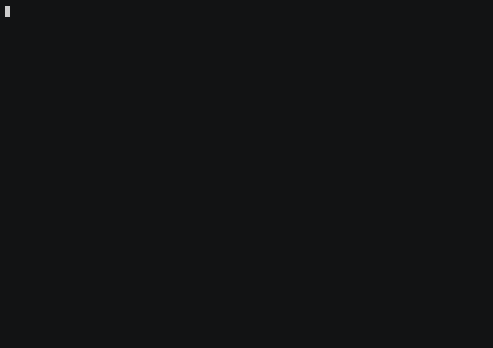

# Health Systems KG — Case Study

Emergency preparedness, country by country: WHO SPAR (IHR core-capacity) scores
that say how ready each nation is for a health emergency. The third panel of the
public-health trifecta — joins to [surveillance](../surveillance) (what's
happening) and [health-determinants](../health-determinants) (why) by ISO code.



```bash
cd case_studies/health-systems && ./run.sh        # validate every query
RECORD=1 ./run.sh                                  # also regenerate demo.gif
```

## The graph

**Scale:** 8,663 nodes · 8,430 edges (from a 0.2 MB snapshot — runs in a blink)

| Node label | Count | Key properties |
|------------|-------|----------------|
| EmergencyResponse | 8,430 | capacity_code, capacity_name, country_code, score, year |
| Country | 233 | iso_code, name |

**Relationships:** `CAPACITY_FOR` (8,430) — each preparedness assessment links a
capacity score to the country it scores.

## Showcase queries

See [`queries.cypher`](queries.cypher): least-prepared countries (lowest average
SPAR score) → best-prepared → global preparedness trend over time → most
comprehensively assessed countries. Every query returns real rows (DoD-gated).

Cross-reference: a country that is **under-prepared here** *and* shows a **weak
outbreak signal in [surveillance](../surveillance)** *and* **poor determinants in
[health-determinants](../health-determinants)** is a triple-risk nation — one
join key (`Country.iso_code`) across three graphs.

## Question catalog

[`health-systems.sgqueries`](./health-systems.sgqueries) holds 33 questions (easy to hard, three unanswerable), built with `catalog-build --release` against the pinned snapshot
(#1154). [`questions.json`](questions.json) is its source. Every entry is checked
weekly against the published snapshot by
[`kg-catalogs.yml`](../../.github/workflows/kg-catalogs.yml).

```bash
samyama queries list case_studies/health-systems/health-systems.sgqueries
samyama queries run  case_studies/health-systems/health-systems.sgqueries --snapshot health-systems.sgsnap \
    --entry <id> [--param name=value]...
samyama verify health-systems.sgsnap --queries case_studies/health-systems/health-systems.sgqueries
```

A template runs with bound values only, held to its declared types and enums
and to ten times the work its sample did (#1156).

**Data caveat the catalog surfaces** (#1609). Every C1 (Policy) assessment carries
no `year`, and its `score` holds the assessment year (2021-2023) instead of a
score — a column shift in the load. Score questions therefore filter on a
year, which excludes C1; `hs_policy_rows_have_no_year` counts the affected
rows so a corrected snapshot shows up as a changed answer. The averages in
`queries.cypher` above still include C1 and are inflated by it.

## Data & license

Source: [WHO SPAR](https://extranet.who.int/e-spar) (IHR State Party
Self-Assessment) + WHO NHWA. Snapshot `health-systems.sgsnap` on release
[`kg-snapshots-v6`](https://github.com/samyama-ai/samyama-graph/releases/tag/kg-snapshots-v6)
(sha256 pinned in [`case.env`](case.env)).
