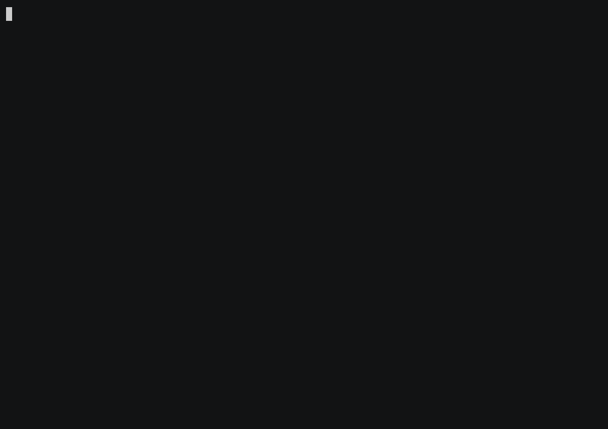

# Biological Pathways KG — Case Study

Proteins, complexes, reactions, pathways and Gene Ontology terms from Reactome,
STRING, GO and UniProt. Systems-biology questions — protein hubs, pleiotropy,
pathway crosstalk — become graph traversals over a 835K-edge interaction network.



```bash
cd case_studies/pathways && ./run.sh        # validate every query
RECORD=1 ./run.sh                           # also regenerate demo.gif
```

## The graph

**Scale:** 118,686 nodes · 834,785 edges (from a 9 MB snapshot)

| Node label | Count | Key properties |
|------------|-------|----------------|
| GOTerm | 51,897 | go_id, name, namespace |
| Protein | 37,990 | uniprot_id, name |
| Complex | 15,963 | name, complex_id |
| Reaction | 9,988 | reaction_id, reaction_type |
| Pathway | 2,848 | name, pathway_id, organism |

**Relationships:** `ANNOTATED_WITH` (265K), `INTERACTS_WITH` (228K, with
`combined_score`), `PARTICIPATES_IN` (140K), `CATALYZES` (121K), `IS_A` (59K),
`COMPONENT_OF`, `PART_OF`, `REGULATES`, `CHILD_OF`.

## Showcase queries

See [`queries.cypher`](queries.cypher): most-connected protein hubs (degree
centrality — master regulators surface) → most pleiotropic proteins → largest
pathways → **pathway crosstalk** (pathway pairs sharing the most proteins, a
two-hop join across 140K participations) → most heavily GO-annotated proteins.
Every query returns real rows (DoD-gated).

## Data & license

Sources: [Reactome](https://reactome.org) (CC0), [STRING](https://string-db.org)
(CC BY 4.0), [Gene Ontology](http://geneontology.org) (CC BY 4.0),
[UniProt](https://www.uniprot.org) (CC BY 4.0). Snapshot `pathways.sgsnap` on
release
[`kg-snapshots-v3`](https://github.com/samyama-ai/samyama-graph/releases/tag/kg-snapshots-v3)
(sha256 pinned in [`case.env`](case.env)). Built by the
[`pathways-kg`](https://github.com/samyama-ai/pathways-kg) loader.
