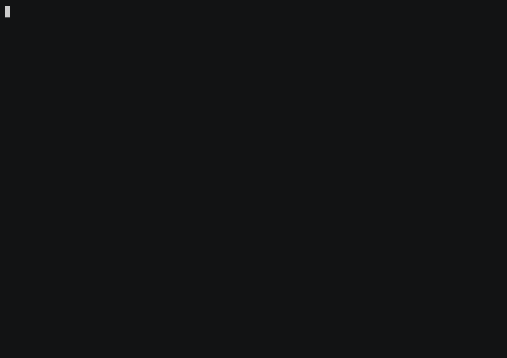

# Disease Surveillance KG (WHO GHO) — Case Study

WHO Global Health Observatory outbreak reports and immunization coverage, country
by country. The graph answers public-health questions — disease burden, immunity
gaps, regional structure — and joins cleanly to the health-systems and
health-determinants graphs via ISO country code.



```bash
cd case_studies/surveillance && ./run.sh        # validate every query
RECORD=1 ./run.sh                               # also regenerate demo.gif
```

## The graph

**Scale:** 216,553 nodes · 241,084 edges (from a 6 MB snapshot)

| Node label | Count | Key properties |
|------------|-------|----------------|
| HealthIndicator | 163,950 | name, value, year, indicator_code |
| DiseaseReport | 42,136 | year, value |
| VaccineCoverage | 10,212 | antigen, coverage_pct, year |
| Country | 234 | name, iso_code |
| Disease | 15 | name, indicator_code |
| Region | 6 | name, who_code |

**Relationships:** `HAS_INDICATOR` (149K), `REPORT_OF` (42K), `REPORTED` (40K),
`HAS_COVERAGE` (9.7K), `IN_REGION`.

## Showcase queries

See [`queries.cypher`](queries.cypher): which diseases are under surveillance →
highest reported burden (summed case counts) → most-reporting countries → lowest
average immunization coverage (the immunity gaps) → WHO regional structure. Every
query returns real rows (DoD-gated).

The `Country.iso_code` property is the **federation key**: the same node identity
lets you join this graph to health-systems (workforce, preparedness) and
health-determinants (pollution, water) — cross-domain public-health analysis
without a single hand-written join key.

## Question catalog

[`surveillance.sgqueries`](./surveillance.sgqueries) holds 34 questions (easy to hard, three unanswerable), built with `catalog-build --release` against the pinned snapshot
(#1154). [`questions.json`](questions.json) is its source. Every entry is checked
weekly against the published snapshot by
[`kg-catalogs.yml`](../../.github/workflows/kg-catalogs.yml).

```bash
samyama queries list case_studies/surveillance/surveillance.sgqueries
samyama queries run  case_studies/surveillance/surveillance.sgqueries --snapshot surveillance.sgsnap \
    --entry <id> [--param name=value]...
samyama verify surveillance.sgsnap --queries case_studies/surveillance/surveillance.sgqueries
```

A template runs with bound values only, held to its declared types and enums
and to ten times the work its sample did (#1156).

**Data caveats the catalog surfaces** (#1609). Four of the fifteen disease
indicators (both malaria series, leprosy, yaws) have no reports
(`sv_silent_diseases`); 64 countries have no WHO region (`sv_unregioned`);
2,323 reports name no country (`sv_unattributed_reports`). Health indicators
carry several values per country and year with no breakdown recorded, so the
catalog asks for ranges and extremes rather than a single value.

## Data & license

Source: [WHO Global Health Observatory](https://www.who.int/data/gho). Snapshot
`surveillance.sgsnap` on release
[`kg-snapshots-v4`](https://github.com/samyama-ai/samyama-graph/releases/tag/kg-snapshots-v4)
(sha256 pinned in [`case.env`](case.env)). Built by the
[`surveillance-kg`](https://github.com/samyama-ai/surveillance-kg) loader.
