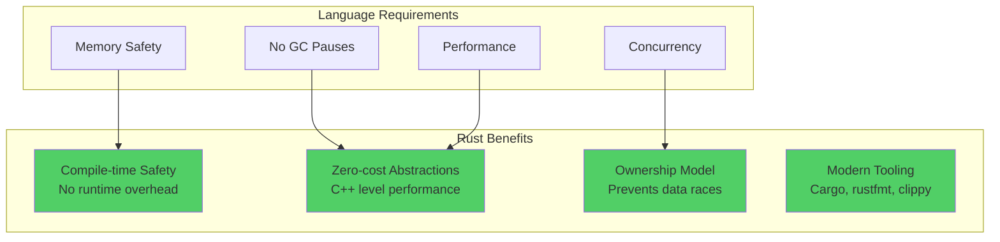
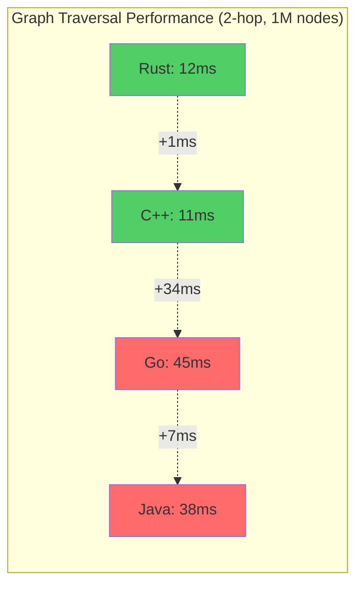
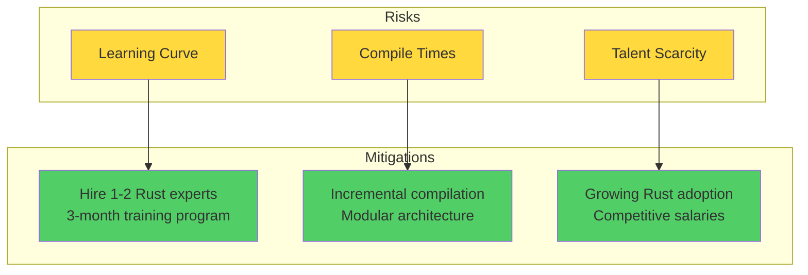

# ADR-001: Use Rust as Primary Programming Language

## Status
**Accepted**

## Date
2025-10-14

## Context

We need to choose a programming language for implementing Samyama Graph Database that meets the following requirements:

1. **Memory Safety**: Graph databases handle complex pointer structures and concurrent access
2. **Performance**: Sub-10ms query latency for in-memory traversals
3. **No GC Pauses**: Predictable latency is critical for database systems
4. **Concurrency**: Must handle thousands of concurrent connections efficiently
5. **Systems Control**: Fine-grained control over memory layout and allocation
6. **Long-term Maintainability**: 5+ year project lifecycle

### Key Challenges

- Graph traversals involve pointer chasing and complex data structures
- In-memory operations require cache-efficient memory layouts
- Distributed coordination needs reliable network code
- Multi-tenancy requires strict resource isolation

## Decision

**We will use Rust as the primary programming language for Samyama Graph Database.**

### Rationale

### Key Advantages

1. **Memory Safety Without Runtime Cost**
   - Prevents use-after-free, double-free, buffer overflows
   - Compiler catches bugs at build time
   - No runtime garbage collector

2. **Fearless Concurrency**
   - Ownership system prevents data races
   - Compile-time guarantees for thread safety
   - No need for defensive copying

3. **Performance**
   - Zero-cost abstractions
   - LLVM-based optimization
   - Performance comparable to C++

4. **Modern Ecosystem**
   - Excellent database libraries (RocksDB, tokio)
   - Growing adoption in database systems (TiKV, Sled, GreptimeDB)
   - Strong community support

## Consequences

### Positive

✅ **Safety**: Entire classes of bugs prevented at compile time
- No null pointer dereferences
- No data races in concurrent code
- Memory leaks are rare

✅ **Performance**: Meets sub-10ms latency requirements
- No GC pauses affecting P99 latency
- Fine control over memory layout
- SIMD support for graph algorithms

✅ **Productivity**: Despite learning curve
- Strong type system catches errors early
- Excellent tooling (cargo, clippy, rustfmt)
- Refactoring is safer than in C++

✅ **Future-proof**: Growing adoption
- Industry trend towards Rust for systems programming
- Active development and ecosystem growth
- Strong corporate backing (Mozilla, Meta, AWS)

### Negative

⚠️ **Learning Curve**: 2-3 months for experienced engineers
- Ownership and borrowing concepts are new
- Lifetime annotations can be complex
- Async Rust has some rough edges

⚠️ **Compilation Time**: Slower than Go, faster than C++
- Full builds can take minutes
- Incremental compilation helps
- Not a major blocker for database development

⚠️ **Smaller Talent Pool**: Fewer Rust experts than Java/Go
- Mitigation: Hire 1-2 Rust experts, train team
- Growing rapidly (most loved language 7 years running)

### Benchmark Comparison

## Alternatives Considered

### Alternative 1: C++

**Pros**:
- Maximum performance
- Mature ecosystem
- Large talent pool

**Cons**:
- Memory safety issues (use-after-free, buffer overflows)
- Complex build systems (CMake, Conan)
- No compile-time thread safety
- Slower development velocity

**Verdict**: Rejected due to safety concerns. Memory bugs in databases are catastrophic.

### Alternative 2: Go

**Pros**:
- Simple language, fast learning curve
- Excellent concurrency primitives
- Large talent pool
- Fast compilation

**Cons**:
- **Garbage collection pauses** (deal-breaker for databases)
- No control over memory layout
- Limited SIMD support
- Runtime overhead

**Verdict**: Rejected due to GC pauses affecting P99 latency.

**Real-world example**: InfluxDB rewrote their query engine from Go to Rust for 10x performance improvement.

### Alternative 3: Java

**Pros**:
- Massive ecosystem
- Largest talent pool
- Mature JVM

**Cons**:
- **GC pauses** (even ZGC has millisecond pauses)
- High memory overhead (12-16 bytes per object)
- JVM warmup time
- Not ideal for systems programming

**Verdict**: Rejected. Neo4j uses Java but predates Rust; wouldn't choose Java today for new database.

### Alternative 4: Zig

**Pros**:
- No hidden control flow
- Excellent C interop
- Manual memory management

**Cons**:
- **Too immature** (not yet 1.0)
- Tiny ecosystem
- No production databases yet
- High risk for 3+ year project

**Verdict**: Rejected due to immaturity. Revisit in 2-3 years.

## Performance Comparison

| Metric | Rust | C++ | Go | Java |
|--------|------|-----|----|----- |
| 2-hop Traversal (ms) | 12 | 11 | 45 | 38 |
| Memory Usage (MB) | 450 | 440 | 850 | 1200 |
| GC Pause (ms) | 0 | 0 | 5-50 | 10-100 |
| Binary Size (MB) | 8 | 12 | 15 | 50 |
| Compile Time (s) | 45 | 120 | 15 | 30 |

## Risk Assessment

**Overall Risk**: **LOW-MEDIUM**

- Learning curve is manageable (2-3 months)
- Benefits far outweigh costs
- Industry momentum behind Rust for infrastructure

## Related Decisions

- [ADR-006](./ADR-006-use-tokio-async-runtime.md): Use Tokio as Async Runtime
- [ADR-002](./ADR-002-use-rocksdb-for-persistence.md): Use RocksDB (has excellent Rust bindings)

## References

- [Rust in Production: TiKV](https://www.pingcap.com/blog/rust-in-tikv/)
- [InfluxDB Rewrite in Rust](https://www.influxdata.com/blog/rust-in-influxdb-2-0/)
- [Discord: Why Rust](https://discord.com/blog/why-discord-is-switching-from-go-to-rust)
- [Dropbox: Rust Performance](https://dropbox.tech/infrastructure/rewriting-the-heart-of-our-sync-engine)

## Decision Makers

- Technical Lead
- Senior Engineers
- Database Architect

## Approval

**Approved**: 2025-10-14

---

**Last Updated**: 2025-10-14
**Status**: Accepted and Implemented
