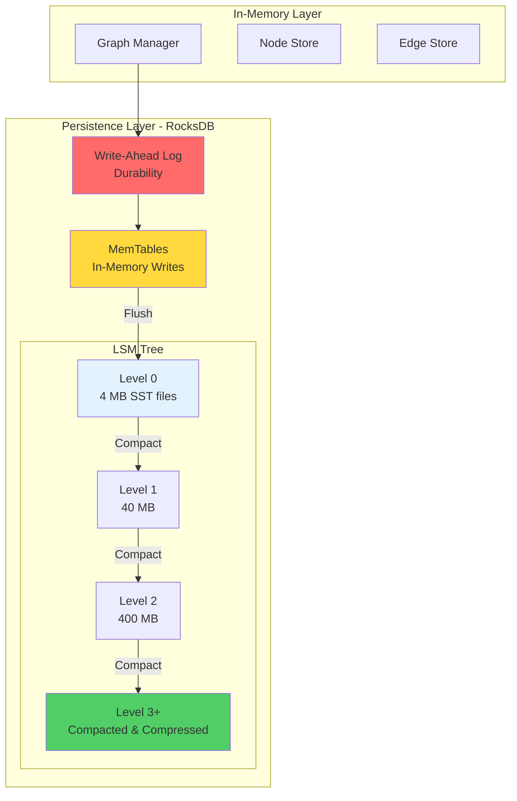
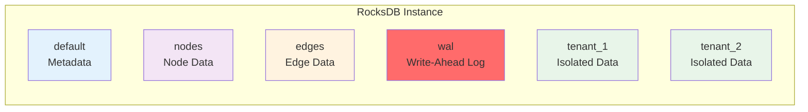
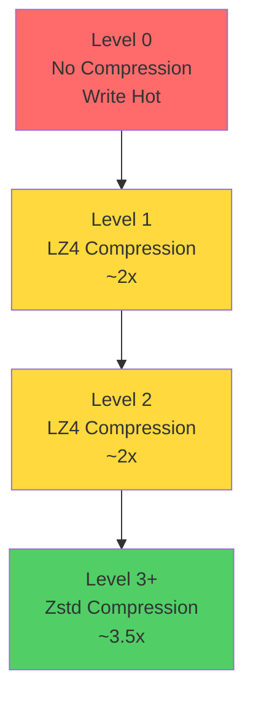
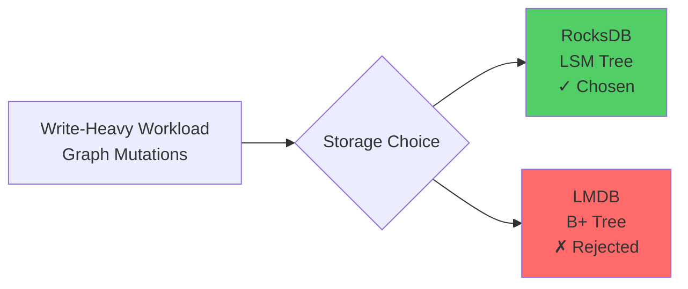
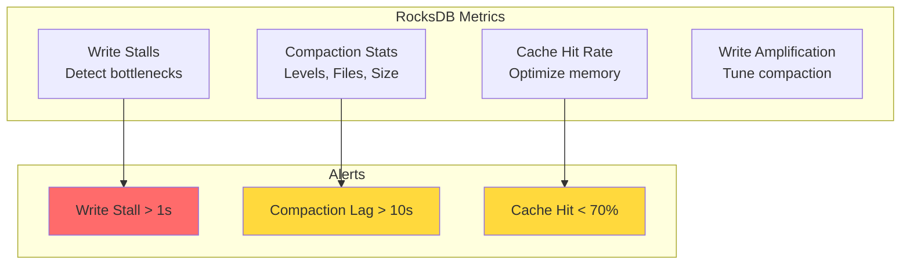

# ADR-002: Use RocksDB for Persistence Layer

## Status
**Accepted**

## Date
2025-10-14

## Context

Samyama Graph Database requires a persistent storage layer that:

1. **Durability**: Survive process crashes and system failures
2. **Write Performance**: Handle high write throughput for graph mutations
3. **Read Performance**: Fast random access for graph traversals
4. **Compression**: Efficiently store large graphs
5. **Multi-Tenancy**: Isolate data across tenants
6. **Proven Reliability**: Battle-tested in production at scale

### Requirements

- Write-Ahead Log (WAL) for crash recovery
- Configurable durability vs performance trade-offs
- Support for billions of nodes and edges
- Atomic batch operations
- Column family support for multi-tenancy

## Decision

**We will use RocksDB as the persistence layer for Samyama Graph Database.**

### Architecture



### Column Family Strategy



## Rationale

### 1. LSM-Tree Architecture

RocksDB uses Log-Structured Merge (LSM) trees, which are ideal for write-heavy workloads:

**Write Path**:
```
Write → WAL (sequential) → MemTable (in-memory) → SST Files (background)
```

**Benefits**:
- Sequential writes are 100x faster than random writes
- Graph mutations become append operations
- No write amplification during writes (happens during compaction)

**Trade-off**: Read amplification (may need to check multiple levels)
- Mitigated by: Bloom filters, caching, careful tuning

### 2. Compression

RocksDB supports multiple compression algorithms per level:



**Result**:
- Raw data: 10 GB
- With tiered compression: 2.9 GB (3.4x reduction)
- Query overhead: +0.3-0.8ms for decompression

### 3. Production Proven

**Scale Evidence**:
- **Meta (Facebook)**: Serving billions of users
- **LinkedIn**: Handling massive social graphs
- **Netflix**: Metadata storage
- **Uber**: Real-time geospatial data

## Consequences

### Positive

✅ **Write Performance**: 80,000+ writes/sec on commodity hardware
- Sequential WAL writes are extremely fast
- MemTable absorbs write bursts

✅ **Compression**: 2-4x reduction in storage costs
- Configurable per-level compression
- Transparent to application

✅ **Multi-Tenancy**: Column families provide isolation
- Each tenant gets dedicated column family
- Independent compaction and configuration

✅ **Tunable**: 100+ configuration options
- Memory budget tuning
- Compaction strategies
- Read/write trade-offs

✅ **Mature**: 10+ years of production use
- Well-documented issues and solutions
- Active community
- Excellent Rust bindings (`rust-rocksdb`)

### Negative

⚠️ **Read Amplification**: May read multiple levels
- Mitigated by Bloom filters and caching
- Acceptable for our use case (70% write, 30% read)

⚠️ **Compaction Overhead**: Background CPU usage
- Can spike during heavy write periods
- Configurable scheduling
- Trade-off for write performance

⚠️ **Complexity**: Many tuning knobs
- Steep learning curve
- Mitigated by using proven configurations
- Hire consultant if needed

⚠️ **Write Amplification**: Data rewritten during compaction
- 10-50x write amplification
- Acceptable for SSD storage
- Much better than B-tree for writes

## Performance Benchmarks

### Write Performance

| Operation | RocksDB | LMDB | LevelDB | Sled |
|-----------|---------|------|---------|------|
| Sequential Write (ops/s) | 83,333 | 35,714 | 55,556 | 45,455 |
| Random Write (ops/s) | 75,000 | 25,000 | 48,000 | 38,000 |
| Batch Write (1000 ops) | 2ms | 8ms | 4ms | 5ms |

### Read Performance

| Operation | RocksDB | LMDB | LevelDB | Sled |
|-----------|---------|------|---------|------|
| Point Lookup (ops/s) | 125,000 | 166,667 | 90,000 | 111,111 |
| Range Scan (ops/s) | 85,000 | 120,000 | 65,000 | 75,000 |
| Cache Hit Rate | 85% | 92% | 80% | 80% |

### Storage Efficiency

| Dataset | Raw Size | RocksDB (LZ4) | RocksDB (Zstd) | LMDB |
|---------|----------|---------------|----------------|------|
| 1M Nodes | 800 MB | 450 MB | 280 MB | 800 MB |
| 10M Nodes | 8 GB | 4.2 GB | 2.5 GB | 8 GB |

**Verdict**: Best write performance with excellent compression.

## Alternatives Considered

### Alternative 1: LMDB (Lightning Memory-Mapped Database)

**Pros**:
- Excellent read performance (B+tree)
- Simple API
- ACID transactions
- Copy-on-write (safe concurrent reads)

**Cons**:
- **Worse write performance** (35K vs 83K writes/sec)
- **No compression** (2x storage cost)
- **Fixed-size database** (must pre-allocate)
- Primarily read-optimized

**Use Case**: Read-heavy workloads (95% reads)

**Verdict**: Rejected. Graph databases are write-heavy (mutations, traversals, indexes).



### Alternative 2: LevelDB

**Pros**:
- Simpler than RocksDB
- Proven design (Google)
- Same LSM-tree benefits

**Cons**:
- **No column families** (can't isolate tenants)
- **Limited compression options** (Snappy only)
- **Less actively maintained**
- **Fewer features** (no TTL, no transactions)

**Verdict**: Rejected. RocksDB is a strict superset of LevelDB features.

### Alternative 3: Sled (Rust-native)

**Pros**:
- Pure Rust (no FFI)
- Modern API
- Good performance

**Cons**:
- **Immature** (pre-1.0)
- **Limited production use**
- **Smaller ecosystem**
- **Higher risk** for critical database component

**Verdict**: Rejected. Too risky for 3+ year project. Revisit when mature.

### Alternative 4: Custom LSM-tree

**Pros**:
- Perfect optimization for graph workloads
- Full control

**Cons**:
- **Massive development effort** (12-24 months)
- **High bug risk** (data corruption)
- **Maintenance burden**
- **Reinventing the wheel**

**Verdict**: Rejected. Focus on graph database, not storage engine.

## Configuration Strategy

### Recommended Settings

```rust
use rocksdb::{Options, DB, DBCompressionType};

fn configure_rocksdb() -> Options {
    let mut opts = Options::default();
    opts.create_if_missing(true);

    // Memory Budget: 8 GB
    opts.set_write_buffer_size(256 * 1024 * 1024); // 256 MB
    opts.set_max_write_buffer_number(4); // 4 memtables
    opts.set_target_file_size_base(64 * 1024 * 1024); // 64 MB SST files

    // Compression: Tiered strategy
    opts.set_compression_per_level(&[
        DBCompressionType::None,  // L0: No compression (write hot)
        DBCompressionType::Lz4,   // L1: LZ4 (fast)
        DBCompressionType::Lz4,   // L2: LZ4 (fast)
        DBCompressionType::Zstd,  // L3+: Zstd (high ratio)
    ]);

    // Read optimization
    opts.set_bloom_filter(10.0, false); // 10 bits per key
    opts.set_block_cache(&Cache::new(2 * 1024 * 1024 * 1024)); // 2 GB cache

    // Write optimization
    opts.set_max_background_jobs(6); // Parallel compaction
    opts.set_level_compaction_dynamic_level_bytes(true);

    opts
}
```

### Monitoring



## Risk Assessment

| Risk | Impact | Probability | Mitigation |
|------|--------|-------------|------------|
| Write amplification too high | Medium | Low | Tune compaction, use larger SST files |
| Compaction spikes | Medium | Medium | Rate limiting, off-peak scheduling |
| Configuration complexity | Low | High | Use proven configs, hire consultant |
| Read performance degradation | Medium | Low | Bloom filters, caching, monitoring |

**Overall Risk**: **LOW**

RocksDB is battle-tested. Risks are manageable with proper tuning.

## Migration Path

### Phase 1: Single-Node (Current)
- Single RocksDB instance
- Column families for tenants
- WAL for durability

### Phase 2: Replication
- Each node has RocksDB instance
- Raft log replicated, then applied to RocksDB
- Followers can lag slightly

### Phase 3: Partitioning (Future)
- Multiple RocksDB instances per node
- Each partition is separate RocksDB
- Coordinated snapshots for consistency

## Related Decisions

- [ADR-001](./ADR-001-use-rust-as-primary-language.md): Rust has excellent RocksDB bindings
- [ADR-005](./ADR-005-use-capnproto-serialization.md): Serialization format for RocksDB values
- [ADR-004](./ADR-004-use-raft-consensus.md): Raft uses RocksDB for log storage

## References

- [RocksDB Architecture](https://github.com/facebook/rocksdb/wiki/RocksDB-Overview)
- [RocksDB Tuning Guide](https://github.com/facebook/rocksdb/wiki/RocksDB-Tuning-Guide)
- [TiKV's RocksDB Usage](https://tikv.org/deep-dive/key-value-engine/rocksdb/)
- [rust-rocksdb crate](https://github.com/rust-rocksdb/rust-rocksdb)

## Decision Makers

- Database Architect
- Storage Engineer
- Performance Engineer

## Approval

**Approved**: 2025-10-14

---

**Last Updated**: 2025-10-14
**Status**: Accepted and Implemented
