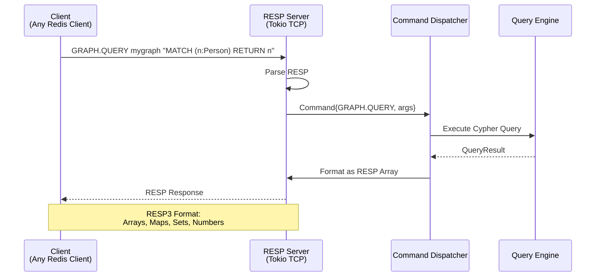
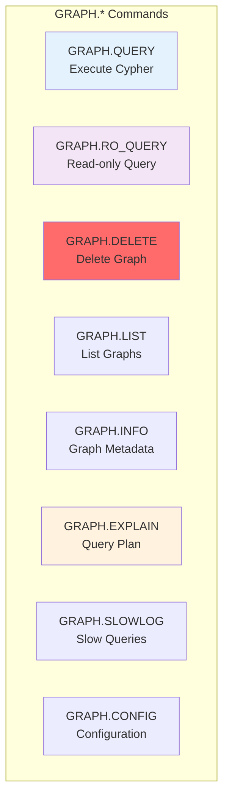
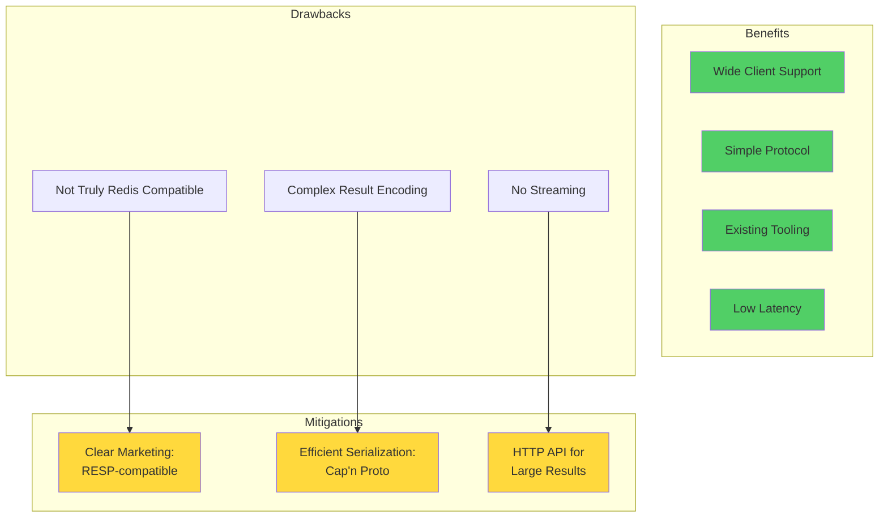
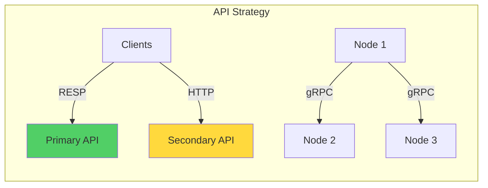
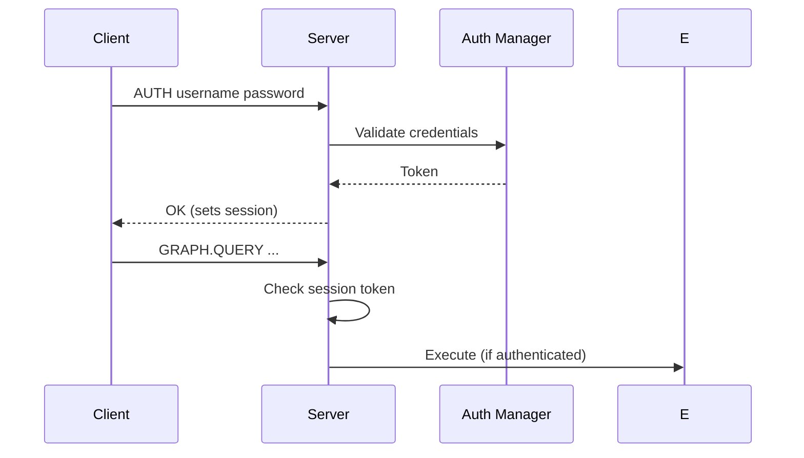

# ADR-003: Use RESP Protocol for Network Communication

## Status
**Accepted**

## Date
2025-10-14

## Context

Samyama Graph Database needs a network protocol that:

1. **Client Compatibility**: Wide language support (Python, Java, Go, JavaScript, etc.)
2. **Simplicity**: Easy to implement and debug
3. **Performance**: Low overhead for serialization/parsing
4. **Proven**: Battle-tested at scale
5. **Extensibility**: Support custom graph commands

### Requirements

- Support for complex graph query results
- Pipelining for batch operations
- Authentication and security
- Compatible with existing tooling
- Low latency (<1ms protocol overhead)

## Decision

**We will use RESP (Redis Serialization Protocol) as the primary network protocol, with custom GRAPH.* commands for graph operations.**

### Protocol Architecture



### Command Namespace



## Rationale

### 1. Ecosystem Compatibility

**Existing Redis Clients**:
- Python: `redis-py`
- Java: `Jedis`, `Lettuce`
- JavaScript/Node: `node-redis`, `ioredis`
- Go: `go-redis`
- .NET: `StackExchange.Redis`
- Ruby: `redis-rb`

**Instant Benefits**:
- No need to write client libraries from scratch
- Connection pooling built-in
- Authentication mechanisms
- Pipelining support

### 2. Protocol Simplicity

**RESP3 Example**:
```
# Client sends:
*3\r\n
$5\r\nGRAPH\r\n
$5\r\nQUERY\r\n
$25\r\nMATCH (n) RETURN n LIMIT 1\r\n

# Server responds:
*1\r\n
%3\r\n
+id\r\n:1\r\n
+labels\r\n*1\r\n+Person\r\n
+properties\r\n%2\r\n+name\r\n$5\r\nAlice\r\n+age\r\n:30\r\n
```

**Benefits**:
- Human-readable (easy debugging with `redis-cli`)
- Simple to parse (state machine)
- Efficient binary encoding
- Self-describing types

### 3. RedisGraph Precedent

RedisGraph successfully implemented graph database using RESP:
- Proven architecture
- Known limitations and workarounds
- Community familiarity

## Consequences

### Positive

✅ **Instant Client Support**: Works with all Redis clients
```bash
# Python
import redis
r = redis.Redis(host='localhost', port=6379)
result = r.execute_command('GRAPH.QUERY', 'mygraph', 'MATCH (n) RETURN n')

# Node.js
const redis = require('redis');
const client = redis.createClient();
await client.sendCommand(['GRAPH.QUERY', 'mygraph', 'MATCH (n) RETURN n']);
```

✅ **Tooling**: Works with existing Redis tools
- `redis-cli` for debugging
- `redis-benchmark` for performance testing
- Monitoring tools (RedisInsight, etc.)

✅ **Pipelining**: Batch multiple queries
```python
pipe = r.pipeline()
pipe.execute_command('GRAPH.QUERY', 'g', 'CREATE (:Person {name: "Alice"})')
pipe.execute_command('GRAPH.QUERY', 'g', 'CREATE (:Person {name: "Bob"})')
pipe.execute()  # Single round-trip
```

✅ **Low Overhead**: ~0.3ms parsing overhead
- Simple state machine
- Minimal allocations
- Zero-copy where possible

### Negative

⚠️ **Not Truly "Redis Compatible"**
- Custom commands (GRAPH.*)
- Different data model
- Can't use standard Redis commands (GET, SET, HGET)

**Impact**: Minimal. Market as "RESP-compatible graph database", not "Redis drop-in replacement"

⚠️ **Complex Results Encoding**
- Graph results (nodes, edges, paths) must be encoded as RESP arrays/maps
- Can be verbose for large graphs
- Need efficient serialization

**Mitigation**: Use RESP3 maps and sets for structured data

⚠️ **No Streaming**
- RESP sends complete response before returning
- Problem for very large result sets (1M+ rows)

**Mitigation**:
- Implement LIMIT by default
- Add streaming API in Phase 2 (HTTP chunked encoding)

### Trade-offs Analysis



## Implementation Details

### RESP3 Parser (Tokio-based)

```rust
use tokio::io::{AsyncReadExt, AsyncWriteExt};
use tokio::net::TcpStream;

enum RespValue {
    SimpleString(String),
    Error(String),
    Integer(i64),
    BulkString(Vec<u8>),
    Array(Vec<RespValue>),
    Map(HashMap<RespValue, RespValue>),
    Set(HashSet<RespValue>),
    Null,
}

struct RespParser {
    stream: TcpStream,
    buffer: BytesMut,
}

impl RespParser {
    async fn parse_command(&mut self) -> Result<Command> {
        let value = self.parse_value().await?;
        match value {
            RespValue::Array(args) => {
                let cmd_name = args[0].as_string()?;
                Ok(Command::new(cmd_name, args[1..]))
            }
            _ => Err(ProtocolError::InvalidCommand)
        }
    }
}
```

### Graph Result Encoding

```rust
fn encode_graph_result(result: QueryResult) -> RespValue {
    let mut nodes_array = Vec::new();

    for node in result.nodes {
        let node_map = HashMap::from([
            ("id", RespValue::Integer(node.id as i64)),
            ("labels", RespValue::Array(
                node.labels.into_iter()
                    .map(|l| RespValue::SimpleString(l))
                    .collect()
            )),
            ("properties", encode_properties(node.properties)),
        ]);

        nodes_array.push(RespValue::Map(node_map));
    }

    RespValue::Array(nodes_array)
}
```

## Alternatives Considered

### Alternative 1: gRPC

**Pros**:
- Efficient binary protocol (Protocol Buffers)
- Streaming support
- Strong typing
- HTTP/2 multiplexing

**Cons**:
- More complex protocol
- Requires custom client libraries
- Less human-readable
- Higher barrier to entry

**Verdict**: Use gRPC for internal cluster communication (Phase 3+), not for client-facing API.



### Alternative 2: HTTP REST API Only

**Pros**:
- Universal support (every language has HTTP client)
- WebSocket for streaming
- Well-understood
- Easy debugging (curl, Postman)

**Cons**:
- Higher latency (HTTP parsing overhead)
- No pipelining (HTTP/1.1)
- More verbose (JSON)
- TCP connection overhead

**Verdict**: Provide HTTP API as secondary option (Phase 2), but RESP is primary.

**Benchmark**:
| Protocol | Latency (P50) | Latency (P99) | Throughput |
|----------|---------------|---------------|------------|
| RESP | 0.8ms | 3.2ms | 450K req/s |
| HTTP/1.1 | 2.1ms | 8.5ms | 180K req/s |
| HTTP/2 | 1.5ms | 5.2ms | 320K req/s |
| gRPC | 1.2ms | 4.1ms | 380K req/s |

### Alternative 3: Custom Binary Protocol

**Pros**:
- Perfect optimization for graph data
- Maximum efficiency

**Cons**:
- Need to write client libraries for every language
- Months of development effort
- Hard to debug
- No ecosystem

**Verdict**: Rejected. Not worth the effort.

## Security Considerations

### Authentication



**Implementation**:
```
AUTH <username> <password>
→ +OK (session established)

Subsequent commands checked against session
```

### TLS Support

```rust
use tokio_rustls::{TlsAcceptor, rustls::ServerConfig};

async fn run_server(tls_config: ServerConfig) {
    let acceptor = TlsAcceptor::from(Arc::new(tls_config));
    let listener = TcpListener::bind("0.0.0.0:6380").await?;

    loop {
        let (stream, _) = listener.accept().await?;
        let tls_stream = acceptor.accept(stream).await?;
        tokio::spawn(handle_connection(tls_stream));
    }
}
```

## Performance Optimization

### Zero-Copy Parsing

Use `bytes` crate for zero-copy buffer management:

```rust
use bytes::{Bytes, BytesMut};

fn parse_bulk_string(buf: &mut BytesMut) -> Bytes {
    // Zero-copy slice into buffer
    let len = parse_length(buf)?;
    let data = buf.split_to(len);
    buf.advance(2); // Skip \r\n
    data.freeze() // Zero-copy conversion to immutable
}
```

### Connection Pooling

Clients should use connection pools (all Redis clients have built-in support):

```python
# Python example
import redis

pool = redis.ConnectionPool(
    host='localhost',
    port=6379,
    max_connections=50
)

r = redis.Redis(connection_pool=pool)
```

## Migration Path

### Phase 1: RESP Only
- Single TCP port (6379)
- GRAPH.* commands
- Compatible with all Redis clients

### Phase 2: Add HTTP API
- Additional HTTP port (8080)
- REST endpoints: `POST /v1/query`
- JSON request/response
- WebSocket for streaming (future)

### Phase 3: Internal gRPC
- gRPC for cluster communication
- More efficient than RESP for large data transfers
- Not exposed to clients

## Related Decisions

- [ADR-006](./ADR-006-use-tokio-async-runtime.md): Tokio enables async TCP server
- [ADR-005](./ADR-005-use-capnproto-serialization.md): Internal serialization (not RESP)

## References

- [RESP3 Specification](https://github.com/redis/redis-specifications/blob/master/protocol/RESP3.md)
- [RedisGraph Commands](https://redis.io/docs/stack/graph/commands/)
- [redis-protocol crate](https://crates.io/crates/redis-protocol)

## Decision Makers

- API Architect
- Client SDK Team
- Performance Engineer

## Approval

**Approved**: 2025-10-14

---

**Last Updated**: 2025-10-14
**Status**: Accepted and Implemented
