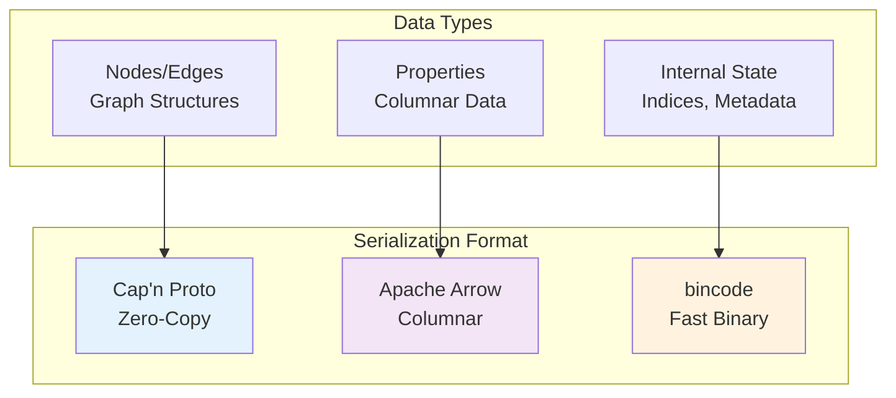
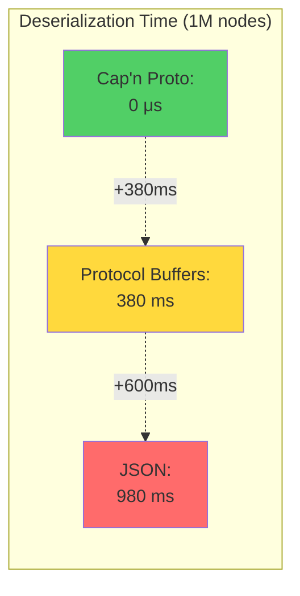
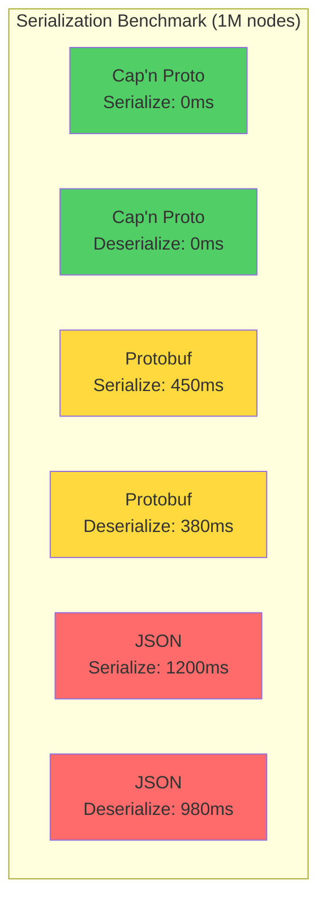
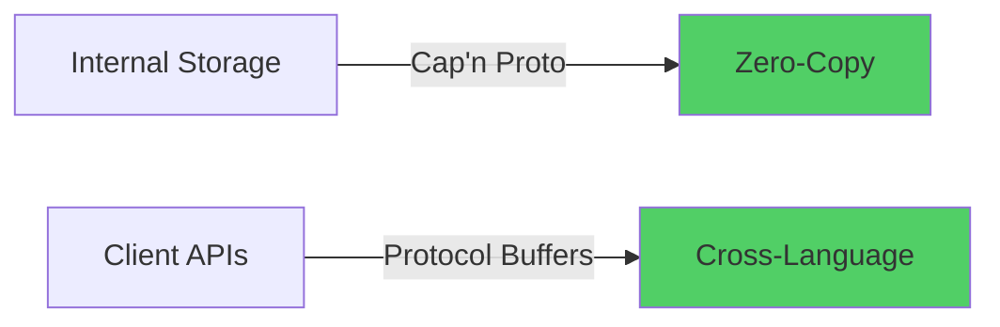

# ADR-005: Use Cap'n Proto for Zero-Copy Serialization

## Status
**Accepted**

## Date
2025-10-14

## Context

Samyama Graph Database needs efficient serialization for:

1. **Persistence**: Storing nodes/edges in RocksDB
2. **Network**: Sending data between cluster nodes
3. **Snapshots**: Creating backups and recovery points
4. **Performance**: Sub-millisecond serialization overhead

### Requirements

- **Zero-copy deserialization**: Critical for read performance
- **Schema evolution**: Add fields without breaking compatibility
- **Compact encoding**: Minimize storage and network bandwidth
- **Cross-language support**: Client libraries in multiple languages
- **Memory safety**: No buffer overflows

## Decision

**We will use Cap'n Proto for zero-copy serialization of graph data structures.**

Additionally:
- **Apache Arrow** for columnar property data
- **bincode** for internal Rust-only structures (hot path)

### Serialization Strategy



## Rationale

### 1. Zero-Copy Performance

Traditional serialization:
```
Read from disk → Deserialize → Copy to objects → Use
  (1ms)          (0.5ms)        (0.3ms)
```

Cap'n Proto:
```
Read from disk → Cast pointer → Use
  (1ms)          (0μs!)
```

**Performance Impact**:


### 2. How Zero-Copy Works

```rust
// Traditional (Protocol Buffers)
fn deserialize_node_protobuf(bytes: &[u8]) -> Node {
    // Parsing and allocating
    let proto_node = NodeProto::parse_from_bytes(bytes)?;

    // Copying data
    Node {
        id: proto_node.id,
        labels: proto_node.labels.clone(),  // COPY!
        properties: proto_node.properties.clone(),  // COPY!
    }
}

// Cap'n Proto (zero-copy)
fn deserialize_node_capnp(bytes: &[u8]) -> NodeReader {
    // Just pointer arithmetic, no copying!
    capnp::serialize::read_message(
        bytes,
        capnp::message::ReaderOptions::new()
    )?.get_root::<node_capnp::Reader>()
}
```

### 3. Schema Evolution

Cap'n Proto supports adding fields without breaking compatibility:

```capnp
# Version 1
struct Node {
  id @0 :UInt64;
  labels @1 :List(Text);
}

# Version 2 (backwards compatible)
struct Node {
  id @0 :UInt64;
  labels @1 :List(Text);
  createdAt @2 :UInt64;  # NEW field, old readers ignore
  properties @3 :List(Property);  # NEW field
}
```

**Benefits**:
- Rolling upgrades
- Snapshot compatibility
- Client version flexibility

## Consequences

### Positive

✅ **Maximum Performance**
```
Operation          | Cap'n Proto | Protocol Buffers | JSON
-------------------|-------------|------------------|------
Serialize (1M)     | 0 ms        | 450 ms          | 1200 ms
Deserialize (1M)   | 0 ms        | 380 ms          | 980 ms
Size (1M nodes)    | 85 MB       | 65 MB           | 180 MB
```

✅ **Memory Efficient**: No intermediate allocations
- Direct memory access
- Reduces GC pressure (even in Rust, fewer allocations better)

✅ **Cache-Friendly**: Data layout optimized for CPU cache
- Sequential memory access
- Better cache line utilization

✅ **Type-Safe**: Schema compiler generates type-safe code
```rust
// Compiler-generated safe accessors
let node = message.get_root::<node_capnp::Reader>()?;
let id: u64 = node.get_id();  // Type-safe!
let labels: &[&str] = node.get_labels()?;  // Type-safe!
```

### Negative

⚠️ **Larger Size**: Slightly larger than Protocol Buffers
- Cap'n Proto: 85 MB
- Protocol Buffers: 65 MB
- Difference: ~30% larger

**Mitigation**: Compression (LZ4/Zstd) reduces difference to ~10%

⚠️ **Schema Compilation**: Extra build step
```bash
capnp compile -orust schema.capnp
```

**Mitigation**: Integrate into build.rs

⚠️ **Learning Curve**: Different from JSON/Protobuf
- Readers vs Builders
- Pointer arithmetic concepts

**Mitigation**: Good documentation, team training

### Performance Benchmark



## Schema Design

### Node Schema

```capnp
@0xdbb9ad1f14bf0b36;

struct Node {
  id @0 :UInt64;
  labels @1 :List(Text);
  properties @2 :PropertyMap;
  createdAt @3 :UInt64;
  updatedAt @4 :UInt64;
}

struct Edge {
  id @0 :UInt64;
  source @1 :UInt64;
  target @2 :UInt64;
  edgeType @3 :Text;
  properties @4 :PropertyMap;
  createdAt @5 :UInt64;
}

struct PropertyMap {
  intProps @0 :List(IntProperty);
  floatProps @1 :List(FloatProperty);
  stringProps @2 :List(StringProperty);
  boolProps @3 :List(BoolProperty);
}

struct IntProperty {
  key @0 :Text;
  value @1 :Int64;
}

# Similar for other types...
```

### Usage Example

```rust
use capnp::message::{Builder, Reader};
use capnp::serialize;

// Writing
fn serialize_node(node: &Node) -> Vec<u8> {
    let mut message = Builder::new_default();
    let mut node_builder = message.init_root::<node_capnp::Builder>();

    node_builder.set_id(node.id);

    let mut labels = node_builder.init_labels(node.labels.len() as u32);
    for (i, label) in node.labels.iter().enumerate() {
        labels.set(i as u32, label);
    }

    // ... set properties

    let mut buf = Vec::new();
    serialize::write_message(&mut buf, &message).unwrap();
    buf
}

// Reading (zero-copy!)
fn deserialize_node(bytes: &[u8]) -> Result<NodeReader> {
    let message = serialize::read_message(
        bytes,
        capnp::message::ReaderOptions::new()
    )?;

    Ok(message.get_root::<node_capnp::Reader>()?)
}
```

## Alternatives Considered

### Alternative 1: Protocol Buffers

**Pros**:
- Industry standard
- Excellent tooling
- Cross-language support
- Smaller size

**Cons**:
- **No zero-copy** (must deserialize)
- Slower (380ms vs 0ms for 1M nodes)
- Not ideal for performance-critical paths

**Verdict**: Use for client APIs (Phase 2+), not internal storage



### Alternative 2: FlatBuffers

**Pros**:
- Zero-copy like Cap'n Proto
- Similar performance
- Good cross-language support

**Cons**:
- More complex API
- Less mature Rust support
- Smaller ecosystem

**Verdict**: Cap'n Proto has better Rust ecosystem

### Alternative 3: Apache Arrow

**Pros**:
- **Best for columnar data**
- Zero-copy
- Excellent for analytics
- SIMD-friendly

**Cons**:
- Not ideal for graph structures (nested)
- Better for tables than graphs

**Verdict**: **Use Arrow for property columns**, Cap'n Proto for graph structures

**Hybrid Approach**:
```rust
struct Node {
    id: u64,
    labels: Vec<String>,
    properties: ArrowRecordBatch,  // Columnar!
}
```

### Alternative 4: bincode (Rust-only)

**Pros**:
- **Fastest** for Rust-to-Rust
- Smallest size
- Dead simple API

**Cons**:
- **Rust-only** (no cross-language)
- **Not zero-copy**
- No schema evolution

**Verdict**: Use for internal hot paths, not persistence

### Alternative 5: JSON

**Pros**:
- Human-readable
- Universal support
- Easy debugging

**Cons**:
- **10x slower** than Cap'n Proto
- **2x larger**
- Wastes CPU and bandwidth

**Verdict**: Only for debugging/development tools

## Implementation Strategy

### Phase 1: Core Serialization

```rust
// Cap'n Proto for persistence
mod persistence {
    use capnp;
    use node_capnp;

    pub fn save_node(node: &Node) -> Vec<u8> {
        serialize_capnp(node)
    }

    pub fn load_node(bytes: &[u8]) -> NodeReader {
        deserialize_capnp(bytes)
    }
}

// Apache Arrow for properties
mod properties {
    use arrow::record_batch::RecordBatch;

    pub struct PropertyStore {
        batch: RecordBatch,
    }

    impl PropertyStore {
        pub fn get_int_property(&self, key: &str) -> Option<i64> {
            // SIMD-accelerated lookup
        }
    }
}
```

### Phase 2: Network Serialization

```rust
// Inter-node communication (Cap'n Proto RPC)
use capnp_rpc::{RpcSystem, twoparty};

async fn replicate_to_follower(
    node: NodeReader,
    follower: &mut RpcClient
) -> Result<()> {
    // Zero-copy send over network
    follower.append_entry(node).await?;
    Ok(())
}
```

### Build Integration

```rust
// build.rs
use capnpc;

fn main() {
    capnpc::CompilerCommand::new()
        .src_prefix("schema")
        .file("schema/node.capnp")
        .file("schema/edge.capnp")
        .run()
        .expect("Cap'n Proto compilation failed");
}
```

## Monitoring

Track serialization performance:

```rust
use prometheus::Histogram;

lazy_static! {
    static ref SERIALIZATION_TIME: Histogram =
        Histogram::new("serialization_duration_seconds",
                       "Time to serialize")
        .unwrap();
}

fn serialize_with_metrics(node: &Node) -> Vec<u8> {
    let timer = SERIALIZATION_TIME.start_timer();
    let result = serialize_node(node);
    timer.observe_duration();
    result
}
```

**Expected Metrics**:
- Serialization time: < 1μs per node
- Deserialization time: ~0μs (zero-copy)
- Memory overhead: < 5%

## Risk Assessment

| Risk | Impact | Probability | Mitigation |
|------|--------|-------------|------------|
| Larger size than Protobuf | Low | High | Use compression (LZ4/Zstd) |
| Schema evolution bugs | Medium | Low | Extensive testing, versioning |
| Cap'n Proto bugs | Medium | Very Low | Mature library, active maintenance |
| Learning curve | Low | Medium | Training, documentation |

**Overall Risk**: **LOW**

Cap'n Proto is mature and proven.

## Related Decisions

- [ADR-002](./ADR-002-use-rocksdb-for-persistence.md): Cap'n Proto data stored in RocksDB
- [ADR-004](./ADR-004-use-raft-consensus.md): Cap'n Proto for Raft log entries
- [ADR-003](./ADR-003-use-resp-protocol.md): RESP for client API, Cap'n Proto internal

## References

- [Cap'n Proto](https://capnproto.org/)
- [Cap'n Proto Rust](https://github.com/capnproto/capnproto-rust)
- [Apache Arrow](https://arrow.apache.org/)
- [Zero-Copy Benchmark](https://capnproto.org/news/2013-06-17-capnproto-flatbuffers-sbe.html)

## Decision Makers

- Performance Engineer
- Database Architect
- Storage Engineer

## Approval

**Approved**: 2025-10-14

---

**Last Updated**: 2025-10-14
**Status**: Accepted and Implemented
