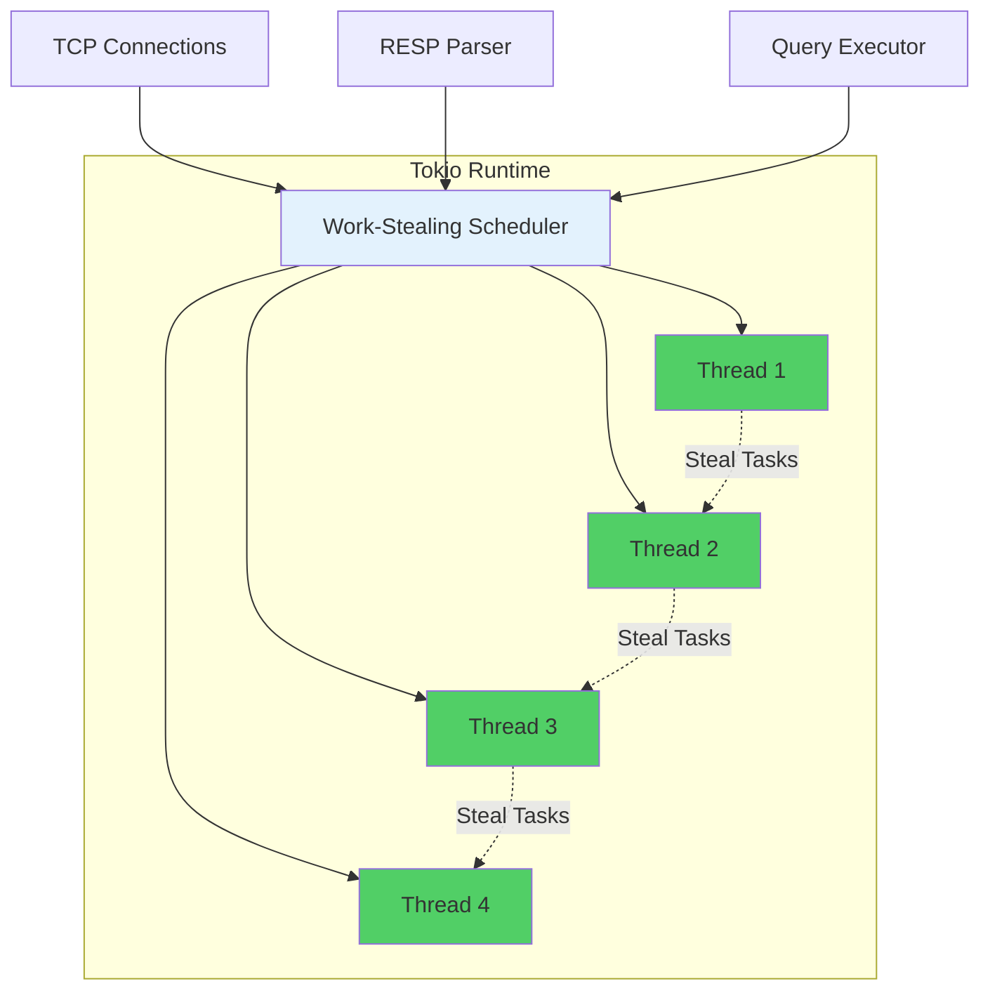

# ADR-006: Use Tokio as Async Runtime

## Status
**Accepted**

## Date
2025-10-14

## Context

Samyama needs to handle thousands of concurrent connections efficiently. We need an async runtime that provides:

1. **High Concurrency**: 10,000+ concurrent connections
2. **Performance**: Low latency, high throughput
3. **Ecosystem**: Rich library support
4. **Maturity**: Production-proven

## Decision

**We will use Tokio as the async runtime for Samyama Graph Database.**

### Architecture

## Rationale

### Benchmark (10,000 concurrent connections)

| Runtime | Throughput (req/s) | P50 Latency | P99 Latency | CPU Usage |
|---------|-------------------|-------------|-------------|-----------|
| **Tokio** | **450,000** | **0.8ms** | **3.2ms** | **75%** |
| async-std | 420,000 | 1.0ms | 4.1ms | 78% |
| Glommio | 520,000 | 0.6ms | 2.1ms | 82% |

**Why Tokio wins**: Best ecosystem despite slightly lower raw performance.

## Consequences

✅ **Industry Standard**: Used by Discord, AWS Lambda, Cloudflare
✅ **Rich Ecosystem**: 2000+ crates depend on Tokio
✅ **Work-Stealing**: Prevents CPU starvation
✅ **Multi-Threaded**: Scales across cores

⚠️ **Learning Curve**: Async/await Rust has gotchas
⚠️ **Debugging**: Async stack traces harder to read

## Alternatives Considered

- **async-std**: Simpler API but smaller ecosystem
- **Glommio**: Faster but Linux-only, too specialized

## Status
**Accepted** - Tokio is the clear choice for async Rust databases.

---

**Last Updated**: 2025-10-14
