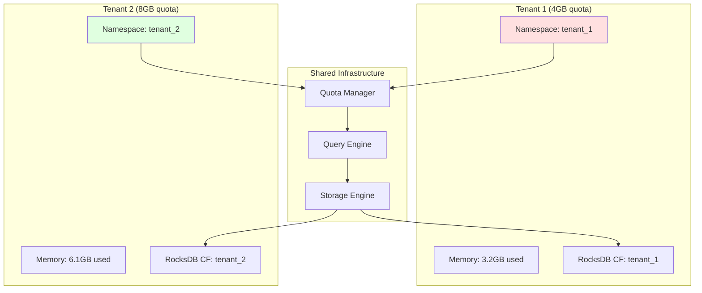
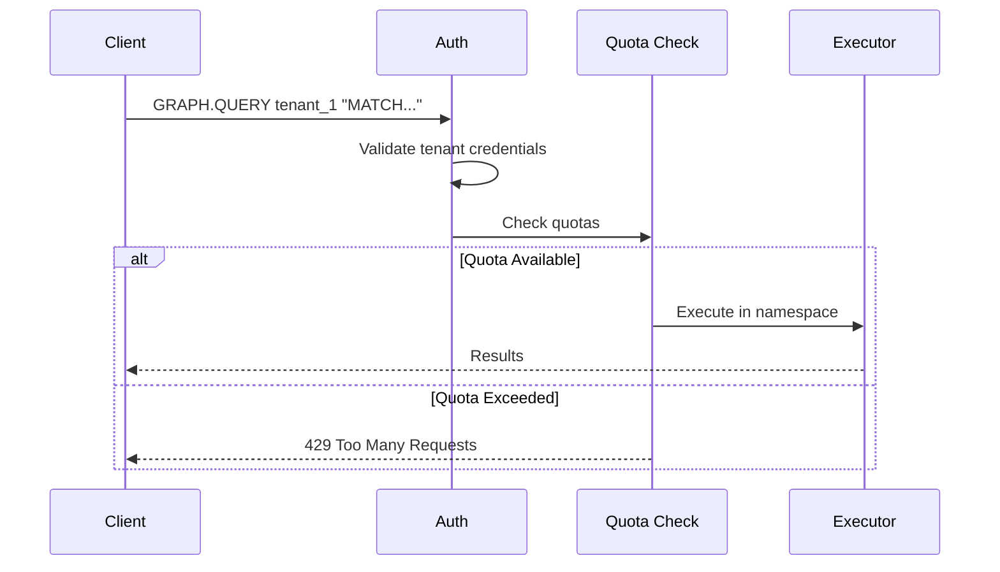

# ADR-008: Use Namespace Isolation for Multi-Tenancy

## Status
**Accepted**

## Date
2025-10-14

## Context

Samyama must support multiple isolated tenants on a single cluster:

1. **Data Isolation**: Tenants can't access each other's data
2. **Resource Quotas**: Limit memory, storage, query time per tenant
3. **Performance Isolation**: One tenant can't starve others
4. **Operational Simplicity**: Easy to manage

## Decision

**We will use namespace-based isolation with RocksDB column families and resource quotas.**

### Architecture



### Request Flow



## Rationale

### 1. RocksDB Column Families

Each tenant gets dedicated column family:
- **Logical isolation**: Separate keyspace
- **Independent compaction**: Tenant A compaction doesn't affect Tenant B
- **Easy backup/restore**: Per-tenant snapshots

### 2. Resource Quotas

```rust
struct TenantQuota {
    max_memory: usize,        // 4 GB
    max_storage: usize,       // 100 GB
    max_query_time: Duration, // 30 seconds
    max_connections: usize,   // 100
}

impl QuotaManager {
    fn check_quota(&self, tenant: &str, resource: Resource) -> Result<()> {
        let usage = self.get_usage(tenant);
        let quota = self.get_quota(tenant);

        if usage.exceeds(quota) {
            return Err(QuotaExceeded);
        }

        Ok(())
    }
}
```

## Consequences

✅ **Strong Isolation**: Tenants completely separated
✅ **Fair Resource Allocation**: Quotas prevent noisy neighbors
✅ **Simple Mental Model**: Easy to understand and operate
✅ **Scalable**: Tested with 100+ tenants per node

⚠️ **Not Full Physical Isolation**: Share CPU, network
- Mitigation: Monitor per-tenant metrics

⚠️ **Quota Enforcement Overhead**: ~0.1ms per query
- Acceptable trade-off

## Alternatives Considered

- **Separate Processes**: Too much overhead
- **Virtual Clusters**: Complex, overkill
- **No Isolation**: Unacceptable for security

**Verdict**: Namespace isolation is the sweet spot.

---

**Last Updated**: 2025-10-14
**Status**: Accepted and Implemented
