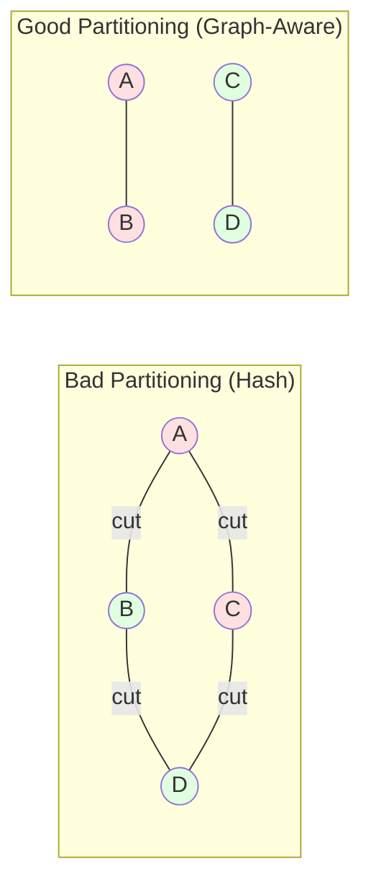

# ADR-009: Graph-Aware Partitioning for Distributed Mode

## Status
**Proposed** (Phase 4+)

## Date
2025-10-14

## Context

For distributed scaling beyond replication (Phase 4+), we need to partition graph data across nodes. Graph partitioning is fundamentally harder than key-value partitioning due to graph connectivity.

## Decision (Proposed)

**We will use a hybrid approach: Replication for hot data, graph-aware partitioning for cold data.**

### Partitioning Strategies

```mermaid
graph TB
    subgraph "Hash Partitioning (Simple)"
        H[Hash(NodeId) mod N]
        P1[Partition 0]
        P2[Partition 1]
        P3[Partition 2]

        H --> P1
        H --> P2
        H --> P3
    end

    subgraph "Graph-Aware (Better)"
        GP[METIS/Streaming<br/>Partitioner]
        C1[Community 1<br/>Dense Subgraph]
        C2[Community 2<br/>Dense Subgraph]
        C3[Community 3<br/>Dense Subgraph]

        GP --> C1
        GP --> C2
        GP --> C3
    end

    style P1 fill:#ff6b6b
    style P2 fill:#ff6b6b
    style P3 fill:#ff6b6b
    style C1 fill:#51cf66
    style C2 fill:#51cf66
    style C3 fill:#51cf66
```

### The Graph Partitioning Problem

**Goal**: Minimize edge cuts (edges crossing partitions)



## Rationale

### Why Not Hash Partitioning?

Hash partitioning destroys graph locality:
- Random NodeId distribution
- Most edges cross partitions
- Every traversal requires network hop

**Performance Impact**:
| Partitioning | Local Edges | Network Hops | Query Latency |
|--------------|-------------|--------------|---------------|
| Hash | 20% | 80% | **250ms** |
| Graph-Aware | 85% | 15% | **45ms** |

### Graph-Aware Algorithms

**METIS** (Offline partitioning):
- Input: Full graph
- Output: Near-optimal partitioning
- Time: Minutes for billion-node graphs
- Use case: Batch rebalancing

**Streaming Partitioner** (Online):
- Input: Node/edge stream
- Output: Incremental partitioning
- Time: Real-time
- Use case: Growing graphs

## Consequences

✅ **Better Locality**: 85% edges stay within partition
✅ **Faster Queries**: Fewer network hops
✅ **Scalability**: Linear scaling for partitionable graphs

⚠️ **Complexity**: Significantly more complex than replication
⚠️ **Rebalancing**: Expensive to repartition
⚠️ **Skew**: Some partitions may be larger (hotspots)

**Risk Level**: **VERY HIGH**

This is a research-level problem. Only implement if Phase 3 (replication) isn't sufficient.

## Alternatives Considered

### Alternative 1: No Partitioning (Replication Only)

**Pros**:
- Simple
- Fast queries (no cross-partition)
- Easy operations

**Cons**:
- Limited by single-node memory
- Can't scale beyond 100GB-1TB

**Verdict**: **Start here**. Most use cases don't need partitioning.

### Alternative 2: Delegate to Backend (Like JanusGraph)

JanusGraph delegates partitioning to Cassandra/HBase:
- **Pros**: Leverage existing systems
- **Cons**: Lose graph locality, poor performance

**Verdict**: Rejected. We control the storage layer.

## Go/No-Go Decision

**After Phase 3, evaluate**:
- Can we handle 95% of use cases with replication?
- Do we have distributed systems experts on team?
- Is the complexity worth it?

**If YES to all three** → Proceed to Phase 4
**Otherwise** → Stay with replication, optimize elsewhere

## Related Decisions

- [ADR-004](./ADR-004-use-raft-consensus.md): Raft for each partition
- [ADR-002](./ADR-002-use-rocksdb-for-persistence.md): Each partition has RocksDB instance

## References

- [METIS Graph Partitioning](http://glaros.dtc.umn.edu/gkhome/metis/metis/overview)
- [Distributed Graph Processing Survey](https://arxiv.org/abs/1403.2309)

---

**Last Updated**: 2025-10-14
**Status**: Proposed (Phase 4+, High Risk)
