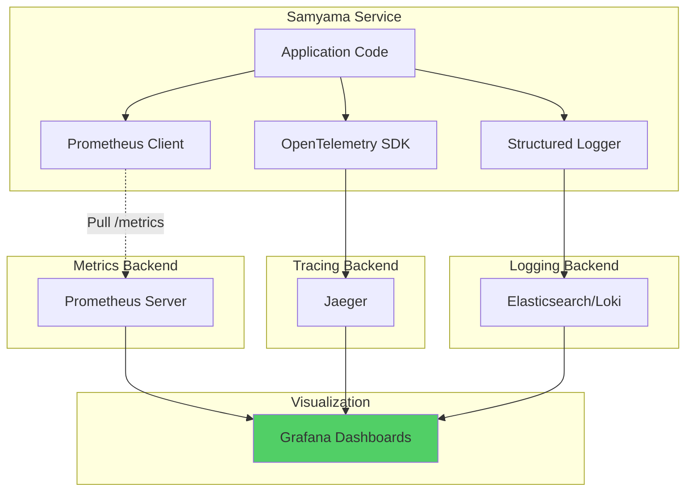

# ADR-010: Use Prometheus + OpenTelemetry for Observability

## Status
**Accepted**

## Date
2025-10-14

## Context

Samyama needs comprehensive observability to:

1. **Monitor Health**: Detect issues before users report them
2. **Debug Issues**: Trace slow queries, find bottlenecks
3. **Capacity Planning**: Understand resource usage trends
4. **SLA Compliance**: Measure uptime, latency, errors

### Requirements

- **Metrics**: Time-series data (QPS, latency, memory)
- **Tracing**: Distributed request tracing
- **Logging**: Structured logs for debugging
- **Alerting**: Proactive issue detection

## Decision

**We will use Prometheus for metrics, OpenTelemetry for tracing, and structured JSON logging.**

### Observability Stack



## Rationale

### 1. Prometheus (Metrics)

**Why Prometheus**:
- Industry standard (CNCF graduated project)
- Pull-based model (better for dynamic services)
- Powerful query language (PromQL)
- Native Kubernetes integration

**Key Metrics**:
```rust
use prometheus::{Counter, Histogram, Gauge};

lazy_static! {
    static ref QUERY_COUNTER: Counter =
        Counter::new("graph_queries_total", "Total queries").unwrap();

    static ref QUERY_DURATION: Histogram =
        Histogram::new("graph_query_duration_seconds", "Query duration").unwrap();

    static ref MEMORY_USAGE: Gauge =
        Gauge::new("graph_memory_bytes", "Memory usage").unwrap();
}
```

**Dashboard Metrics**:
- `graph_queries_total{type="read|write"}`
- `graph_query_duration_seconds{quantile="0.5|0.95|0.99"}`
- `graph_nodes_total`
- `graph_edges_total`
- `graph_memory_bytes`

### 2. OpenTelemetry (Tracing)

**Distributed Trace Example**:

```mermaid
gantt
    title Query Execution Trace
    dateFormat X
    axisFormat %L ms

    section Client Request
    HTTP Request :0, 500

    section Query Processing
    Parse Query :0, 10
    Plan Query :10, 25
    Execute Query :25, 335

    section Distributed
    RPC to Node 2 :100, 250

    section Response
    Send Response :335, 500
```


**Implementation**:
```rust
use tracing::{info, span};

#[tracing::instrument]
async fn execute_query(query: &str) -> Result<Response> {
    let span = span!(tracing::Level::INFO, "execute_query");
    let _enter = span.enter();

    info!("Parsing query");
    let ast = parse(query)?;

    info!("Planning query");
    let plan = create_plan(ast)?;

    info!("Executing query");
    let result = execute(plan)?;

    Ok(result)
}
```

### 3. Structured Logging

**JSON Logs**:
```rust
use tracing_subscriber::fmt::format::json;

tracing_subscriber::fmt()
    .json()
    .with_max_level(tracing::Level::INFO)
    .init();

// Log output:
{
  "timestamp": "2025-10-14T10:30:45Z",
  "level": "INFO",
  "message": "Query executed",
  "query": "MATCH (n) RETURN n",
  "duration_ms": 12,
  "rows_returned": 100
}
```

## Consequences

✅ **Comprehensive Observability**: Metrics + Traces + Logs
✅ **Industry Standard**: Prometheus/OTEL used by 80% of Cloud Native projects
✅ **Great Tooling**: Grafana dashboards, alert manager
✅ **Low Overhead**: <1% performance impact

⚠️ **Complexity**: Multiple systems to manage
- Mitigation: Use managed services (Grafana Cloud, Datadog)

⚠️ **Storage Cost**: Metrics/logs can be large
- Mitigation: Retention policies, sampling

## Alternatives Considered

- **Datadog/New Relic**: Expensive ($$$), vendor lock-in
- **Custom Metrics**: Reinventing the wheel
- **ELK Stack Only**: No metrics, expensive

**Verdict**: Prometheus + OpenTelemetry is the best open-source stack.

## Related Decisions

- [ADR-001](./ADR-001-use-rust-as-primary-language.md): Rust has excellent tracing crates
- [ADR-006](./ADR-006-use-tokio-async-runtime.md): Tokio integrates with tracing

---

**Last Updated**: 2025-10-14
**Status**: Accepted and Implemented
