# Samyama Graph Database - System Architecture

## Overview

This document describes the detailed architecture of Samyama Graph Database with visual diagrams showing component interactions, data flows, and deployment models.

---

## 1. High-Level System Architecture

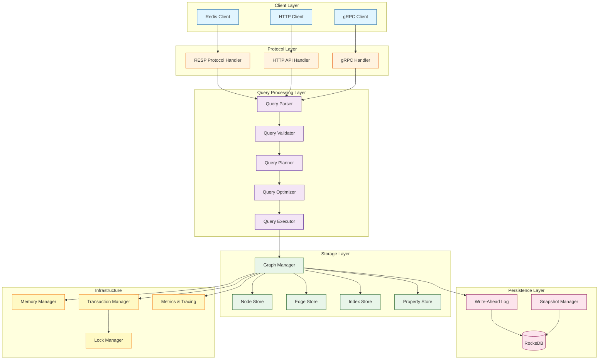
```mermaid
graph TB
    subgraph "Client Layer"
        RC[Redis Client]
        HC[HTTP Client]
        GC[gRPC Client]
    end

    subgraph "Protocol Layer"
        RESP[RESP Protocol Handler]
        HTTP[HTTP API Handler]
        GRPC[gRPC Handler]
    end

    subgraph "Query Processing Layer"
        QP[Query Parser]
        QV[Query Validator]
        QPL[Query Planner]
        QO[Query Optimizer]
        QE[Query Executor]
    end

    subgraph "Storage Layer"
        GM[Graph Manager]
        NS[Node Store]
        ES[Edge Store]
        IS[Index Store]
        PS[Property Store]
    end

    subgraph "Persistence Layer"
        WAL[Write-Ahead Log]
        SS[Snapshot Manager]
        RDB[(RocksDB)]
    end

    subgraph "Infrastructure"
        MM[Memory Manager]
        TM[Transaction Manager]
        LM[Lock Manager]
        MT[Metrics & Tracing]
    end

    RC --> RESP
    HC --> HTTP
    GC --> GRPC

    RESP --> QP
    HTTP --> QP
    GRPC --> QP

    QP --> QV
    QV --> QPL
    QPL --> QO
    QO --> QE

    QE --> GM
    GM --> NS
    GM --> ES
    GM --> IS
    GM --> PS

    GM --> WAL
    WAL --> RDB
    SS --> RDB

    GM --> MM
    GM --> TM
    TM --> LM
    GM --> MT

    classDef clientStyle fill:#e1f5ff,stroke:#01579b
    classDef protocolStyle fill:#fff3e0,stroke:#e65100
    classDef queryStyle fill:#f3e5f5,stroke:#4a148c
    classDef storageStyle fill:#e8f5e9,stroke:#1b5e20
    classDef persistStyle fill:#fce4ec,stroke:#880e4f
    classDef infraStyle fill:#fff9c4,stroke:#f57f17

    class RC,HC,GC clientStyle
    class RESP,HTTP,GRPC protocolStyle
    class QP,QV,QPL,QO,QE queryStyle
    class GM,NS,ES,IS,PS storageStyle
    class WAL,SS,RDB persistStyle
    class MM,TM,LM,MT infraStyle
```

---

## 2. Component Architecture Details

### 2.1 Protocol Handler Layer

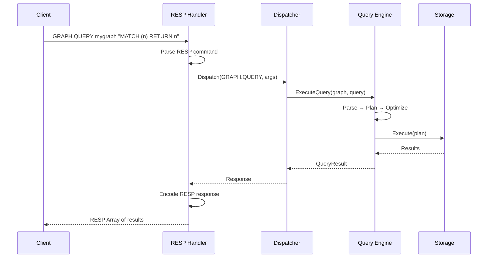
```mermaid
sequenceDiagram
    participant C as Client
    participant R as RESP Handler
    participant D as Dispatcher
    participant Q as Query Engine
    participant S as Storage

    C->>R: GRAPH.QUERY mygraph "MATCH (n) RETURN n"
    R->>R: Parse RESP command
    R->>D: Dispatch(GRAPH.QUERY, args)
    D->>Q: ExecuteQuery(graph, query)
    Q->>Q: Parse → Plan → Optimize
    Q->>S: Execute(plan)
    S-->>Q: Results
    Q-->>D: QueryResult
    D-->>R: Response
    R->>R: Encode RESP response
    R-->>C: RESP Array of results
```

**RESP Command Flow**:
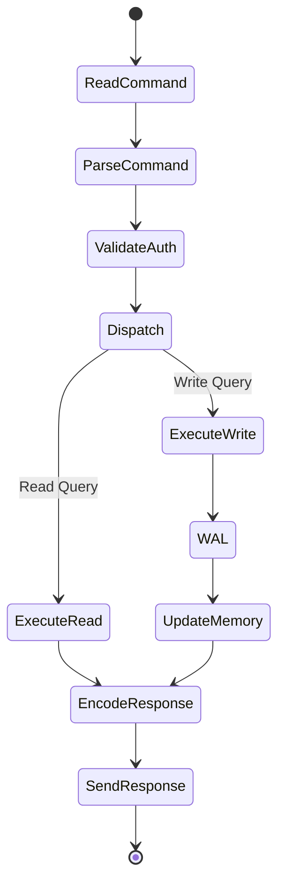
```mermaid
stateDiagram-v2
    [*] --> ReadCommand
    ReadCommand --> ParseCommand
    ParseCommand --> ValidateAuth
    ValidateAuth --> Dispatch
    Dispatch --> ExecuteRead: Read Query
    Dispatch --> ExecuteWrite: Write Query
    ExecuteRead --> EncodeResponse
    ExecuteWrite --> WAL
    WAL --> UpdateMemory
    UpdateMemory --> EncodeResponse
    EncodeResponse --> SendResponse
    SendResponse --> [*]
```

### 2.2 Query Processing Pipeline


```mermaid
graph LR
    subgraph "Parsing Phase"
        CQ[Cypher Query] --> LEX[Lexer]
        LEX --> PAR[Parser]
        PAR --> AST[Abstract Syntax Tree]
    end

    subgraph "Validation Phase"
        AST --> SEM[Semantic Analyzer]
        SEM --> TYPE[Type Checker]
        TYPE --> VAST[Validated AST]
    end

    subgraph "Planning Phase"
        VAST --> LP[Logical Planner]
        LP --> LPLAN[Logical Plan]
        LPLAN --> PP[Physical Planner]
        PP --> PPLAN[Physical Plan]
    end

    subgraph "Optimization Phase"
        PPLAN --> RBO[Rule-Based Optimizer]
        RBO --> CBO[Cost-Based Optimizer]
        CBO --> OPLAN[Optimized Plan]
    end

    subgraph "Execution Phase"
        OPLAN --> EXE[Executor]
        EXE --> RES[Results]
    end

    style CQ fill:#e3f2fd
    style AST fill:#f3e5f5
    style VAST fill:#fff3e0
    style PPLAN fill:#e8f5e9
    style OPLAN fill:#fce4ec
    style RES fill:#fff9c4
```

**Example Query Execution Plan**:
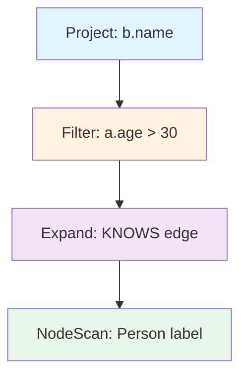
```mermaid
graph TD
    A[Project: b.name] --> B[Filter: a.age > 30]
    B --> C[Expand: KNOWS edge]
    C --> D[NodeScan: Person label]

    style A fill:#e1f5ff
    style B fill:#fff3e0
    style C fill:#f3e5f5
    style D fill:#e8f5e9
```

### 2.3 Storage Engine Architecture


```mermaid
graph TB
    subgraph "In-Memory Graph Store"
        direction TB
        NM[Node Manager]
        EM[Edge Manager]
        PM[Property Manager]
        IM[Index Manager]

        subgraph "Node Storage"
            NH[Node HashMap<br/>NodeId → Node]
            NL[Label Index<br/>Label → NodeIds]
        end

        subgraph "Edge Storage"
            EH[Edge HashMap<br/>EdgeId → Edge]
            ADJ_OUT[Outgoing Adjacency<br/>NodeId → EdgeIds]
            ADJ_IN[Incoming Adjacency<br/>NodeId → EdgeIds]
        end

        subgraph "Property Storage"
            PC[Property Columns<br/>Columnar Storage]
            PI[Property Index<br/>Hash/BTree]
        end

        subgraph "Indices"
            LI[Label Index<br/>RoaringBitmap]
            PRI[Property Index<br/>RoaringBitmap]
        end

        NM --> NH
        NM --> NL
        EM --> EH
        EM --> ADJ_OUT
        EM --> ADJ_IN
        PM --> PC
        PM --> PI
        IM --> LI
        IM --> PRI
    end

    subgraph "Persistence Layer"
        RDB[(RocksDB)]
        CF1[Column Family: nodes]
        CF2[Column Family: edges]
        CF3[Column Family: wal]
        CF4[Column Family: metadata]

        RDB --> CF1
        RDB --> CF2
        RDB --> CF3
        RDB --> CF4
    end

    NM -.->|Persist| CF1
    EM -.->|Persist| CF2
    PM -.->|WAL| CF3

    style NM fill:#e3f2fd
    style EM fill:#f3e5f5
    style PM fill:#fff3e0
    style IM fill:#e8f5e9
```

**Data Structures**:
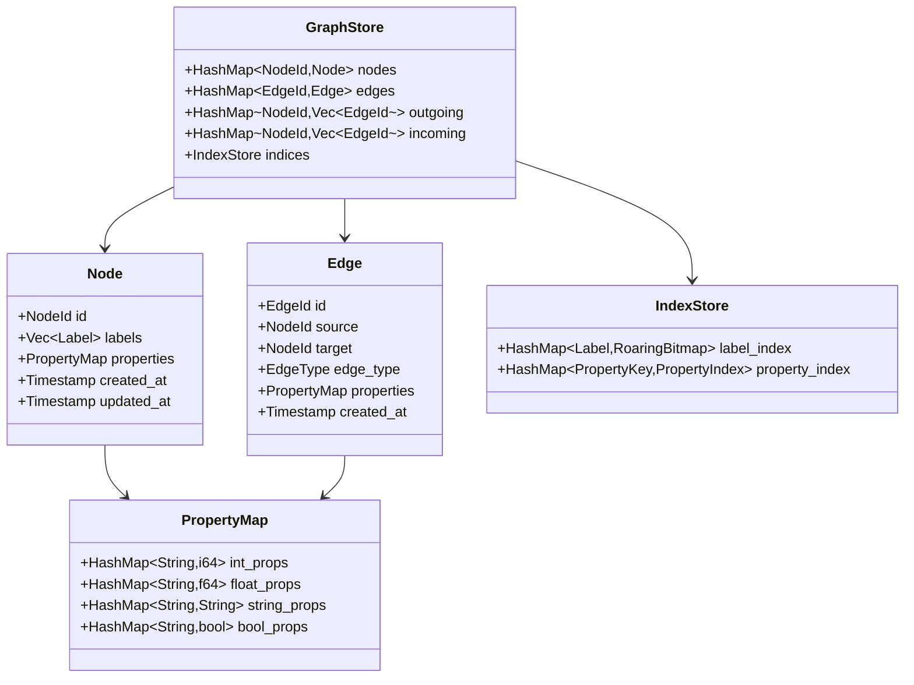
```mermaid
classDiagram
    class Node {
        +NodeId id
        +Vec~Label~ labels
        +PropertyMap properties
        +Timestamp created_at
        +Timestamp updated_at
    }

    class Edge {
        +EdgeId id
        +NodeId source
        +NodeId target
        +EdgeType edge_type
        +PropertyMap properties
        +Timestamp created_at
    }

    class PropertyMap {
        +HashMap~String,i64~ int_props
        +HashMap~String,f64~ float_props
        +HashMap~String,String~ string_props
        +HashMap~String,bool~ bool_props
    }

    class GraphStore {
        +HashMap~NodeId,Node~ nodes
        +HashMap~EdgeId,Edge~ edges
        +HashMap~NodeId,Vec~EdgeId~~ outgoing
        +HashMap~NodeId,Vec~EdgeId~~ incoming
        +IndexStore indices
    }

    class IndexStore {
        +HashMap~Label,RoaringBitmap~ label_index
        +HashMap~PropertyKey,PropertyIndex~ property_index
    }

    Node --> PropertyMap
    Edge --> PropertyMap
    GraphStore --> Node
    GraphStore --> Edge
    GraphStore --> IndexStore
```

### 2.4 Memory Management

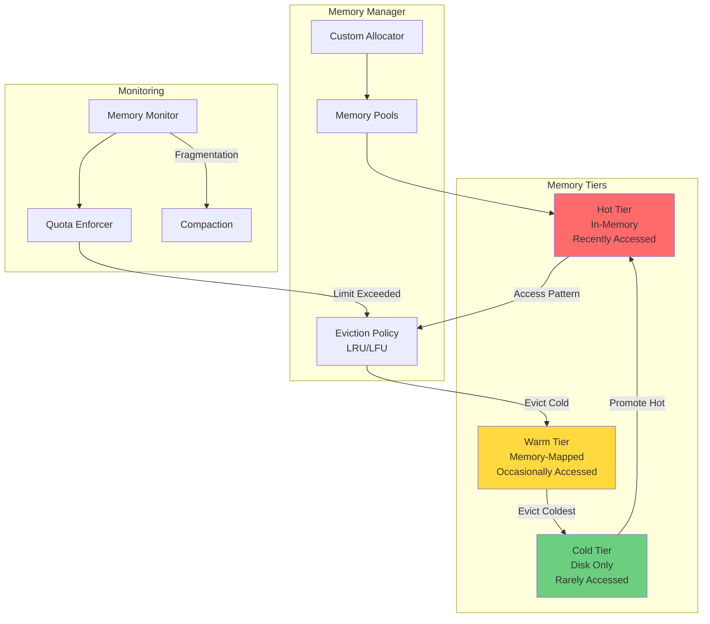
```mermaid
graph TB
    subgraph "Memory Tiers"
        HOT[Hot Tier<br/>In-Memory<br/>Recently Accessed]
        WARM[Warm Tier<br/>Memory-Mapped<br/>Occasionally Accessed]
        COLD[Cold Tier<br/>Disk Only<br/>Rarely Accessed]
    end

    subgraph "Memory Manager"
        ALLOC[Custom Allocator]
        POOL[Memory Pools]
        EVICT[Eviction Policy<br/>LRU/LFU]
    end

    subgraph "Monitoring"
        MEM_MON[Memory Monitor]
        QUOTA[Quota Enforcer]
        GC[Compaction]
    end

    HOT -->|Access Pattern| EVICT
    EVICT -->|Evict Cold| WARM
    WARM -->|Evict Coldest| COLD
    COLD -->|Promote Hot| HOT

    ALLOC --> POOL
    POOL --> HOT

    MEM_MON --> QUOTA
    QUOTA -->|Limit Exceeded| EVICT
    MEM_MON -->|Fragmentation| GC

    style HOT fill:#ff6b6b
    style WARM fill:#ffd93d
    style COLD fill:#6bcf7f
```

**Memory Allocation Strategy**:
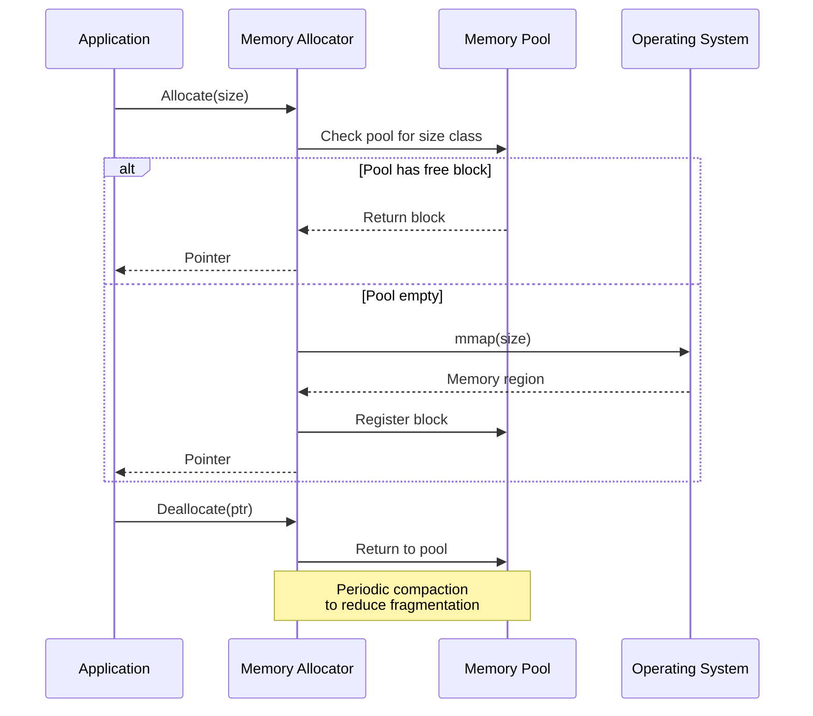
```mermaid
sequenceDiagram
    participant App as Application
    participant MA as Memory Allocator
    participant Pool as Memory Pool
    participant OS as Operating System

    App->>MA: Allocate(size)
    MA->>Pool: Check pool for size class
    alt Pool has free block
        Pool-->>MA: Return block
        MA-->>App: Pointer
    else Pool empty
        MA->>OS: mmap(size)
        OS-->>MA: Memory region
        MA->>Pool: Register block
        MA-->>App: Pointer
    end

    App->>MA: Deallocate(ptr)
    MA->>Pool: Return to pool

    Note over MA,Pool: Periodic compaction<br/>to reduce fragmentation
```

---

## 3. Distributed Architecture (Phase 3+)

### 3.1 Cluster Topology

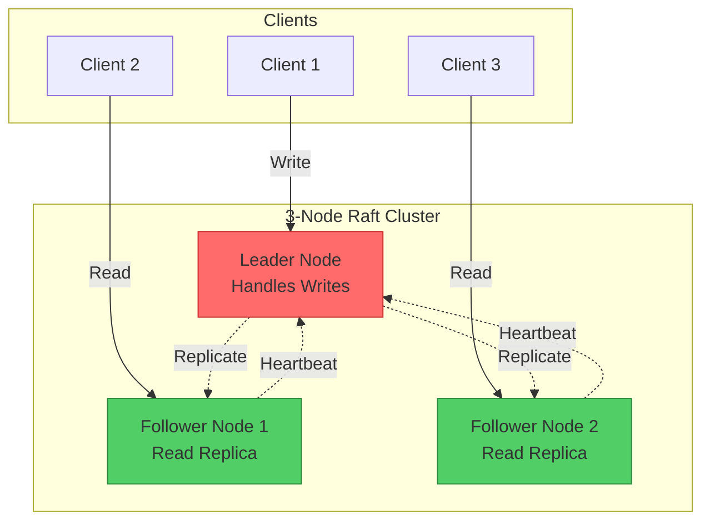
```mermaid
graph TB
    subgraph "3-Node Raft Cluster"
        L[Leader Node<br/>Handles Writes]
        F1[Follower Node 1<br/>Read Replica]
        F2[Follower Node 2<br/>Read Replica]
    end

    subgraph "Clients"
        C1[Client 1]
        C2[Client 2]
        C3[Client 3]
    end

    C1 -->|Write| L
    C2 -->|Read| F1
    C3 -->|Read| F2

    L -.->|Replicate| F1
    L -.->|Replicate| F2
    F1 -.->|Heartbeat| L
    F2 -.->|Heartbeat| L

    style L fill:#ff6b6b,stroke:#c92a2a
    style F1 fill:#51cf66,stroke:#2b8a3e
    style F2 fill:#51cf66,stroke:#2b8a3e
```

### 3.2 Raft Consensus Flow

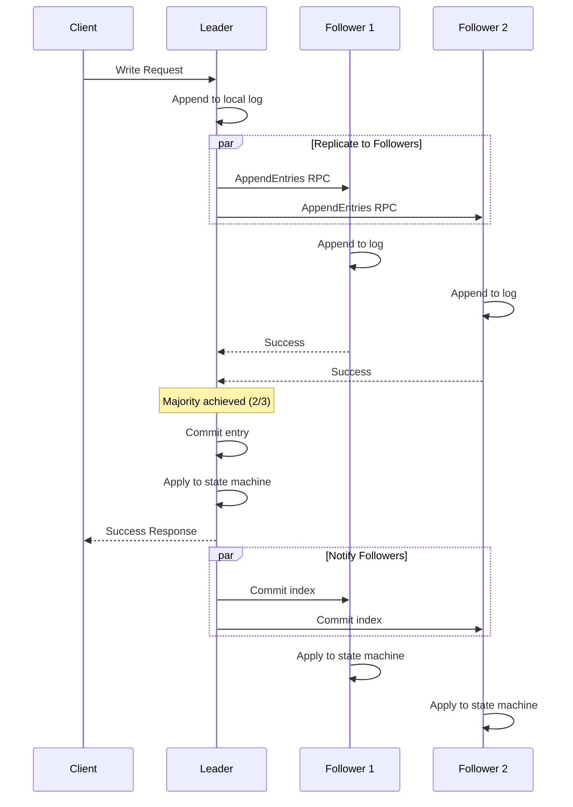
```mermaid
sequenceDiagram
    participant C as Client
    participant L as Leader
    participant F1 as Follower 1
    participant F2 as Follower 2

    C->>L: Write Request
    L->>L: Append to local log
    par Replicate to Followers
        L->>F1: AppendEntries RPC
        L->>F2: AppendEntries RPC
    end

    F1->>F1: Append to log
    F2->>F2: Append to log

    F1-->>L: Success
    F2-->>L: Success

    Note over L: Majority achieved (2/3)

    L->>L: Commit entry
    L->>L: Apply to state machine
    L-->>C: Success Response

    par Notify Followers
        L->>F1: Commit index
        L->>F2: Commit index
    end

    F1->>F1: Apply to state machine
    F2->>F2: Apply to state machine
```

### 3.3 Leader Election

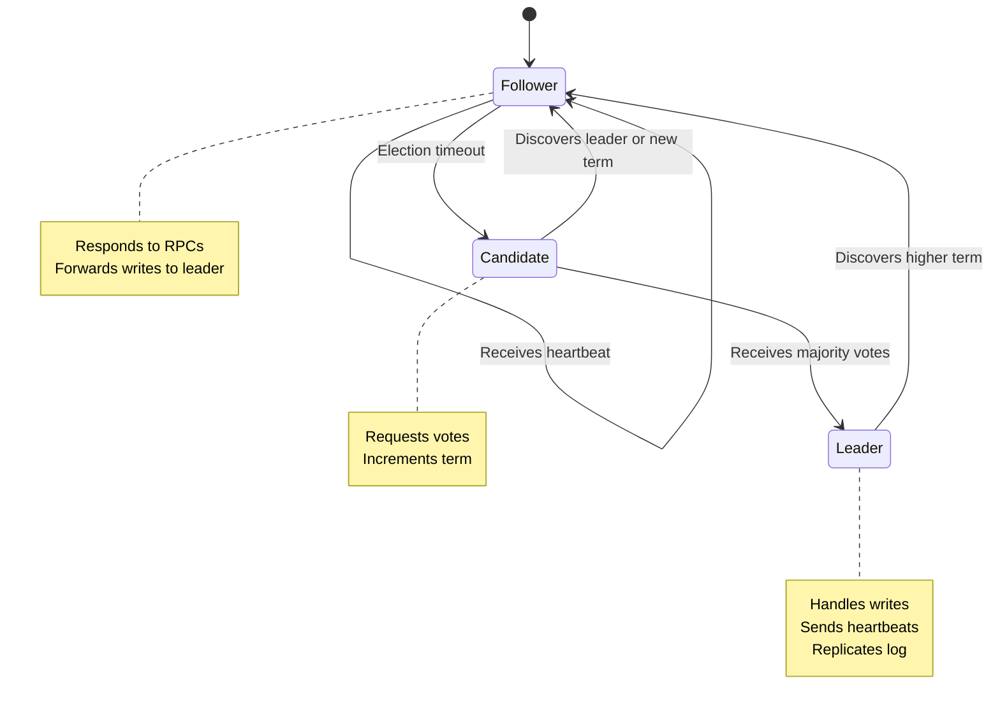
```mermaid
stateDiagram-v2
    [*] --> Follower
    Follower --> Candidate: Election timeout
    Candidate --> Leader: Receives majority votes
    Candidate --> Follower: Discovers leader or new term
    Leader --> Follower: Discovers higher term
    Follower --> Follower: Receives heartbeat

    note right of Follower
        Responds to RPCs
        Forwards writes to leader
    end note

    note right of Candidate
        Requests votes
        Increments term
    end note

    note right of Leader
        Handles writes
        Sends heartbeats
        Replicates log
    end note
```

### 3.4 Distributed Partitioning (Phase 4)

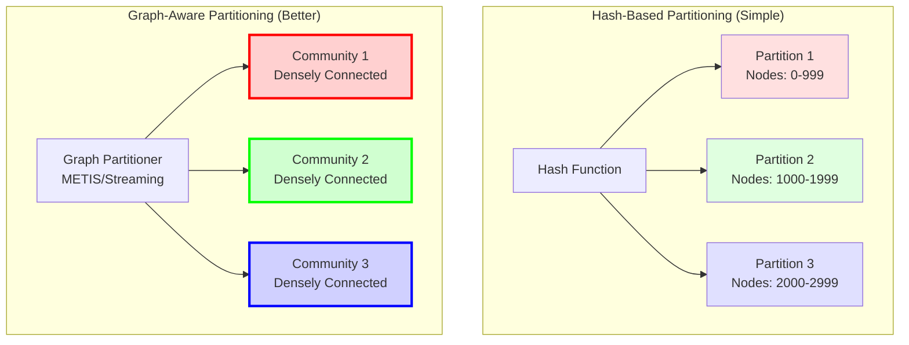
```mermaid
graph TB
    subgraph "Hash-Based Partitioning (Simple)"
        H[Hash Function]
        P1[Partition 1<br/>Nodes: 0-999]
        P2[Partition 2<br/>Nodes: 1000-1999]
        P3[Partition 3<br/>Nodes: 2000-2999]

        H --> P1
        H --> P2
        H --> P3
    end

    subgraph "Graph-Aware Partitioning (Better)"
        GP[Graph Partitioner<br/>METIS/Streaming]
        C1[Community 1<br/>Densely Connected]
        C2[Community 2<br/>Densely Connected]
        C3[Community 3<br/>Densely Connected]

        GP --> C1
        GP --> C2
        GP --> C3
    end

    style P1 fill:#ffe0e0
    style P2 fill:#e0ffe0
    style P3 fill:#e0e0ff
    style C1 fill:#ffd0d0,stroke:#ff0000,stroke-width:3px
    style C2 fill:#d0ffd0,stroke:#00ff00,stroke-width:3px
    style C3 fill:#d0d0ff,stroke:#0000ff,stroke-width:3px
```

**Cross-Partition Query**:
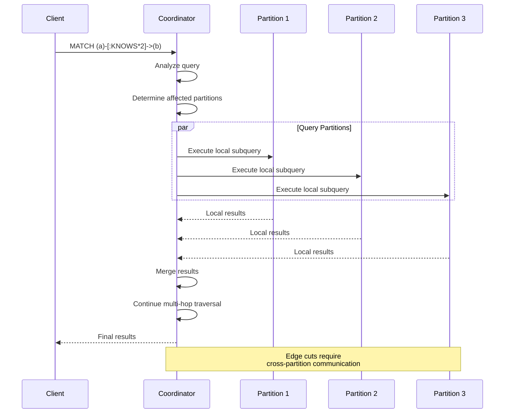
```mermaid
sequenceDiagram
    participant C as Client
    participant CO as Coordinator
    participant P1 as Partition 1
    participant P2 as Partition 2
    participant P3 as Partition 3

    C->>CO: MATCH (a)-[:KNOWS*2]->(b)
    CO->>CO: Analyze query
    CO->>CO: Determine affected partitions

    par Query Partitions
        CO->>P1: Execute local subquery
        CO->>P2: Execute local subquery
        CO->>P3: Execute local subquery
    end

    P1-->>CO: Local results
    P2-->>CO: Local results
    P3-->>CO: Local results

    CO->>CO: Merge results
    CO->>CO: Continue multi-hop traversal
    CO-->>C: Final results

    Note over CO,P3: Edge cuts require<br/>cross-partition communication
```

---

## 4. Query Execution Architecture

### 4.1 Volcano Iterator Model

```mermaid
graph TB
    subgraph "Query Plan Tree"
        PROJ[ProjectOperator<br/>SELECT b.name]
        FILT[FilterOperator<br/>WHERE a.age > 30]
        EXP[ExpandOperator<br/>-[:KNOWS]->]
        SCAN[NodeScanOperator<br/>MATCH :Person]
    end

    PROJ --> FILT
    FILT --> EXP
    EXP --> SCAN

    subgraph "Iterator Protocol"
        direction LR
        I1[next()] --> I2[next()]
        I2 --> I3[next()]
        I3 --> I4[next()]
    end

    PROJ -.-> I1
    FILT -.-> I2
    EXP -.-> I3
    SCAN -.-> I4

    style PROJ fill:#e3f2fd
    style FILT fill:#f3e5f5
    style EXP fill:#fff3e0
    style SCAN fill:#e8f5e9
```

**Execution Flow**:
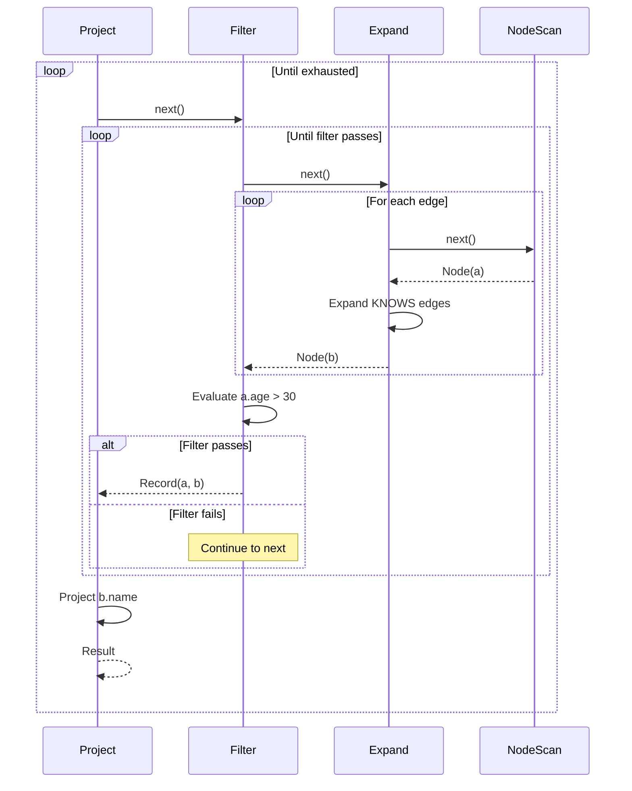
```mermaid
sequenceDiagram
    participant Proj as Project
    participant Filt as Filter
    participant Exp as Expand
    participant Scan as NodeScan

    loop Until exhausted
        Proj->>Filt: next()
        loop Until filter passes
            Filt->>Exp: next()
            loop For each edge
                Exp->>Scan: next()
                Scan-->>Exp: Node(a)
                Exp->>Exp: Expand KNOWS edges
                Exp-->>Filt: Node(b)
            end
            Filt->>Filt: Evaluate a.age > 30
            alt Filter passes
                Filt-->>Proj: Record(a, b)
            else Filter fails
                Note over Filt: Continue to next
            end
        end
        Proj->>Proj: Project b.name
        Proj-->>Proj: Result
    end
```

### 4.2 Query Optimization

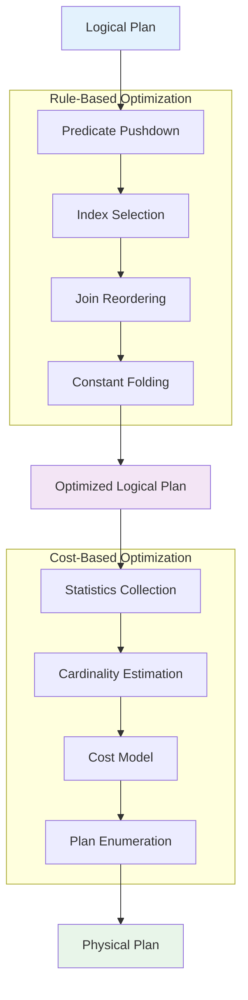
```mermaid
graph TB
    subgraph "Rule-Based Optimization"
        R1[Predicate Pushdown]
        R2[Index Selection]
        R3[Join Reordering]
        R4[Constant Folding]
    end

    subgraph "Cost-Based Optimization"
        C1[Statistics Collection]
        C2[Cardinality Estimation]
        C3[Cost Model]
        C4[Plan Enumeration]
    end

    LP[Logical Plan] --> R1
    R1 --> R2
    R2 --> R3
    R3 --> R4
    R4 --> OLP[Optimized Logical Plan]

    OLP --> C1
    C1 --> C2
    C2 --> C3
    C3 --> C4
    C4 --> PP[Physical Plan]

    style LP fill:#e3f2fd
    style OLP fill:#f3e5f5
    style PP fill:#e8f5e9
```

**Cost Estimation**:
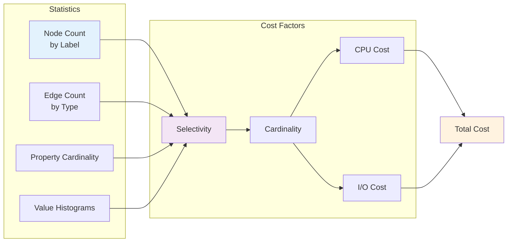
```mermaid
graph LR
    subgraph "Statistics"
        NC[Node Count<br/>by Label]
        EC[Edge Count<br/>by Type]
        PC[Property Cardinality]
        HIST[Value Histograms]
    end

    subgraph "Cost Factors"
        SEL[Selectivity]
        CARD[Cardinality]
        CPU[CPU Cost]
        IO[I/O Cost]
    end

    NC --> SEL
    EC --> SEL
    PC --> SEL
    HIST --> SEL

    SEL --> CARD
    CARD --> CPU
    CARD --> IO

    CPU --> TOTAL[Total Cost]
    IO --> TOTAL

    style NC fill:#e3f2fd
    style SEL fill:#f3e5f5
    style TOTAL fill:#fff3e0
```

---

## 5. Multi-Tenancy Architecture

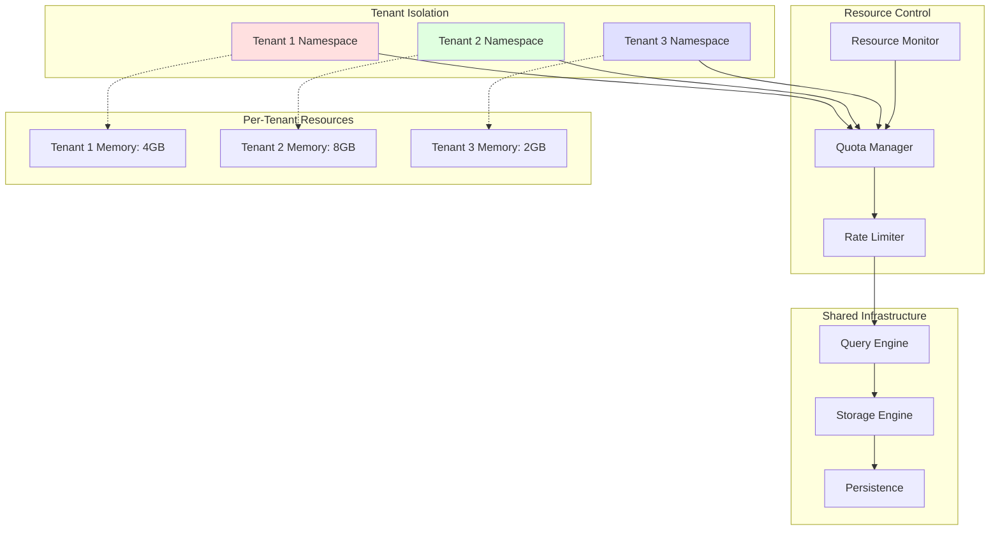
```mermaid
graph TB
    subgraph "Tenant Isolation"
        T1[Tenant 1 Namespace]
        T2[Tenant 2 Namespace]
        T3[Tenant 3 Namespace]
    end

    subgraph "Shared Infrastructure"
        QE[Query Engine]
        SE[Storage Engine]
        PE[Persistence]
    end

    subgraph "Resource Control"
        QM[Quota Manager]
        RM[Resource Monitor]
        RL[Rate Limiter]
    end

    T1 --> QM
    T2 --> QM
    T3 --> QM

    QM --> RL
    RL --> QE
    QE --> SE
    SE --> PE

    RM --> QM

    subgraph "Per-Tenant Resources"
        T1M[Tenant 1 Memory: 4GB]
        T2M[Tenant 2 Memory: 8GB]
        T3M[Tenant 3 Memory: 2GB]

        T1 -.-> T1M
        T2 -.-> T2M
        T3 -.-> T3M
    end

    style T1 fill:#ffe0e0
    style T2 fill:#e0ffe0
    style T3 fill:#e0e0ff
```

**Tenant Request Flow**:
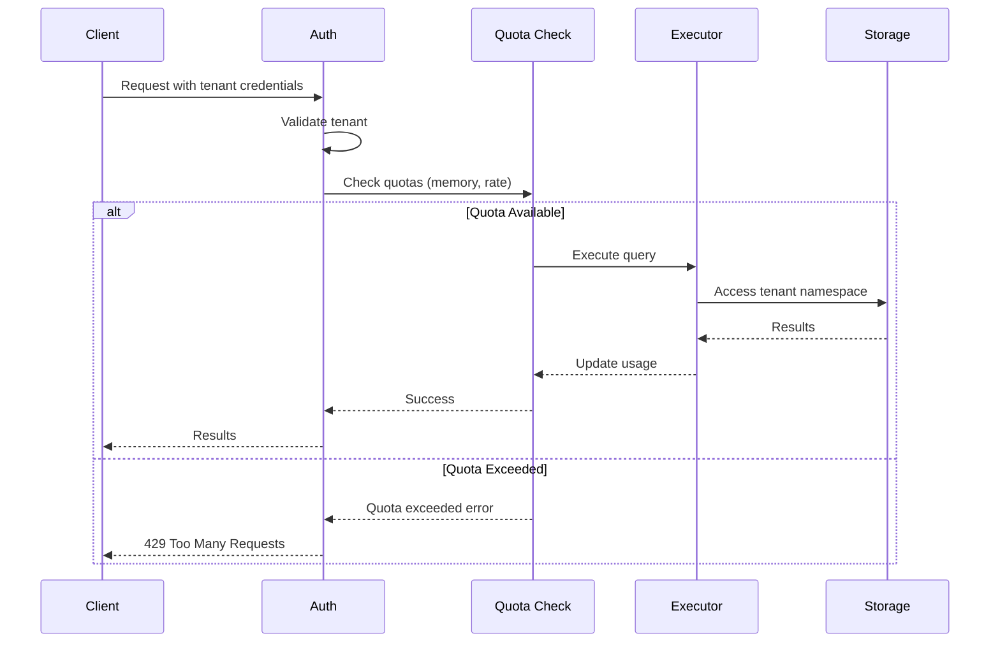
```mermaid
sequenceDiagram
    participant C as Client
    participant A as Auth
    participant Q as Quota Check
    participant E as Executor
    participant S as Storage

    C->>A: Request with tenant credentials
    A->>A: Validate tenant
    A->>Q: Check quotas (memory, rate)

    alt Quota Available
        Q->>E: Execute query
        E->>S: Access tenant namespace
        S-->>E: Results
        E-->>Q: Update usage
        Q-->>A: Success
        A-->>C: Results
    else Quota Exceeded
        Q-->>A: Quota exceeded error
        A-->>C: 429 Too Many Requests
    end
```

---

## 6. Persistence and Recovery

### 6.1 Write-Ahead Log (WAL)

```mermaid
sequenceDiagram
    participant C as Client
    participant E as Executor
    participant W as WAL
    participant M as Memory
    participant D as Disk (RocksDB)

    C->>E: Write Operation
    E->>W: Append to WAL
    W->>D: fsync() [if sync mode]
    D-->>W: Persisted

    W->>M: Update in-memory
    M-->>E: Success
    E-->>C: Acknowledge

    Note over W,D: Background: Checkpoint<br/>WAL to RocksDB

    loop Periodic
        W->>D: Flush to RocksDB
        W->>W: Truncate old WAL
    end
```

### 6.2 Snapshot Process

```mermaid
stateDiagram-v2
    [*] --> Running
    Running --> SnapshotTriggered: Time/Size threshold
    SnapshotTriggered --> ForkMemory: Copy-on-Write
    ForkMemory --> SerializeGraph: Background Thread
    SerializeGraph --> WriteSnapshot: Compress & Write
    WriteSnapshot --> UpdateMetadata
    UpdateMetadata --> Running
    Running --> [*]

    note right of ForkMemory
        Uses fork() or
        Rust Arc cloning
    end note

    note right of SerializeGraph
        Cap'n Proto
        serialization
    end note
```

### 6.3 Recovery Process

```mermaid
graph TB
    START[Database Start] --> CHECK[Check for snapshot]

    CHECK -->|Found| LOAD[Load Latest Snapshot]
    CHECK -->|Not Found| EMPTY[Start Empty]

    LOAD --> REPLAY[Replay WAL from snapshot point]
    EMPTY --> REPLAY

    REPLAY --> REBUILD[Rebuild Indices]
    REBUILD --> VALIDATE[Validate Integrity]
    VALIDATE --> READY[Ready to Serve]

    style START fill:#e3f2fd
    style LOAD fill:#f3e5f5
    style REPLAY fill:#fff3e0
    style READY fill:#e8f5e9
```

---

## 7. Observability Architecture

```mermaid
graph TB
    subgraph "Application"
        APP[Samyama Service]
    end

    subgraph "Metrics Collection"
        PROM[Prometheus Client]
        APP --> PROM
    end

    subgraph "Tracing"
        OTEL[OpenTelemetry]
        APP --> OTEL
    end

    subgraph "Logging"
        LOG[Structured Logs<br/>JSON]
        APP --> LOG
    end

    subgraph "Metrics Backend"
        PS[Prometheus Server]
        PROM -.->|Pull| PS
    end

    subgraph "Tracing Backend"
        JAEGER[Jaeger]
        OTEL --> JAEGER
    end

    subgraph "Log Backend"
        ELK[ELK Stack]
        LOG --> ELK
    end

    subgraph "Visualization"
        GRAF[Grafana]
        PS --> GRAF
        JAEGER --> GRAF
        ELK --> GRAF
    end

    style APP fill:#e3f2fd
    style PROM fill:#f3e5f5
    style OTEL fill:#fff3e0
    style LOG fill:#e8f5e9
    style GRAF fill:#ffe0e0
```

**Distributed Trace Example**:
```mermaid
gantt
    title Query Execution Trace
    dateFormat X
    axisFormat %L ms

    section Client Request
    HTTP Request           :0, 500

    section Query Processing
    Parse Query            :0, 10
    Validate Query         :10, 15
    Plan Query             :15, 25
    Optimize Query         :25, 35

    section Execution
    Node Scan              :35, 85
    Edge Expand            :85, 285
    Filter                 :285, 325
    Project                :325, 335

    section Network (Distributed)
    RPC to Partition 2     :100, 250

    section Response
    Serialize Results      :335, 345
    Send Response          :345, 500
```

---

## 8. Deployment Architecture

### 8.1 Single-Node Deployment

```mermaid
graph TB
    subgraph "Docker Container"
        SRV[Samyama Server]
        RDB[(RocksDB Data)]
        CFG[Config Files]
        LOG[Logs]
    end

    subgraph "Host Machine"
        VOL1[/data Volume]
        VOL2[/config Volume]
        VOL3[/logs Volume]
    end

    RDB -.->|Mount| VOL1
    CFG -.->|Mount| VOL2
    LOG -.->|Mount| VOL3

    LB[Load Balancer] --> SRV

    CLIENT1[Client 1] --> LB
    CLIENT2[Client 2] --> LB
    CLIENT3[Client 3] --> LB

    style SRV fill:#e3f2fd
    style RDB fill:#f3e5f5
```

### 8.2 Kubernetes Deployment (HA Cluster)

```mermaid
graph TB
    subgraph "Kubernetes Cluster"
        subgraph "Samyama StatefulSet"
            POD1[samyama-0<br/>Leader]
            POD2[samyama-1<br/>Follower]
            POD3[samyama-2<br/>Follower]
        end

        subgraph "Persistent Volumes"
            PV1[(PV: samyama-0)]
            PV2[(PV: samyama-1)]
            PV3[(PV: samyama-2)]
        end

        SVC[Service<br/>Load Balancer]

        POD1 --> PV1
        POD2 --> PV2
        POD3 --> PV3

        SVC --> POD1
        SVC --> POD2
        SVC --> POD3
    end

    subgraph "Monitoring"
        PROM[Prometheus]
        GRAF[Grafana]

        PROM --> POD1
        PROM --> POD2
        PROM --> POD3
        GRAF --> PROM
    end

    INGRESS[Ingress] --> SVC

    style POD1 fill:#ff6b6b
    style POD2 fill:#51cf66
    style POD3 fill:#51cf66
```

**Kubernetes Manifest Structure**:
```yaml
# StatefulSet for stable network identity
apiVersion: apps/v1
kind: StatefulSet
metadata:
  name: samyama
spec:
  serviceName: samyama
  replicas: 3
  selector:
    matchLabels:
      app: samyama
  template:
    spec:
      containers:
      - name: samyama
        image: samyama:v1.0
        ports:
        - containerPort: 6379  # RESP
        - containerPort: 8080  # HTTP
        volumeMounts:
        - name: data
          mountPath: /data
  volumeClaimTemplates:
  - metadata:
      name: data
    spec:
      accessModes: [ "ReadWriteOnce" ]
      resources:
        requests:
          storage: 100Gi
```

### 8.3 Cloud Architecture (AWS Example)

```mermaid
graph TB
    subgraph "AWS Cloud"
        subgraph "VPC"
            subgraph "Public Subnet"
                ALB[Application Load Balancer]
            end

            subgraph "Private Subnet AZ-1"
                EC2_1[EC2: Samyama Leader]
                EBS_1[(EBS Volume)]
                EC2_1 --> EBS_1
            end

            subgraph "Private Subnet AZ-2"
                EC2_2[EC2: Samyama Follower]
                EBS_2[(EBS Volume)]
                EC2_2 --> EBS_2
            end

            subgraph "Private Subnet AZ-3"
                EC2_3[EC2: Samyama Follower]
                EBS_3[(EBS Volume)]
                EC2_3 --> EBS_3
            end
        end

        S3[S3: Backups]
        CW[CloudWatch: Metrics & Logs]

        ALB --> EC2_1
        ALB --> EC2_2
        ALB --> EC2_3

        EC2_1 -.->|Backup| S3
        EC2_1 --> CW
        EC2_2 --> CW
        EC2_3 --> CW
    end

    INTERNET[Internet] --> ALB

    style EC2_1 fill:#ff6b6b
    style EC2_2 fill:#51cf66
    style EC2_3 fill:#51cf66
```

---

## 9. Data Flow Diagrams

### 9.1 Read Query Flow

```mermaid
sequenceDiagram
    participant C as Client
    participant P as Protocol Handler
    participant Q as Query Engine
    participant I as Index
    participant M as Memory Store
    participant D as Disk (RocksDB)

    C->>P: GRAPH.QUERY "MATCH (n:Person {name:'Alice'})"
    P->>Q: Parse & Plan
    Q->>Q: Optimize (use index)
    Q->>I: Lookup index for name='Alice'
    I-->>Q: NodeId: 42

    Q->>M: Get Node(42)
    alt In Memory
        M-->>Q: Node data
    else Not in Memory
        M->>D: Read from disk
        D-->>M: Node data
        M->>M: Cache in memory
        M-->>Q: Node data
    end

    Q->>Q: Project results
    Q-->>P: Results
    P-->>C: RESP response
```

### 9.2 Write Query Flow

```mermaid
sequenceDiagram
    participant C as Client
    participant P as Protocol Handler
    participant T as Transaction Manager
    participant W as WAL
    participant M as Memory Store
    participant I as Index
    participant D as Disk (RocksDB)

    C->>P: CREATE (n:Person {name:'Bob'})
    P->>T: Begin transaction
    T->>W: Write to WAL
    W->>D: Persist (if sync mode)
    D-->>W: ACK

    T->>M: Create node in memory
    M-->>T: NodeId: 100

    T->>I: Update indices
    I-->>T: ACK

    T->>T: Commit transaction
    T-->>P: Success
    P-->>C: Node created

    Note over W,D: Background: Flush WAL to RocksDB
```

### 9.3 Graph Traversal Flow

```mermaid
graph LR
    START[Start Node] -->|1. Get Outgoing Edges| ADJ[Adjacency List]
    ADJ -->|2. For Each Edge| EDGE[Load Edge]
    EDGE -->|3. Get Target Node| TARGET[Target Node]
    TARGET -->|4. Filter| FILTER{Matches Criteria?}
    FILTER -->|Yes| COLLECT[Collect Result]
    FILTER -->|No| SKIP[Skip]
    COLLECT -->|5. Continue?| MORE{More Hops?}
    MORE -->|Yes| ADJ
    MORE -->|No| RESULT[Return Results]
    SKIP --> ADJ

    style START fill:#e3f2fd
    style TARGET fill:#f3e5f5
    style COLLECT fill:#e8f5e9
    style RESULT fill:#fff3e0
```

---

## 10. Security Architecture

```mermaid
graph TB
    subgraph "External"
        CLIENT[Client]
    end

    subgraph "Network Security"
        TLS[TLS Termination]
        FW[Firewall Rules]
    end

    subgraph "Authentication Layer"
        AUTH[Authentication<br/>Token/Password]
        SESSION[Session Manager]
    end

    subgraph "Authorization Layer"
        RBAC[Role-Based Access Control]
        PERM[Permission Checker]
    end

    subgraph "Audit Layer"
        AUDIT[Audit Logger]
        SIEM[SIEM Integration]
    end

    subgraph "Data Layer"
        ENC_REST[Encryption at Rest]
        ENC_MEM[Memory Encryption]
    end

    CLIENT --> FW
    FW --> TLS
    TLS --> AUTH
    AUTH --> SESSION
    SESSION --> RBAC
    RBAC --> PERM
    PERM --> AUDIT
    AUDIT --> SIEM

    PERM -.->|Access Data| ENC_REST
    PERM -.->|Access Data| ENC_MEM

    style TLS fill:#ffe0e0
    style AUTH fill:#fff3e0
    style RBAC fill:#e8f5e9
    style ENC_REST fill:#e3f2fd
```

---

## 11. Performance Optimization Strategies

### 11.1 Cache Hierarchy

```mermaid
graph TB
    subgraph "Cache Layers"
        L1[L1: Query Result Cache<br/>LRU, 10ms TTL]
        L2[L2: Node/Edge Cache<br/>In-Memory, Hot Data]
        L3[L3: Memory-Mapped Files<br/>OS Page Cache]
        DISK[(Disk: RocksDB)]
    end

    Q[Query] --> L1
    L1 -->|Miss| L2
    L2 -->|Miss| L3
    L3 -->|Miss| DISK

    L1 -.->|Evict| L2
    L2 -.->|Evict| L3

    style L1 fill:#ff6b6b
    style L2 fill:#ffd93d
    style L3 fill:#6bcf7f
    style DISK fill:#4ecdc4
```

### 11.2 Index Strategy

```mermaid
graph TB
    subgraph "Index Types"
        LABEL[Label Index<br/>RoaringBitmap<br/>Fast: O(1)]
        PROP_HASH[Property Hash Index<br/>Exact Match<br/>O(1)]
        PROP_BTREE[Property BTree Index<br/>Range Queries<br/>O(log n)]
        FULL_TEXT[Full-Text Index<br/>Tantivy<br/>O(log n)]
    end

    subgraph "Query Types"
        Q1[MATCH :Person]
        Q2[WHERE name = 'Alice']
        Q3[WHERE age > 30]
        Q4[WHERE text CONTAINS 'graph']
    end

    Q1 --> LABEL
    Q2 --> PROP_HASH
    Q3 --> PROP_BTREE
    Q4 --> FULL_TEXT

    style LABEL fill:#e3f2fd
    style PROP_HASH fill:#f3e5f5
    style PROP_BTREE fill:#fff3e0
    style FULL_TEXT fill:#e8f5e9
```

---

## 12. Failure Scenarios and Recovery

### 12.1 Node Failure in Raft Cluster

```mermaid
stateDiagram-v2
    [*] --> Healthy: 3 nodes running
    Healthy --> NodeFailure: Follower crashes
    NodeFailure --> Degraded: 2 nodes remain
    Degraded --> Healthy: Node recovers
    Degraded --> LeaderFailure: Leader crashes
    LeaderFailure --> Election: Start election
    Election --> NewLeader: New leader elected
    NewLeader --> Degraded: 2 nodes (new leader + 1 follower)
    NewLeader --> Healthy: Failed node recovers

    note right of Degraded
        System still operational
        Write quorum: 2/3
        Read from 2 replicas
    end note

    note right of Election
        Timeout: 150-300ms
        Majority vote needed
    end note
```

### 12.2 Split-Brain Prevention

```mermaid
sequenceDiagram
    participant N1 as Node 1 (Leader)
    participant N2 as Node 2
    participant N3 as Node 3

    Note over N1,N3: Network partition occurs

    N1->>N1: Can't reach N2, N3
    N1->>N1: No majority, step down

    N2->>N3: Can reach each other
    N2->>N2: Start election
    N3->>N2: Vote for N2
    N2->>N2: Majority (2/3), become leader

    Note over N1: Isolated, cannot serve writes
    Note over N2,N3: New leader, continues serving

    Note over N1,N3: Partition heals

    N1->>N2: Discover higher term
    N1->>N1: Become follower
    N2->>N1: Replicate log
```

---

## Summary

This architecture provides:

✅ **Modularity**: Clear separation of concerns
✅ **Scalability**: From single-node to distributed cluster
✅ **Performance**: Multi-tier caching, optimized data structures
✅ **Reliability**: WAL, snapshots, Raft consensus
✅ **Observability**: Comprehensive metrics, tracing, logging
✅ **Security**: Multi-layer security architecture
✅ **Flexibility**: Multiple protocols, deployment options

**Key Design Principles**:
1. **Start Simple**: Single-node first, distribute later
2. **Optimize for Reads**: In-memory caching, indices
3. **Durability First**: WAL before acknowledgment
4. **Fail-Safe**: Raft quorum, split-brain prevention
5. **Observable**: Metrics and traces at every layer

---

**Document Version**: 1.0
**Last Updated**: 2025-10-14
**Status**: System Architecture Specification
