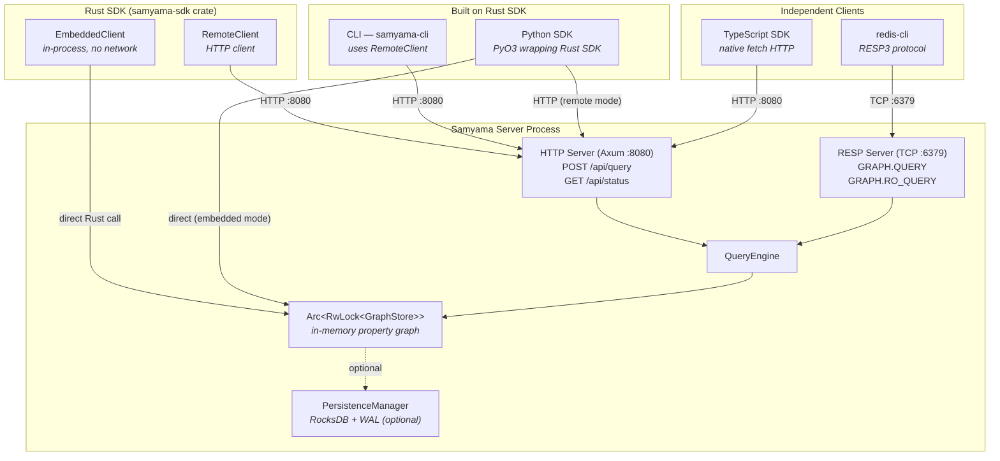
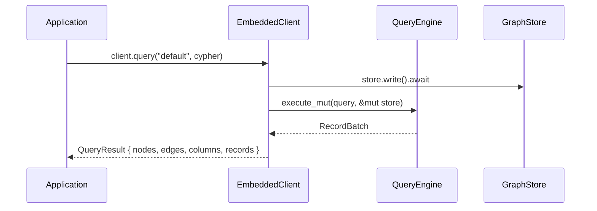
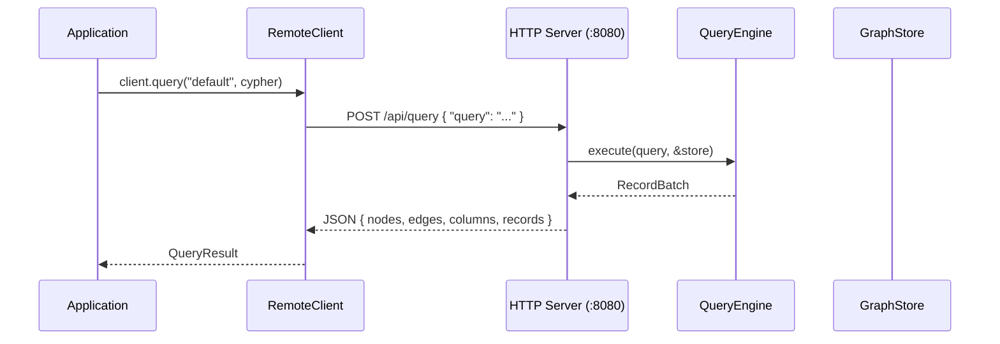
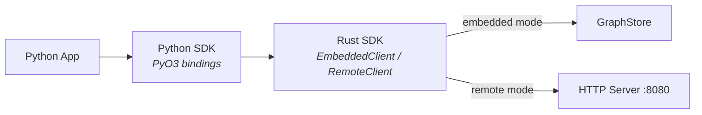

# SDK, API & CLI — Connection Architecture

How the SDK, API, and CLI connect to the Samyama graph database.

---

## SDKs Overview

Samyama provides SDKs in three languages. The **Rust SDK** is the primary SDK and the most feature-complete.

| SDK | Crate / Package | Clients | Built On | Key Dependencies |
|-----|----------------|---------|----------|-----------------|
| **Rust SDK** | `samyama-sdk` (`crates/samyama-sdk/`) | `EmbeddedClient`, `RemoteClient` | samyama core (direct) | samyama, reqwest, tokio |
| **Python SDK** | `samyama` (`sdk/python/`) | `SamyamaClient.embedded()`, `.connect(url)` | **Rust SDK via PyO3** | samyama-sdk, pyo3 0.22, tokio |
| **TypeScript SDK** | `samyama-sdk` (`sdk/typescript/`) | `SamyamaClient.connectHttp(url)` | Independent (HTTP only) | fetch (native) |

The **Rust SDK** is the foundation:
- Defines the `SamyamaClient` async trait with two implementations:
  - **`EmbeddedClient`** — in-process, no network, full feature set (algorithms, vector, NLQ, persistence)
  - **`RemoteClient`** — HTTP client to a running server, core query features only
- The **Python SDK wraps the Rust SDK** via PyO3 — it imports `EmbeddedClient` and `RemoteClient` directly from the `samyama-sdk` crate and exposes them as Python classes. Both embedded and remote modes work from Python.
- The **TypeScript SDK is independent** — it reimplements the HTTP client protocol using native `fetch`, targeting the same `/api/query` and `/api/status` endpoints. HTTP-only, no embedded mode.

---

## Connection Summary

| Component | Type | Protocol | Port | Transport Layer | GraphStore Access | Requires Server? |
|-----------|------|----------|------|-----------------|-------------------|------------------|
| **Rust SDK — EmbeddedClient** | SDK (Rust) | Direct | N/A | In-process `Arc<RwLock<GraphStore>>` | Direct memory | No |
| **Rust SDK — RemoteClient** | SDK (Rust) | HTTP/JSON | 8080 | `reqwest` async HTTP | `/api/query`, `/api/status` | Yes |
| **CLI** (`samyama-cli`) | Tool | HTTP/JSON | 8080 | Uses Rust SDK `RemoteClient` | Via RemoteClient | Yes |
| **Python SDK** | SDK (Python) | Direct / HTTP | N/A / 8080 | PyO3 wrapping **Rust SDK** (`EmbeddedClient` + `RemoteClient`) | Both modes | Depends on mode |
| **TypeScript SDK** | SDK (TS) | HTTP/JSON | 8080 | Native `fetch` (independent) | Via HTTP endpoints | Yes |
| **RESP Server** | Protocol | RESP3 (Redis) | 6379 | TCP socket | Direct `Arc<RwLock<>>` | Is the server |
| **HTTP Server** | Protocol | HTTP/JSON | 8080 | Axum async | Direct `Arc<RwLock<>>` | Is the server |

---

## Data Flow



---

## Component Details

### 1. Rust SDK (`samyama-sdk`)

**Crate:** `crates/samyama-sdk/` — workspace member, published as `samyama-sdk`

The Rust SDK is the primary client library. It provides:
- **`SamyamaClient`** trait — unified async API implemented by both clients
- **`EmbeddedClient`** — in-process, zero-network access (tests, examples, embedded apps)
- **`RemoteClient`** — HTTP client for production use against a running server
- **Extension traits** — `AlgorithmClient`, `VectorClient` (EmbeddedClient only)
- **Re-exports** — all core types (graph, algo, vector, NLQ, persistence, optimization)

#### 1a. EmbeddedClient (In-Process, Direct)

**File:** `crates/samyama-sdk/src/embedded.rs`

- No network, no serialization overhead
- Wraps `Arc<RwLock<GraphStore>>` directly in memory
- Two construction modes:
  - `EmbeddedClient::new()` — creates fresh empty GraphStore
  - `EmbeddedClient::with_store(arc)` — wraps an existing store

**Query execution path:**



**Exclusive features** (not available on RemoteClient):

| Extension Trait | Methods |
|----------------|---------|
| `AlgorithmClient` | `page_rank`, `weakly_connected_components`, `strongly_connected_components`, `bfs`, `dijkstra`, `edmonds_karp`, `prim_mst`, `count_triangles`, `build_view` |
| `VectorClient` | `create_vector_index`, `add_vector`, `vector_search` |

**Factory methods** on EmbeddedClient:

| Method | Returns | Purpose |
|--------|---------|---------|
| `nlq_pipeline(config)` | `NLQPipeline` | Natural language to Cypher |
| `agent_runtime(config)` | `AgentRuntime` | Agentic enrichment (GAK) |
| `persistence_manager(path)` | `PersistenceManager` | RocksDB + WAL |
| `tenant_manager()` | `TenantManager` | Multi-tenancy + quotas |
| `store_read()` | `RwLockReadGuard` | Direct read access |
| `store_write()` | `RwLockWriteGuard` | Direct write access |

---

#### 1b. RemoteClient (HTTP Network)

**File:** `crates/samyama-sdk/src/remote.rs`

- Connects to a running Samyama server via HTTP
- Uses `reqwest` async HTTP client
- Default URL: `http://localhost:8080`

**Endpoints used:**

| Method | Endpoint | Purpose |
|--------|----------|---------|
| POST | `/api/query` | Execute Cypher (body: `{ "query": "..." }`) |
| GET | `/api/status` | Server health and stats |

**Query execution path:**



---

### 2. CLI (`samyama-cli`)

**File:** `cli/src/main.rs`

- Thin wrapper around `RemoteClient`
- Built with `clap` (arg parsing) + `comfy-table` (table formatting)
- URL from `--url` flag or `SAMYAMA_URL` env var

**Subcommands:**

| Command | Description | Example |
|---------|-------------|---------|
| `query <cypher>` | Execute Cypher | `samyama-cli query "MATCH (n) RETURN n"` |
| `status` | Server stats | `samyama-cli status` |
| `ping` | Health check | `samyama-cli ping` |
| `shell` | Interactive REPL | `samyama-cli shell` |

**Output formats:** `--format table` (default), `--format json`, `--format csv`

---

### 3. Python & TypeScript SDKs

#### Python SDK (`sdk/python/`)

**Built on the Rust SDK** — a PyO3 cdylib that wraps `samyama-sdk` directly.

- **Dependency:** `samyama-sdk = { path = "../../crates/samyama-sdk" }` in `Cargo.toml`
- **Internal:** `ClientInner` enum holds either `EmbeddedClient` or `RemoteClient` from the Rust SDK
- **Build:** `maturin develop` / `maturin build`
- **Two modes:**
  - `SamyamaClient.embedded()` — wraps Rust `EmbeddedClient` (in-process, no server)
  - `SamyamaClient.connect(url)` — wraps Rust `RemoteClient` (HTTP to server)



#### TypeScript SDK (`sdk/typescript/`)

**Independent implementation** — pure TypeScript, does NOT use the Rust SDK.

- Reimplements HTTP client protocol using native `fetch`
- Targets the same endpoints: `POST /api/query`, `GET /api/status`
- HTTP-only — no embedded mode available
- `SamyamaClient.connectHttp(url)` factory method

---

### 4. HTTP API Server

**Files:** `src/http/server.rs`, `src/http/handler.rs`

- Framework: **Axum** (async Rust web framework)
- Port: **8080** (default)
- CORS: permissive (enabled)

**Endpoints:**

| Method | Path | Handler | Description |
|--------|------|---------|-------------|
| POST | `/api/query` | `query_handler` | Execute Cypher, return nodes/edges/records |
| GET | `/api/status` | `status_handler` | Return `{ status, version, storage }` |
| GET | `/` | static | Serve HTML graph visualizer |

**Response format** (matches `QueryResult` in SDK):

```json
{
  "nodes": [{ "id": 1, "labels": ["Person"], "properties": {"name": "Alice"} }],
  "edges": [{ "id": 1, "source": 1, "target": 2, "type": "KNOWS", "properties": {} }],
  "columns": ["n.name"],
  "records": [["Alice"]]
}
```

**OpenAPI spec:** `api/openapi.yaml`

---

### 5. RESP Protocol Server

**Files:** `src/protocol/server.rs`, `src/protocol/command.rs`, `src/protocol/resp.rs`

- Protocol: **RESP3** (Redis Serialization Protocol)
- Port: **6379** (Redis-compatible)
- Compatible clients: `redis-cli`, `redis-py`, `ioredis`, etc.

**Supported commands:**

| Command | Description |
|---------|-------------|
| `GRAPH.QUERY graph "CYPHER"` | Execute Cypher (read or write) |
| `GRAPH.RO_QUERY graph "CYPHER"` | Read-only query |
| `GRAPH.DELETE graph` | Delete all nodes/edges |
| `GRAPH.LIST` | List graphs |
| `PING` | Health check |
| `ECHO msg` | Echo back |
| `INFO` | Server info |

---

## Shared Trait: `SamyamaClient`

**File:** `crates/samyama-sdk/src/client.rs`

Both `EmbeddedClient` and `RemoteClient` implement this async trait:

```rust
#[async_trait]
pub trait SamyamaClient {
    async fn query(&self, graph: &str, cypher: &str) -> SamyamaResult<QueryResult>;
    async fn query_readonly(&self, graph: &str, cypher: &str) -> SamyamaResult<QueryResult>;
    async fn delete_graph(&self, graph: &str) -> SamyamaResult<()>;
    async fn list_graphs(&self) -> SamyamaResult<Vec<String>>;
    async fn status(&self) -> SamyamaResult<ServerStatus>;
    async fn ping(&self) -> SamyamaResult<String>;
}
```

---

## Capability Matrix

| Capability | Rust SDK (Embedded) | Rust SDK (Remote) | CLI | Python SDK | TS SDK | RESP |
|------------|:-:|:-:|:-:|:-:|:-:|:-:|
| Cypher queries | Y | Y | Y | Y | Y | Y |
| Read-only queries | Y | Y | Y | Y | Y | Y |
| Graph algorithms | Y | - | - | - | - | - |
| Vector search (HNSW) | Y | - | - | - | - | - |
| NLQ (natural language) | Y | - | - | - | - | - |
| Agent enrichment (GAK) | Y | - | - | - | - | - |
| Persistence (RocksDB) | Y | - | - | - | - | Y |
| Multi-tenancy | Y | - | - | - | - | Y |
| Direct store access | Y | - | - | - | - | - |
| Network required | - | Y | Y | Y | Y | Y |

---

## File Index

| Area | File | Purpose |
|------|------|---------|
| **Rust SDK** | `crates/samyama-sdk/src/lib.rs` | Module root + re-exports |
| | `crates/samyama-sdk/src/client.rs` | `SamyamaClient` trait definition |
| | `crates/samyama-sdk/src/embedded.rs` | In-process client + factory methods |
| | `crates/samyama-sdk/src/remote.rs` | HTTP client via reqwest |
| | `crates/samyama-sdk/src/models.rs` | `QueryResult`, `SdkNode`, `SdkEdge`, `ServerStatus` |
| | `crates/samyama-sdk/src/algo.rs` | `AlgorithmClient` extension trait |
| | `crates/samyama-sdk/src/vector_ext.rs` | `VectorClient` extension trait |
| | `crates/samyama-sdk/src/error.rs` | `SamyamaError` enum |
| **Python SDK** | `sdk/python/src/lib.rs` | PyO3 bindings (embedded + HTTP) |
| **TypeScript SDK** | `sdk/typescript/src/client.ts` | Fetch-based HTTP client |
| **CLI** | `cli/src/main.rs` | Clap subcommands + table/json/csv output |
| **HTTP Server** | `src/http/server.rs` | Axum server setup |
| | `src/http/handler.rs` | `/api/query`, `/api/status` handlers |
| **RESP Server** | `src/protocol/server.rs` | TCP listener + connection handler |
| | `src/protocol/command.rs` | `GRAPH.QUERY` etc. |
| | `src/protocol/resp.rs` | RESP3 encoding/decoding |
| **Specs** | `api/openapi.yaml` | HTTP API specification (OpenAPI 3.0) |
| **Server** | `src/main.rs` | Server startup (RESP + HTTP) |
