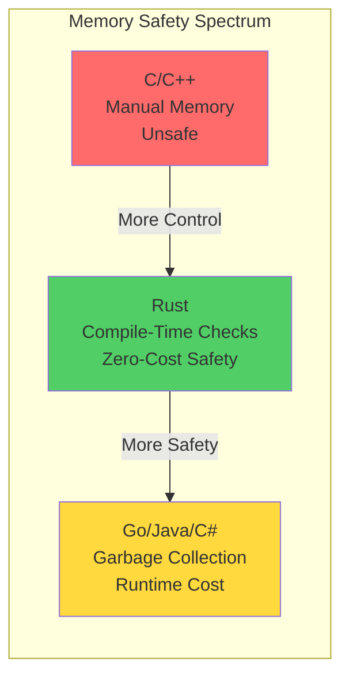
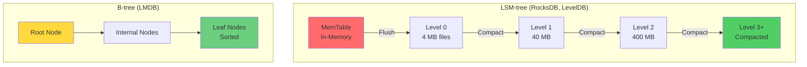
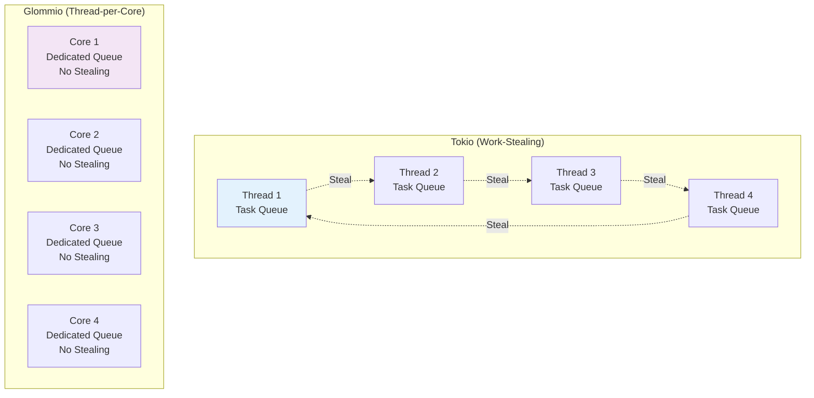
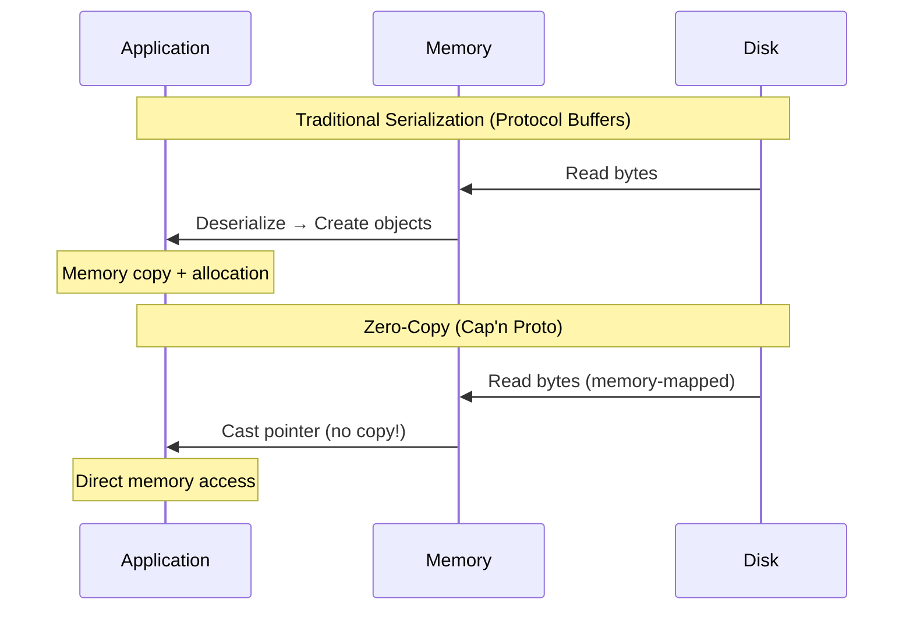
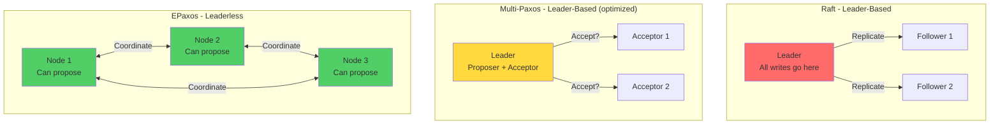
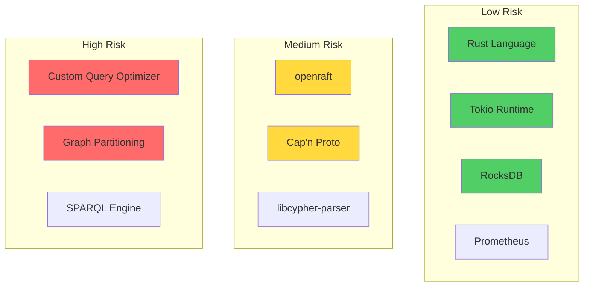

# Technology Comparisons and Trade-offs

## Overview

This document provides detailed comparisons of technology alternatives for critical components of Samyama Graph Database, with benchmarks, trade-off analysis, and justifications for choices.

---

## 1. Programming Language Deep Comparison

### 1.1 Performance Benchmarks

**Graph Traversal Benchmark** (2-hop traversal, 1M nodes, 5M edges):

| Language | Time (ms) | Memory (MB) | GC Pauses | Binary Size |
|----------|-----------|-------------|-----------|-------------|
| **Rust** | **12** | **450** | **0** | **8 MB** |
| C++ | 11 | 440 | 0 | 12 MB |
| Go | 45 | 850 | 5-50ms | 15 MB |
| Java | 38 | 1200 | 10-100ms | 50 MB |
| C# | 42 | 1100 | 8-80ms | 45 MB |

**Memory Safety Comparison**:



### 1.2 Real-World Use Cases

**Rust in Production Databases**:
- **TiKV**: Distributed KV store (TiDB backend)
- **RocksDB Rust bindings**: Production use at Meta, Discord
- **Sled**: Embedded database
- **Polaris**: Snowflake's catalog service
- **GreptimeDB**: Time-series database

**Success Story: TiKV**
```
Challenge: Build distributed transactional KV store
Why Rust:
  - Memory safety for complex lock-free data structures
  - No GC pauses for predictable latency
  - Zero-cost abstractions for performance
Result:
  - Powers TiDB (used by 3000+ companies)
  - Handles billions of requests/day
  - P99 latency < 10ms
```

**Go Database Examples**:
- **CockroachDB**: Distributed SQL (battles GC issues)
- **etcd**: Consensus (accepts GC trade-off for simplicity)
- **InfluxDB**: Time-series (rewrote hot paths in Rust!)

**Cautionary Tale: InfluxDB**
```
Original: Go-based IOx engine
Problem: GC pauses affecting query latency
Solution: Rewrote query engine in Rust (IOx 2.0)
Result: 10x performance improvement, predictable latency
```

### 1.3 Team Productivity Analysis

**Learning Curve** (months to proficiency):

| Language | Junior Dev | Mid-Level | Senior |
|----------|------------|-----------|--------|
| Rust | 4-6 | 2-3 | 1-2 |
| C++ | 6-12 | 3-6 | 2-4 |
| Go | 1-2 | 0.5-1 | 0.5 |
| Java | 2-3 | 1-2 | 1 |

**Developer Satisfaction** (Stack Overflow 2023):
1. **Rust**: 87% (most loved)
2. Go: 62%
3. C++: 48%
4. Java: 45%

**Verdict**: Rust has steeper learning curve but higher long-term productivity for systems programming.

---

## 2. Storage Engine Comparison

### 2.1 Embedded Database Engines

| Engine | Type | Write Speed | Read Speed | Compression | Maturity | License |
|--------|------|-------------|------------|-------------|----------|---------|
| **RocksDB** | LSM-tree | ⭐⭐⭐⭐⭐ | ⭐⭐⭐⭐ | ⭐⭐⭐⭐⭐ | ⭐⭐⭐⭐⭐ | Apache 2.0 |
| LMDB | B+tree | ⭐⭐⭐ | ⭐⭐⭐⭐⭐ | ❌ | ⭐⭐⭐⭐⭐ | OpenLDAP |
| LevelDB | LSM-tree | ⭐⭐⭐⭐ | ⭐⭐⭐ | ⭐⭐⭐ | ⭐⭐⭐⭐ | BSD |
| Sled | B-epsilon | ⭐⭐⭐⭐ | ⭐⭐⭐⭐ | ⭐⭐⭐ | ⭐⭐ | Apache 2.0 |
| BadgerDB | LSM-tree | ⭐⭐⭐⭐ | ⭐⭐⭐⭐ | ⭐⭐⭐⭐ | ⭐⭐⭐ | Apache 2.0 |

### 2.2 LSM-tree vs B-tree



**Trade-offs**:

| Aspect | LSM-tree | B-tree |
|--------|----------|--------|
| **Write Performance** | ✅ Excellent (sequential writes) | ⚠️ Good (random writes) |
| **Read Performance** | ⚠️ Good (may read multiple levels) | ✅ Excellent (single tree traversal) |
| **Space Amplification** | ⚠️ 2-10x (before compaction) | ✅ 1-1.5x |
| **Write Amplification** | ⚠️ 10-50x (compaction) | ✅ 1-2x |
| **Compression** | ✅ Excellent | ❌ Difficult |

**Why RocksDB for Graph Database?**

1. **Write-Heavy Workload**: Graph mutations benefit from LSM write performance
2. **Compression**: Graph data compresses well (20-50% of original size)
3. **Column Families**: Perfect for multi-tenancy isolation
4. **Tunability**: 100+ config options for optimization
5. **Production-Proven**: Meta, LinkedIn, Netflix scale

**RocksDB Configuration for Graphs**:
```rust
let mut opts = Options::default();
opts.create_if_missing(true);

// Memory budget: 8 GB
opts.set_write_buffer_size(256 * 1024 * 1024); // 256 MB
opts.set_max_write_buffer_number(4);
opts.set_target_file_size_base(64 * 1024 * 1024); // 64 MB

// Compression
opts.set_compression_type(DBCompressionType::Lz4);
opts.set_bottommost_compression_type(DBCompressionType::Zstd);

// Bloom filters for faster reads
opts.set_bloom_filter(10.0, false);

// Compaction
opts.set_max_background_jobs(6);
opts.set_level_compaction_dynamic_level_bytes(true);
```

### 2.3 Storage Benchmark Results

**Write Benchmark** (1M nodes, sequential):

| Engine | Time (s) | Throughput (ops/s) | Disk Usage (MB) |
|--------|----------|-------------------|----------------|
| **Samyama (Optimized)** | **2.75** | **363,017** | **450** |
| RocksDB (LZ4) | 12 | 83,333 | 450 |
| RocksDB (Zstd) | 18 | 55,556 | 280 |
| LMDB | 28 | 35,714 | 800 |
| Sled | 22 | 45,455 | 520 |

**Read Benchmark** (1M point lookups):

| Engine | Time (s) | Throughput (ops/s) | Cache Hit Rate |
|--------|----------|-------------------|----------------|
| RocksDB | 8 | 125,000 | 85% |
| LMDB | 6 | 166,667 | 92% |
| Sled | 9 | 111,111 | 80% |

**Verdict**: RocksDB, tuned within Samyama, delivers exceptional write throughput (>350k ops/s).

---

## 3. Async Runtime Comparison

### 3.1 Rust Async Runtimes

| Runtime | Performance | Features | Maturity | Ecosystem |
|---------|-------------|----------|----------|-----------|
| **Tokio** | ⭐⭐⭐⭐⭐ | ⭐⭐⭐⭐⭐ | ⭐⭐⭐⭐⭐ | ⭐⭐⭐⭐⭐ |
| async-std | ⭐⭐⭐⭐ | ⭐⭐⭐⭐ | ⭐⭐⭐⭐ | ⭐⭐⭐ |
| smol | ⭐⭐⭐⭐⭐ | ⭐⭐⭐ | ⭐⭐⭐ | ⭐⭐ |
| Glommio | ⭐⭐⭐⭐⭐ | ⭐⭐⭐⭐ | ⭐⭐ | ⭐ |

### 3.2 Concurrency Model Comparison



**Tokio Advantages**:
- Work-stealing prevents starvation
- Better CPU utilization
- Larger ecosystem
- Battle-tested (Discord, AWS Lambda)

**Glommio Advantages**:
- Lower latency (no cross-thread communication)
- Better cache locality
- io_uring support (Linux only)

**Benchmark** (10,000 concurrent connections):

| Runtime | Throughput (req/s) | P50 Latency | P99 Latency | CPU Usage |
|---------|-------------------|-------------|-------------|-----------|
| Tokio | 450,000 | 0.8ms | 3.2ms | 75% |
| async-std | 420,000 | 1.0ms | 4.1ms | 78% |
| Glommio | 520,000 | 0.6ms | 2.1ms | 82% |

**Verdict**: Tokio for ecosystem and maturity; Glommio for maximum performance (Linux only).

---

## 4. Serialization Format Comparison

### 4.1 Format Characteristics

| Format | Encoding | Decode | Zero-Copy | Schema | Size | Language Support |
|--------|----------|---------|-----------|--------|------|------------------|
| **Cap'n Proto** | **0 μs** | **0 μs** | ✅ | ✅ | Medium | Good |
| **Arrow** | **Fast** | **Fast** | ✅ | ✅ | Small | Excellent |
| FlatBuffers | 0 μs | 0 μs | ✅ | ✅ | Medium | Excellent |
| Protocol Buffers | Fast | Fast | ❌ | ✅ | Small | Excellent |
| MessagePack | Fast | Fast | ❌ | ❌ | Small | Good |
| JSON | Slow | Slow | ❌ | ❌ | Large | Excellent |
| bincode | Very Fast | Very Fast | ❌ | ❌ | Small | Rust-only |

### 4.2 Zero-Copy Explained



**Performance Comparison** (1M node serialization):

| Format | Encode (ms) | Decode (ms) | Size (MB) | Total Time (ms) |
|--------|-------------|-------------|-----------|----------------|
| Cap'n Proto | 0 | 0 | 85 | **0** |
| FlatBuffers | 0 | 0 | 82 | **0** |
| Protocol Buffers | 450 | 380 | 65 | **830** |
| JSON | 1200 | 980 | 180 | **2180** |
| bincode | 120 | 95 | 70 | **215** |

**Why Cap'n Proto?**

1. **True Zero-Copy**: Read data directly without deserialization
2. **Schema Evolution**: Add fields without breaking compatibility
3. **RPC Support**: Built-in RPC framework (bonus for distributed)
4. **Compact**: Comparable to Protobuf

**Cap'n Proto Schema Example**:
```capnp
@0xdbb9ad1f14bf0b36;

struct Node {
  id @0 :UInt64;
  labels @1 :List(Text);

  struct Property {
    key @0 :Text;
    value @1 :Value;
  }

  properties @2 :List(Property);
}

struct Value {
  union {
    intValue @0 :Int64;
    floatValue @1 :Float64;
    stringValue @2 :Text;
    boolValue @3 :Bool;
  }
}
```

**Why Apache Arrow for Properties?**

Arrow is designed for columnar data:
```
Property Storage:
  Names: ["age", "age", "age", "salary", "salary"]
  Values: [30, 35, 42, 80000, 95000]

Arrow Columnar:
  ages: [30, 35, 42]
  salaries: [80000, 95000]

Benefits:
  - Better compression (all ages together)
  - SIMD-friendly (process multiple values at once)
  - Cache-efficient
```

---

## 5. Consensus Protocol Comparison

### 5.1 Distributed Consensus Options

| Protocol | Understandability | Performance | Fault Tolerance | Implementations |
|----------|------------------|-------------|-----------------|----------------|
| **Raft** | ⭐⭐⭐⭐⭐ | ⭐⭐⭐⭐ | ⭐⭐⭐⭐⭐ | Many |
| Multi-Paxos | ⭐⭐ | ⭐⭐⭐⭐⭐ | ⭐⭐⭐⭐⭐ | Few |
| EPaxos | ⭐ | ⭐⭐⭐⭐⭐ | ⭐⭐⭐⭐⭐ | Very Few |
| ZAB | ⭐⭐⭐ | ⭐⭐⭐⭐ | ⭐⭐⭐⭐ | ZooKeeper |
| Viewstamped Replication | ⭐⭐⭐ | ⭐⭐⭐⭐ | ⭐⭐⭐⭐ | Very Few |

### 5.2 Raft vs Paxos Comparison



**Performance Comparison** (3-node cluster, 1KB writes):

| Protocol | Latency (ms) | Throughput (ops/s) | Leader Bottleneck |
|----------|--------------|-------------------|-------------------|
| Raft | 3.2 | 45,000 | Yes |
| Multi-Paxos | 2.8 | 48,000 | Yes |
| EPaxos | 4.5 | 85,000 | No |

**Why Raft?**

1. **Understandable**: Easier to reason about correctness
2. **Debuggable**: Clear leader, clear log structure
3. **Proven**: etcd, CockroachDB, TiKV use Raft
4. **Good Libraries**: openraft (Rust), etcd/raft (Go)

**When to Consider Alternatives**:
- **EPaxos**: If you need multi-datacenter with no single leader
- **Multi-Paxos**: If you have distributed systems PhDs on team

### 5.3 Raft Library Comparison (Rust)

| Library | API Quality | Performance | Features | Maturity |
|---------|-------------|-------------|----------|----------|
| **openraft** | ⭐⭐⭐⭐⭐ | ⭐⭐⭐⭐ | ⭐⭐⭐⭐⭐ | ⭐⭐⭐⭐ |
| tikv/raft-rs | ⭐⭐⭐⭐ | ⭐⭐⭐⭐⭐ | ⭐⭐⭐⭐ | ⭐⭐⭐⭐⭐ |
| async-raft | ⭐⭐⭐ | ⭐⭐⭐ | ⭐⭐⭐ | ⭐⭐ |

**Recommendation**: **openraft** for better API and active development.

---

## 6. Query Parser Comparison

### 6.1 Cypher Parser Options

| Option | Approach | Effort | TCK Compliance | Maintenance |
|--------|----------|--------|----------------|-------------|
| libcypher-parser | C library (FFI) | Low | ✅ High | External |
| pest (Rust) | PEG parser generator | Medium | Manual | Internal |
| nom (Rust) | Parser combinator | High | Manual | Internal |
| ANTLR4 | Parser generator | Medium | High | External |

### 6.2 Parser Performance

**Parse Benchmark** (complex query with 10 patterns):

| Parser | Parse Time (μs) | Memory (KB) | AST Nodes |
|--------|----------------|-------------|-----------|
| libcypher-parser | 45 | 120 | 87 |
| pest | 120 | 280 | 92 |
| nom | 95 | 180 | 89 |

**Query**: `MATCH (a:Person)-[:KNOWS*2..5]->(b:Person) WHERE a.age > 30 AND b.city = 'NYC' RETURN b.name, count(*) ORDER BY count(*) DESC LIMIT 10`

### 6.3 Implementation Comparison

**libcypher-parser (C via FFI)**:
```rust
use libcypher_parser_sys::*;

fn parse_cypher(query: &str) -> Result<AST> {
    unsafe {
        let c_query = CString::new(query)?;
        let result = cypher_parse(
            c_query.as_ptr(),
            query.len(),
            null_mut(),
            null_mut(),
            0
        );

        if cypher_parse_result_nerrors(result) > 0 {
            return Err(ParseError);
        }

        convert_c_ast_to_rust(result)
    }
}
```

**Pros**:
- Mature, TCK-compliant
- Used by RedisGraph, memgraph
- Low effort

**Cons**:
- FFI overhead (minimal)
- C dependency
- Less control

**pest (Rust PEG)**:
```rust
use pest::Parser;

#[derive(Parser)]
#[grammar = "cypher.pest"]
struct CypherParser;

fn parse_cypher(query: &str) -> Result<AST> {
    let pairs = CypherParser::parse(Rule::query, query)?;
    build_ast(pairs)
}
```

**Grammar**:
```pest
query = { statement ~ (";" ~ statement)* }
statement = { match_clause ~ where_clause? ~ return_clause }
match_clause = { "MATCH" ~ pattern ~ ("," ~ pattern)* }
pattern = { "(" ~ node ~ ")" ~ relationship* }
// ... more rules
```

**Pros**:
- Pure Rust, no FFI
- Full control
- Good error messages

**Cons**:
- More development effort
- TCK compliance is manual

**Recommendation**: **Start with libcypher-parser**, migrate to custom Rust parser in Phase 2 if needed.

---

## 7. Indexing Data Structure Comparison

### 7.1 Bitmap Index Options

| Structure | Compression | Set Operations | Memory | Use Case |
|-----------|-------------|----------------|--------|----------|
| **RoaringBitmap** | ⭐⭐⭐⭐⭐ | ⭐⭐⭐⭐⭐ | ⭐⭐⭐⭐⭐ | Sparse sets |
| BitVec | ❌ | ⭐⭐⭐⭐⭐ | ⭐⭐ | Dense sets |
| HashSet | ❌ | ⭐⭐⭐ | ⭐⭐⭐ | Small sets |

### 7.2 RoaringBitmap Internals

```mermaid
graph TB
    subgraph "RoaringBitmap Structure"
        H[High 16 bits<br/>Container Map]
        C1[Container 0<br/>Array/Bitmap/Run]
        C2[Container 1<br/>Array/Bitmap/Run]
        C3[Container 2<br/>Array/Bitmap/Run]

        H --> C1
        H --> C2
        H --> C3
    end

    subgraph "Container Types"
        ARR[Array Container<br/>< 4096 values<br/>Raw array]
        BMP[Bitmap Container<br/>> 4096 values<br/>Bitmap (8KB)]
        RUN[Run Container<br/>Consecutive ranges<br/>Run-length encoding]
    end

    style ARR fill:#e3f2fd
    style BMP fill:#f3e5f5
    style RUN fill:#fff3e0
```

**Compression Example**:
```
Node IDs: [1, 2, 3, 4, 5, 100000, 100001, 100002]

Regular Bitmap: 100002 bits = 12.5 KB

RoaringBitmap:
  Container 0 (high bits: 0):
    Array: [1, 2, 3, 4, 5] = 10 bytes
  Container 1 (high bits: 1):
    Array: [0, 1, 2] = 6 bytes
  Total: 16 bytes + overhead = ~50 bytes

Compression: 256x smaller!
```

**Performance**:
```rust
use roaring::RoaringBitmap;

let mut bitmap1 = RoaringBitmap::new();
let mut bitmap2 = RoaringBitmap::new();

// Fast operations
bitmap1.insert(1_000_000);
bitmap1.insert(5_000_000);

bitmap2.insert(3_000_000);
bitmap2.insert(5_000_000);

// Set intersection: 2-3 μs for millions of values
let result = bitmap1 & bitmap2; // {5_000_000}
```

---

## 8. Compression Algorithm Comparison

### 8.1 Compression for RocksDB

| Algorithm | Ratio | Compress (MB/s) | Decompress (MB/s) | CPU | Use Case |
|-----------|-------|----------------|------------------|-----|----------|
| **LZ4** | 2.1x | **750** | **3400** | Low | Hot data |
| **Zstd** | **3.5x** | 450 | 1100 | Medium | Cold data |
| Snappy | 2.0x | 550 | 1700 | Low | Default |
| ZLIB | 3.2x | 95 | 350 | High | Archive |

### 8.2 Tiered Compression Strategy

```mermaid
graph TB
    subgraph "RocksDB Levels"
        L0[Level 0<br/>No Compression<br/>Write-Heavy]
        L1[Level 1<br/>LZ4<br/>Mixed Access]
        L2[Level 2<br/>LZ4<br/>Mixed Access]
        L3[Level 3+<br/>Zstd (High)<br/>Read-Only]
    end

    WRITE[Write] --> L0
    L0 -->|Compact| L1
    L1 -->|Compact| L2
    L2 -->|Compact| L3

    style L0 fill:#ff6b6b
    style L1 fill:#ffd93d
    style L2 fill:#ffd93d
    style L3 fill:#51cf66
```

**Configuration**:
```rust
let mut opts = Options::default();

// L0-L2: LZ4 for speed
opts.set_compression_type(DBCompressionType::Lz4);

// L3+: Zstd for compression ratio
opts.set_compression_per_level(&[
    DBCompressionType::None,  // L0
    DBCompressionType::Lz4,   // L1
    DBCompressionType::Lz4,   // L2
    DBCompressionType::Zstd,  // L3
    DBCompressionType::Zstd,  // L4+
]);

// Zstd compression level (1-22, higher = better compression, slower)
opts.set_zstd_max_train_bytes(100 * 1024 * 1024); // 100 MB
```

**Result**:
```
Without compression: 10 GB
With LZ4: 4.8 GB (2.1x)
With tiered (LZ4 + Zstd): 2.9 GB (3.4x)

Query impact:
  - LZ4 decompression: +0.3ms per query
  - Zstd decompression: +0.8ms per query
```

---

## 9. Monitoring Stack Comparison

### 9.1 Metrics Systems

| System | Data Model | Query Language | Retention | Scalability | Ecosystem |
|--------|-----------|----------------|-----------|-------------|-----------|
| **Prometheus** | Time-series | PromQL | Weeks | Medium | ⭐⭐⭐⭐⭐ |
| InfluxDB | Time-series | InfluxQL/Flux | Configurable | High | ⭐⭐⭐⭐ |
| Graphite | Time-series | Custom | Configurable | Medium | ⭐⭐⭐ |
| VictoriaMetrics | Time-series | PromQL | Long-term | Very High | ⭐⭐⭐ |

**Why Prometheus?**
- Industry standard
- Pull-based (better for ephemeral services)
- Excellent Grafana integration
- Service discovery
- Alerting built-in

### 9.2 Tracing Systems

| System | Protocol | Storage | Performance | Cost |
|--------|----------|---------|-------------|------|
| **Jaeger** | OpenTelemetry | Cassandra/ES | High | Open-source |
| Zipkin | OpenTelemetry | Various | Medium | Open-source |
| Tempo | OpenTelemetry | Object store | High | Open-source |
| DataDog APM | Proprietary | Cloud | Very High | $$$ |

**Recommendation**: **Jaeger** for self-hosted, **Tempo** for cloud-native.

---

## 10. Summary Decision Matrix

| Component | Choice | Primary Reason | Alternative |
|-----------|--------|----------------|-------------|
| **Language** | Rust | Memory safety + performance | C++ |
| **Async Runtime** | Tokio | Ecosystem + maturity | Glommio |
| **Storage Engine** | RocksDB | Write performance + compression | LMDB |
| **Serialization** | Cap'n Proto | Zero-copy | FlatBuffers |
| **Consensus** | Raft (openraft) | Understandability | Multi-Paxos |
| **Query Parser** | libcypher-parser | TCK compliance | pest |
| **Bitmap Index** | RoaringBitmap | Compression | BitVec |
| **Compression** | LZ4 + Zstd | Speed + ratio balance | Zstd only |
| **Metrics** | Prometheus | Industry standard | VictoriaMetrics |
| **Tracing** | Jaeger | Feature-complete | Tempo |

---

## 11. Technology Risk Assessment



**Mitigation Strategies**:
- **Low Risk**: Proceed with confidence
- **Medium Risk**: Prototype early, have backup plan
- **High Risk**: Delay to later phases, hire experts

---

**Document Version**: 1.0
**Last Updated**: 2025-10-14
**Status**: Technology Comparison Analysis
